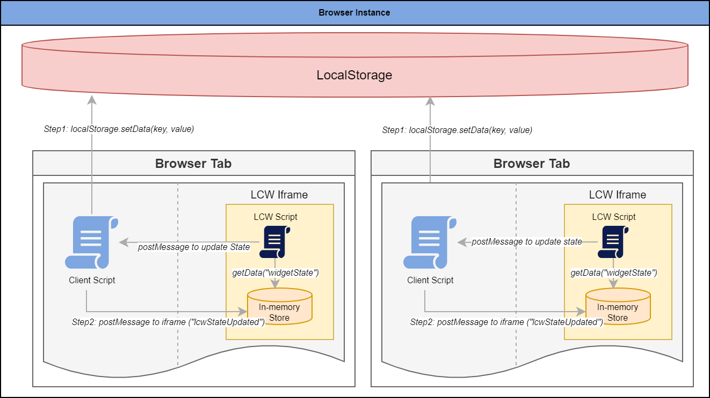

# **Third-Party Cookie Support for Live Chat Widget**

Live Chat Widget (LCW) make use of third-party cookies mainly `localStorage`, for performance improvement and to achieve multi-tab functionality. However, with major browsers are blocking third party cookies in coming days, it is advised to use third-party cookie when available, otherwise fallback to first-party cookie.

> :warning: Disclaimer: The below approach is just one way to fallback to first-party cookies when using Live Chat Widget. You can orchestrate a different approach to make it work.  Please note, YOUR USE OF THIS APPROACH IS SOLELY AT YOUR OWN RISK. 

## **Design Approach**

If you plan to host Live Chat Widget script on another domain, which is not same as your hosted application domain, you're very likely to run into issues to make multi-tab functionality working when third party cookies are blocked. The below design approach to fallback to first-party is one way to get around it. We encourage to use `iframe` when following this approach. 



### **Components**

#### **1. In-Memory Store**
When third-party cookie are blocked, widget gets its intial state from in-memory store. This store is hooked up with an event listner, so when the `localStorage` is updated in-memory store gets notification and update itself.

```
export class CacheManager {
    public static InternalCache: any = {};
}

export const initializeInMemoryDataStore = (widgetId: string) => {
    try {
        localStorage;
    } catch (error) {
        // Register below events when localStorage is not accessible
        // Listening to event raised from client browser
        // eslint-disable-next-line @typescript-eslint/no-explicit-any
        window.addEventListener("message", function (e: any) {
            try {
                if (e.data.key) {
                    const browserData = e.data;
                    if (CacheManager.InternalCache[browserData.key]) {
                        delete CacheManager.InternalCache[browserData.key];
                    }
                    CacheManager.InternalCache[browserData.key] = browserData.data;
                }
            } catch (error) {
                const event: TelemetryEventWrapper = {
                    Event: TelemetryEvent.InMemoryDataStoreFailed,
                    ExceptionDetails: { message: ExceptionConstants.InMemoryDataStoreFailedMessage }
                };
                TelemetryHelper.logConfigDataEvent(LogLevel.ERROR, event);
            }
        });

        // send cache initialize message to client
        if (CacheManager.InternalCache === undefined || {}) {
            parent.postMessage({ data: "cacheinitialize", widgetId: widgetId }, "*");
        }
    }
};

export const inMemoryDataStore = () => {
    const dataStoreProvider = {
        getData: (key: string) => {
            if (CacheManager.InternalCache && CacheManager.InternalCache[key]) {
                return CacheManager.InternalCache[key];
            }
        },
        // eslint-disable-next-line @typescript-eslint/no-explicit-any
        setData: (key: any, data: any) => {
            try {
                CacheManager.InternalCache[key] = data;
            } catch (error) {
                const event: TelemetryEventWrapper = {
                    Event: TelemetryEvent.InMemoryDataStoreSetDataFailed,
                    ExceptionDetails: { message: ExceptionConstants.InMemoryDataStoreSetDataFailedMessage }
                };
                TelemetryHelper.logConfigDataEvent(LogLevel.ERROR, event);
            }
        }
    };
    return dataStoreProvider;
};
```

#### 2. **Initialize in-meomry Data store**

Do not forget to intialize the in-memory data store in your main method:

```
const main = async () => {
    initializeInMemoryDataStore(widgetCacheId);
    ...
  };  
```

#### 3. **`clientDataStoreProvider`**

You can create your own data store provider of type [IContextDataStore](https://github.com/microsoft/omnichannel-chat-widget/blob/main/chat-widget/src/common/interfaces/IContextDataStore.ts)

Or refer to one as below:
```
// clientDataStoreProvider.ts

import { inMemoryDataStore } from "./inMemoryDataStore";
import { IContextDataStore } from "@microsoft/omnichannel-chat-widget/lib/types/common/interfaces/IContextDataStore";
import { WidgetConstants } from "../common/constants";

export const clientDataStoreProvider = (): IContextDataStore => {
    const isCookieAllowed = () => {
        try {
            localStorage;
            sessionStorage;
            return true;
        } catch (error) {
            console.error("Third party cookie blocked");
            return false;
        }
    };

    const dataStoreProvider = {
        setData: (key, data, type) => {
            if (isCookieAllowed()) {
                try {
                    if (type === WidgetConstants.LocalStorage) {
                        localStorage.setItem(key, data);
                    } else {
                        sessionStorage.setItem(key, data);
                    }
                } catch (error) {
                    console.error("logging third-party failed!");
                }
            } else {
                const dataToCache = {
                    key: key,
                    data: data,
                    type: type
                };
                parent.postMessage(dataToCache, "*");
            }
        },
        getData: (key, type) => {
            if (isCookieAllowed()) {
                if (type === WidgetConstants.LocalStorage) {
                    return localStorage.getItem(key);
                } else {
                    return sessionStorage.getItem(key);
                }
            } else {
                // get data from in memory db when cookie is disabled
                return inMemoryDataStore().getData(key);
            }

        }
    };
    return dataStoreProvider;
}
```

#### 4. **Pass initial cached state to `LiveChatWidget`**
`ILiveChatWidgetProps` has a prop called `liveChatContextFromCache` to accept any cached state into the widget.

```
    liveChatWidgetProps = {
            ...
            liveChatContextFromCache: widgetStateJson,
            ...
        };
```

#### 5. **`index.html`**
If you've embedded Live Chat Widget to `index.html`, below scripts are expected on client for third-party cookie approach to work.

```
// index.html

<!DOCTYPE html>
<html lang="en">

<head>
    <meta charset="UTF-8">
    <meta name="viewport" content="width=device-width, initial-scale=1.0">
    <meta http-equiv="X-UA-Compatible" content="ie=edge">
    <title>Default Style</title>
</head>

<body style="margin: 0">
    <script>
        ...
        // For browser compatibility
        var eventMethod = window.addEventListener ? "addEventListener" : "attachEvent";
        var eventer = window[eventMethod];
        var messageEvent = eventMethod === "attachEvent" ? "onmessage" : "message";

        /*Third party cookie blocked scripts*/
        eventer(messageEvent, function (e) {
            try {
                if (e.data.key) {
                    localStorage.setItem(e.data.key, e.data.data);
                }

                // Raise event after data found in localStorage
                var widgetData = localStorage.getItem(e.data.key);
                if (widgetData) {
                    var dataToIFrame = {
                        key: e.data.key,
                        data: widgetData
                    };
                    //Send msg to iframe by iframe Id
                    document.getElementById("Microsoft_Omnichannel_LCWidget_Chat_Iframe_Window").contentWindow.postMessage(dataToIFrame,
                        '*');
                }

                // Below code is needed during the cache initialization scenario
                if (e.data && e.data.data && e.data.data.includes("cacheinitialize")) {
                    var widgetId = e.data.widgetId;
                    var widgetData = localStorage.getItem(widgetId);
                    if (widgetData) {
                        var dataToIFrame = {
                            key: widgetId,
                            data: widgetData
                        };
                        document.getElementById("Microsoft_Omnichannel_LCWidget_Chat_Iframe_Window").contentWindow.postMessage(dataToIFrame,
                            '*');
                    }
                }
            }
            catch (ex) {
                console.log(ex);
            }
        });
        /*3p cookie script ends*/
        ...
    </script>
    </script>
    <script id="Microsoft_Omnichannel_LCWidget"
        src="<path/to/LiveChatScript.js>"
        data-customization-callback="customization-callback-function-name" 
        data-org-id="<org_id>"
        data-org-url="<org_url"
        data-app-id="<widget_id>"></script>

</body>

</html>
```
