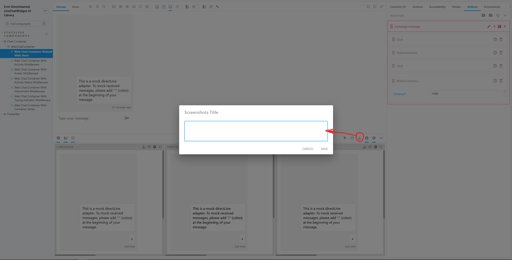
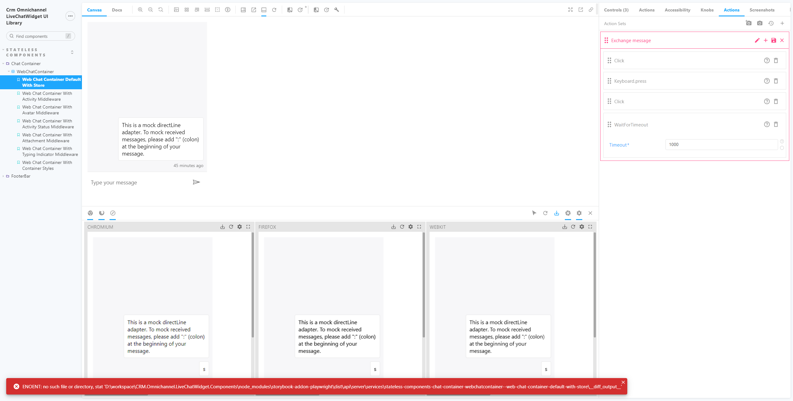

# How to Add Visual Regression Tests

## Introduction
Visual regression tests compare UI of a certain component or website with baseline snapshots that are taken prior to testing. In this project, we want to test on each React Component instead of a whole page, so useing Playwright directly is not ideal because Playwright only works on webpages. Instead, we will use a storybook addon called `storybook-addon-playwright` ([official addon page](https://storybook.js.org/addons/storybook-addon-playwright)).

## Steps
The whole process for adding visual regression tests is code free, as all the necessary code is already in place and you only need to add screenshots and steps to reproduce in a json file (which is also done automatically).

### Adding new screenshots

1. Define stories
    - Make sure you have stories ready in `.stories.tsx` format that include each scenario you want to test.
1. Start storybook
    - After your code changes are complete, run `yarn storybook` as you normally would when developing. Make sure the port is set to 6006. If unsure, run `yarn storybook -p 6006`.
    - At the tolbar panel, click the "Show Panel" button to review the UI for each browser engine. Currently Chromium, Firefox, and webkit are supported. Now you can see the component as it would look on the three browsers.
    
    - On the addon panel, click on the `Actions` tab to the left of the `Screenshots` tab. There will be 2 "Actions" tab, so make sure you choose the one on the right. Next, create action sets that you want to execute on the component. If you just want to test the static look of the component, you don't need create any actions and and skip to the next step.
    
    - In the exmaple below, the send box is clicked, a key `s` is entered, then send button is pressed to mock the send message behavior. Then I waited 1 second to let the message go through. After the action set is defined, click "Save". For more complicated actions/UX behaviors, you can define more actions sets and change the order to execute them by checking/unchecking the checkbox on the right of the action set. For more details and usages, please go to the [official addon page](https://storybook.js.org/addons/storybook-addon-playwright).
    
    - Now the "Browsers" panel should have finished mocking the behavior you have defined and have reached a state where screenshots are ready to be taken. Click the "Save screenshots" button on the "Browsers" panel, and give the screenshots a name. This name will be a part of the file name that's generated.
    
    - **IMPORTANT!!!!!**: The above step needs to be executed twice for the actions to be logged correctly into the `playwright.json` file so that later on jest and playwright can reproduce this behavior. The first time you do this, you will see the error below, which is a bug on the addon and you can ignore
    
    Upon clicking "Save screenshot" the second time and give it the **SAME** title, you'll see the green popups, meaning both the screenshots and the actions are saved locally.
    
1. Screenshots and actions saved
    - If you did everything correctly, you should see screenshots saved in the `__screenshots__` folder at the same level of your stories file. A `stories.playwright.json`. **Make sure you check in both the json file and the screenshots folder.**
    

### Running the test
1. The test script is already set up in `src/visual.test.ts` so there's no need to add any code. 
2. Run `yarn test:visual` to run all VRTs.
3. You may need to increase the timeout in `visual.test.ts` or use `jest.setTimeout()` if there are many more screenshots to be tested and it exceeds the already-set timeout.
4. If there are any failed tests, the difference image will be saved to a `diff` folder. Currently the failure threshold is 0.05%.
