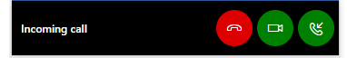
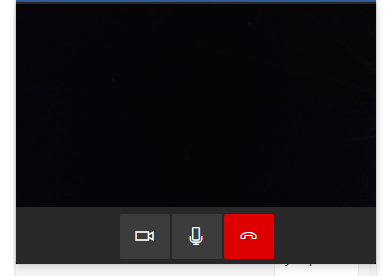
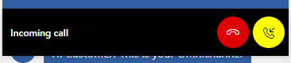
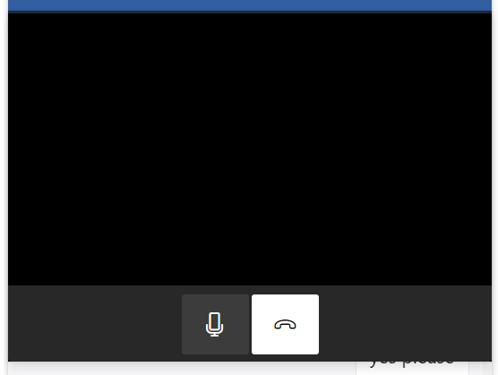

# CallingContainer

## Table of contents

- [Introduction](#introduction)
  - [Term definitions](#term-definitions)
- [Interfaces](#interfaces)
  - [ICallingContainerProps](#icallingcontainerprops)
  - [ICallingContainerControlProps](#icallingcontainercontrolprops)
  - [ICallingContainerStyleProps](#icallingcontainerstyleprops)
  - [IIncomingCallControlProps](#iincomingcallcontrolprops)
  - [IIncomingCallStyleProps](#iincomingcallstyleprops)
  - [ICurrentCallControlProps](#icurrentcallcontrolprops)
  - [ICurrentCallStyleProps](#icurrentcallstyleprops)
  - [ITimer](#itimer)
  - [ICurrentCallClassNames](#icurrentcallclassnames)
- [Sample Scenarios](#sample-scenarios)
  - [Customizing IncomingCall container](#customizing-incomingcall-container)
  - [Customizing CurrentCall container](#customizing-currentcall-container)

## Introduction

By enabling calling options from admin center when creatiing a chat channel, the agent can initiate a voice/video call with the customer for better service. For more details of this feature, see this [public documentation](https://learn.microsoft.com/en-us/dynamics365/customer-service/call-options-visual-engagement).

### Term definitions

IncomingCall:



CurrentCall:



## Interfaces

### [ICallingContainerProps](https://github.com/microsoft/omnichannel-chat-widget/blob/main/chat-components/src/components/callingcontainer/interfaces/ICallingContainerProps.ts)

The top-level interface for customizing `CallingContainer`.

| Property | Type | Required | Description | Default |
| - | - | - | - | - |
controlProps | [ICallingContainerControlProps](#icallingcontainercontrolprops) | No | Properties that control the element behaviors | -
styleProps | [ICallingContainerStyleProps](#icallingcontainerstyleprops) | No | Properties that control the element styles | -

### [ICallingContainerControlProps](https://github.com/microsoft/omnichannel-chat-widget/blob/main/chat-components/src/components/callingcontainer/interfaces/ICallingContainerControlProps.ts)

| Property | Type | Required | Description | Default |
| - | - | - | - | - |
id    | string     | No | The top-level element id for the calling container | "lcw-calling-container"
isIncomingCall | boolean | No | Whether to show the `IncomingCall` screen, or the `CurrentCall` screen. The currentCall screen will appear after an `IncomingCall` request is accepted | false
dir | "rtl"\|"ltr"\|"auto" | No | The locale direction under the `CallingContainer` component | "ltr"
incomingCallControlProps | [IIncomingCallControlProps](#iincomingcallcontrolprops) | No | The control props for the `IncomingCall` screen | [defaultIncomingCallControlProps](https://github.com/microsoft/omnichannel-chat-widget/blob/main/chat-components/src/components/callingcontainer/subcomponents/IncomingCall/common/defaultProps/defaultIncomingCallControlProps.ts)
currentCallControlProps | [ICurrentCallControlProps](#icurrentcallcontrolprops) | No | The control props for the `CurrentCall` screen |  [defaultCurrentCallControlProps](https://github.com/microsoft/omnichannel-chat-widget/blob/main/chat-components/src/components/callingcontainer/subcomponents/CurrentCall/common/defaultProps/defaultCurrentCallControlProps.ts)
hideCallingContainer | boolean | No | Whether to hide the calling container. This is mostly for internal use in case  of minimize scenarios | false

### [ICallingContainerStyleProps](https://github.com/microsoft/omnichannel-chat-widget/blob/main/chat-components/src/components/callingcontainer/interfaces/ICallingContainerStyleProps.ts)

[IStyle](https://github.com/microsoft/fluentui/blob/master/packages/merge-styles/src/IStyle.ts) is the interface provided by [FluentUI](https://developer.microsoft.com/en-us/fluentui#/).

| Property | Type | Required | Description | Default |
| - | - | - | - | - |
| generalStyleProps | [`IStyle`](https://github.com/microsoft/fluentui/blob/master/packages/merge-styles/src/IStyle.ts) | No | Overall styles of the `CallingContainer` component, including the top level container | [`defaultCallingContainerStyles`](https://github.com/microsoft/omnichannel-chat-widget/blob/main/chat-components/src/components/callingcontainer/common/defaultStyles/defaultCallingContainerStyles.ts) |
| className | string | No | Calling container's class name | -
| incomingCallStyleProps | [IIncomingCallStyleProps](#iincomingcallstyleprops) | No | Styles of the `IncomingCall` container | -
| currentCallStyleProps | [ICurrentCallStyleProps](#icurrentcallstyleprops) | No | Styles of the `CurrentCall` container | -

### [IIncomingCallControlProps](https://github.com/microsoft/omnichannel-chat-widget/blob/main/chat-components/src/components/callingcontainer/subcomponents/IncomingCall/interfaces/IIncomingCallControlProps.ts)

| Property | Type | Required | Description | Default |
| - | - | - | - | - |
id    | string     | No | The top-level element id for the `IncomingCall` container | "lcw-incoming-call"
dir | "rtl"\|"ltr"\|"auto" | No | The locale direction under the `IncomingCall` component | "ltr"
ariaLabel | string | No | The aria label of the `IncomingCall` component | "`IncomingCall` area"
className | string | No | The class name of the `IncomingCall` component | -
hideAudioCall | boolean | No | Whether to hide the "Accept audio call" button | false
hideVideoCall | boolean | No | Whether to hide the "Accept video call" button | false
hideDeclineCall | boolean | No | Whether to hide the "Decline call" button | false
hideIncomingCallTitle | boolean | No | Whether to hide the title text of the `IncomingCall` screen | false
incomingCallTitle | [ILabelControlProps](https://github.com/microsoft/omnichannel-chat-widget/blob/main/chat-components/src/components/common/interfaces/ILabelControlProps.ts) | No | The title text props | [defaultIncomingCallControlProps](https://github.com/microsoft/omnichannel-chat-widget/blob/main/chat-components/src/components/callingcontainer/subcomponents/IncomingCall/common/defaultProps/defaultIncomingCallControlProps.ts)
onAudioCallClick | () => void | No | Defines the behavior when the "Accept audio call" button is clicked | [Starts the audio call and shows `CurrentCall` screen]
onVideoCallClick | () => void | No | Defines the behavior when the "Accept video call" button is clicked | [Starts the video call and shows `CurrentCall` screen]
onDeclineCallClick | () => void | No | Defines the behavior when the "Decline call" button is clicked | [Hides the `IncomingCall` screen and returns to chat]
audioCallButtonProps | [ICommandButtonControlProps](https://github.com/microsoft/omnichannel-chat-widget/blob/main/chat-components/src/components/common/interfaces/ICommandButtonControlProps.ts) | No | Define more properties of the "Accept audio call" button | [defaultIncomingCallControlProps](https://github.com/microsoft/omnichannel-chat-widget/blob/main/chat-components/src/components/callingcontainer/subcomponents/IncomingCall/common/defaultProps/defaultIncomingCallControlProps.ts)
videoCallButtonProps | [ICommandButtonControlProps](https://github.com/microsoft/omnichannel-chat-widget/blob/main/chat-components/src/components/common/interfaces/ICommandButtonControlProps.ts) | No | Define more properties of the "Accept video call" button | [defaultIncomingCallControlProps](https://github.com/microsoft/omnichannel-chat-widget/blob/main/chat-components/src/components/callingcontainer/subcomponents/IncomingCall/common/defaultProps/defaultIncomingCallControlProps.ts)
declineCallButtonProps | [ICommandButtonControlProps](https://github.com/microsoft/omnichannel-chat-widget/blob/main/chat-components/src/components/common/interfaces/ICommandButtonControlProps.ts) | No | Define more properties of the "Decline call" button | [defaultIncomingCallControlProps](https://github.com/microsoft/omnichannel-chat-widget/blob/main/chat-components/src/components/callingcontainer/subcomponents/IncomingCall/common/defaultProps/defaultIncomingCallControlProps.ts)
leftGroup | {gap?: number, children: ReactNode[] \| string[]} | No | Add more custom components on the left side of the control | -
middleGroup | {gap?: number, children: ReactNode[] \| string[]} | No | Add more custom components on the middle section of the control | -
rightGroup | {gap?: number, children: ReactNode[] \| string[]} | No | Add more custom components on the right side of the control | -

### [IIncomingCallStyleProps](https://github.com/microsoft/omnichannel-chat-widget/blob/main/chat-components/src/components/callingcontainer/subcomponents/IncomingCall/interfaces/IIncomingCallStyleProps.ts)

[IStyle](https://github.com/microsoft/fluentui/blob/master/packages/merge-styles/src/IStyle.ts) is the interface provided by [FluentUI](https://developer.microsoft.com/en-us/fluentui#/).

| Property | Type | Required | Description | Default |
| - | - | - | - | - |
| generalStyleProps | [IStyle](https://github.com/microsoft/fluentui/blob/master/packages/merge-styles/src/IStyle.ts) | No | Overall styles of the `IncomingCall` component, including the container | [defaultIncomingCallStyleProps](https://github.com/microsoft/omnichannel-chat-widget/blob/main/chat-components/src/components/callingcontainer/subcomponents/IncomingCall/common/defaultStyles/defaultIncomingCallStyleProps.ts) |
| audioCallButtonStyleProps | [IStyle](https://github.com/microsoft/fluentui/blob/master/packages/merge-styles/src/IStyle.ts) | No | Styles of the "Accept audio call" button | [defaultIncomingCallStyleProps](https://github.com/microsoft/omnichannel-chat-widget/blob/main/chat-components/src/components/callingcontainer/subcomponents/IncomingCall/common/defaultStyles/defaultIncomingCallStyleProps.ts) |
| audioCallButtonHoverStyleProps | [IStyle](https://github.com/microsoft/fluentui/blob/master/packages/merge-styles/src/IStyle.ts) | No | Styles of the "Accept audio call" button while hovered | [defaultIncomingCallStyleProps](https://github.com/microsoft/omnichannel-chat-widget/blob/main/chat-components/src/components/callingcontainer/subcomponents/IncomingCall/common/defaultStyles/defaultIncomingCallStyleProps.ts) |
| videoCallButtonStyleProps | [IStyle](https://github.com/microsoft/fluentui/blob/master/packages/merge-styles/src/IStyle.ts) | No | Styles of the "Accept video call" button | [defaultIncomingCallStyleProps](https://github.com/microsoft/omnichannel-chat-widget/blob/main/chat-components/src/components/callingcontainer/subcomponents/IncomingCall/common/defaultStyles/defaultIncomingCallStyleProps.ts) |
| videoCallButtonHoverStyleProps | [IStyle](https://github.com/microsoft/fluentui/blob/master/packages/merge-styles/src/IStyle.ts) | No | Styles of the "Accept video call" button while hovered | [defaultIncomingCallStyleProps](https://github.com/microsoft/omnichannel-chat-widget/blob/main/chat-components/src/components/callingcontainer/subcomponents/IncomingCall/common/defaultStyles/defaultIncomingCallStyleProps.ts) |
| declineCallButtonStyleProps | [IStyle](https://github.com/microsoft/fluentui/blob/master/packages/merge-styles/src/IStyle.ts) | No | Styles of the "Decline call" button | [defaultIncomingCallStyleProps](https://github.com/microsoft/omnichannel-chat-widget/blob/main/chat-components/src/components/callingcontainer/subcomponents/IncomingCall/common/defaultStyles/defaultIncomingCallStyleProps.ts) |
| declineCallButtonHoverStyleProps | [IStyle](https://github.com/microsoft/fluentui/blob/master/packages/merge-styles/src/IStyle.ts) | No | Styles of the "Decline call" button while hovered | [defaultIncomingCallStyleProps](https://github.com/microsoft/omnichannel-chat-widget/blob/main/chat-components/src/components/callingcontainer/subcomponents/IncomingCall/common/defaultStyles/defaultIncomingCallStyleProps.ts) |
| incomingCallTitleStyleProps | [IStyle](https://github.com/microsoft/fluentui/blob/master/packages/merge-styles/src/IStyle.ts) | No | Styles of the title text | [defaultIncomingCallStyleProps](https://github.com/microsoft/omnichannel-chat-widget/blob/main/chat-components/src/components/callingcontainer/subcomponents/IncomingCall/common/defaultStyles/defaultIncomingCallStyleProps.ts) |
| itemFocusStyleProps | [IStyle](https://github.com/microsoft/fluentui/blob/master/packages/merge-styles/src/IStyle.ts) | No | Styles of the buttons while on focus | [defaultIncomingCallStyleProps](https://github.com/microsoft/omnichannel-chat-widget/blob/main/chat-components/src/components/callingcontainer/subcomponents/IncomingCall/common/defaultStyles/defaultIncomingCallStyleProps.ts) |
| className | string | No | The class name of the `IncomingCall` container | [defaultIncomingCallStyleProps](https://github.com/microsoft/omnichannel-chat-widget/blob/main/chat-components/src/components/callingcontainer/subcomponents/IncomingCall/common/defaultStyles/defaultIncomingCallStyleProps.ts) |

### [ICurrentCallControlProps](https://github.com/microsoft/omnichannel-chat-widget/blob/main/chat-components/src/components/callingcontainer/subcomponents/CurrentCall/interfaces/ICurrentCallControlProps.ts)

| Property | Type | Required | Description | Default |
| - | - | - | - | - |
id    | string     | No | The top-level element id for the `CurrentCall` container | "lcw-current-call"
dir | "rtl"\|"ltr"\|"auto" | No | The locale direction under the `CurrentCall` component | "ltr"
ariaLabel | string | No | The aria label of the `CurrentCall` component | "`CurrentCall` area"
nonActionIds | [ICurrentCallNonActionControlIds](#icurrentcallnonactioncontrolids) | No | Sets the ids of several sub-components | see [ICurrentCallNonActionControlIds](#icurrentcallnonactioncontrolids)
hideMicButton | boolean | No | Whether to hide the "Enable/Disable Microphone" button | false
hideVideoButton | boolean | No | Whether to hide the "Enable/Disable Video" button | false
hideEndCallButton | boolean | No | Whether to hide the "End call" button | false
hideCallTimer | boolean | No | Whether to hide the call timer component | false
videoCallDisabled | boolean | No | Whether to completely disable video calls | false
remoteVideoDisabled | boolean | No | Whether to hide the video screen of the agent | false
selfVideoDisabled | boolean | No | Whether to hide the video screen of the customer | false
onEndCallClick | () => void | No | Defines the behavior when the "End call" button is clicked | [Hides the `CurrentCall` screen and returns to chat]
onMicCallClick | () => void | No | Defines the behavior when the "Enable/Disable Microphone" button is clicked | [Enables/Disables microphone input]
onVideoOffClick | () => void | No | Defines the behavior when the "Enable/Disable Video" button is clicked | [Enables/Disables video input]
micButtonProps | [ICommandButtonControlProps](https://github.com/microsoft/omnichannel-chat-widget/blob/main/chat-components/src/components/common/interfaces/ICommandButtonControlProps.ts) | No | Define more properties of the "Enable/Disable Microphone" button | [defaultCurrentCallControlProps](https://github.com/microsoft/omnichannel-chat-widget/blob/main/chat-components/src/components/callingcontainer/subcomponents/CurrentCall/common/defaultProps/defaultCurrentCallControlProps.ts)
videoButtonProps | [ICommandButtonControlProps](https://github.com/microsoft/omnichannel-chat-widget/blob/main/chat-components/src/components/common/interfaces/ICommandButtonControlProps.ts) | No | Define more properties of the "Enable/Disable Video" button | [defaultCurrentCallControlProps](https://github.com/microsoft/omnichannel-chat-widget/blob/main/chat-components/src/components/callingcontainer/subcomponents/CurrentCall/common/defaultProps/defaultCurrentCallControlProps.ts)
endCallButtonProps | [ICommandButtonControlProps](https://github.com/microsoft/omnichannel-chat-widget/blob/main/chat-components/src/components/common/interfaces/ICommandButtonControlProps.ts) | No | Define more properties of the "End call" button | [defaultCurrentCallControlProps](https://github.com/microsoft/omnichannel-chat-widget/blob/main/chat-components/src/components/callingcontainer/subcomponents/CurrentCall/common/defaultProps/defaultCurrentCallControlProps.ts)
callTimerProps | [ITimer](#itimer) | No | Define more properties of the `Timer` component | [defaultCurrentCallControlProps](https://github.com/microsoft/omnichannel-chat-widget/blob/main/chat-components/src/components/callingcontainer/subcomponents/CurrentCall/common/defaultProps/defaultCurrentCallControlProps.ts)
leftGroup | {gap?: number, children: ReactNode[] \| string[]} | No | Add more custom components on the left side of the control | -
middleGroup | {gap?: number, children: ReactNode[] \| string[]} | No | Add more custom components on the middle section of the control | -
rightGroup | {gap?: number, children: ReactNode[] \| string[]} | No | Add more custom components on the right side of the control | -

### [ICurrentCallStyleProps](https://github.com/microsoft/omnichannel-chat-widget/blob/main/chat-components/src/components/header/interfaces/IHeaderStyleProps.ts)

[IStyle](https://github.com/microsoft/fluentui/blob/master/packages/merge-styles/src/IStyle.ts) is the interface provided by [FluentUI](https://developer.microsoft.com/en-us/fluentui#/).

| Property | Type | Required | Description | Default |
| - | - | - | - | - |
| generalStyleProps | [IStyle](https://github.com/microsoft/fluentui/blob/master/packages/merge-styles/src/IStyle.ts) | No | Overall styles of the `CurrentCall` component, including the container | [defaultCurrentCallStyleProps](https://github.com/microsoft/omnichannel-chat-widget/blob/main/chat-components/src/components/callingcontainer/subcomponents/IncomingCall/common/defaultStyles/defaultCurrentCallStyleProps.ts) |
| micButtonStyleProps | [IStyle](https://github.com/microsoft/fluentui/blob/master/packages/merge-styles/src/IStyle.ts) | No | Styles of the "Enable/Disable Microphone" button | [defaultCurrentCallStyleProps](https://github.com/microsoft/omnichannel-chat-widget/blob/main/chat-components/src/components/callingcontainer/subcomponents/IncomingCall/common/defaultStyles/defaultCurrentCallStyleProps.ts) |
| micButtonHoverStyleProps | [IStyle](https://github.com/microsoft/fluentui/blob/master/packages/merge-styles/src/IStyle.ts) | No | Styles of the "Enable/Disable Microphone" button while hovered | [defaultCurrentCallStyleProps](https://github.com/microsoft/omnichannel-chat-widget/blob/main/chat-components/src/components/callingcontainer/subcomponents/IncomingCall/common/defaultStyles/defaultCurrentCallStyleProps.ts) |
| videoOffButtonStyleProps | [IStyle](https://github.com/microsoft/fluentui/blob/master/packages/merge-styles/src/IStyle.ts) | No | Styles of the "Enable/Disable Video" button | [defaultCurrentCallStyleProps](https://github.com/microsoft/omnichannel-chat-widget/blob/main/chat-components/src/components/callingcontainer/subcomponents/IncomingCall/common/defaultStyles/defaultCurrentCallStyleProps.ts) |
| videoOffButtonHoverStyleProps | [IStyle](https://github.com/microsoft/fluentui/blob/master/packages/merge-styles/src/IStyle.ts) | No | Styles of the "Enable/Disable Video" button while hovered | [defaultCurrentCallStyleProps](https://github.com/microsoft/omnichannel-chat-widget/blob/main/chat-components/src/components/callingcontainer/subcomponents/IncomingCall/common/defaultStyles/defaultCurrentCallStyleProps.ts) |
| endCallButtonStyleProps | [IStyle](https://github.com/microsoft/fluentui/blob/master/packages/merge-styles/src/IStyle.ts) | No | Styles of the "End call" button | [defaultCurrentCallStyleProps](https://github.com/microsoft/omnichannel-chat-widget/blob/main/chat-components/src/components/callingcontainer/subcomponents/IncomingCall/common/defaultStyles/defaultCurrentCallStyleProps.ts) |
| endCallButtonHoverStyleProps | [IStyle](https://github.com/microsoft/fluentui/blob/master/packages/merge-styles/src/IStyle.ts) | No | Styles of the "End call" button while hovered | [defaultCurrentCallStyleProps](https://github.com/microsoft/omnichannel-chat-widget/blob/main/chat-components/src/components/callingcontainer/subcomponents/IncomingCall/common/defaultStyles/defaultCurrentCallStyleProps.ts) |
| videoTileStyleWithVideoProps | [IStyle](https://github.com/microsoft/fluentui/blob/master/packages/merge-styles/src/IStyle.ts) | No | Styles of the video section, if video tile is not hidden | [defaultCurrentCallStyleProps](https://github.com/microsoft/omnichannel-chat-widget/blob/main/chat-components/src/components/callingcontainer/subcomponents/IncomingCall/common/defaultStyles/defaultCurrentCallStyleProps.ts) |
| videoTileStyleProps | [IStyle](https://github.com/microsoft/fluentui/blob/master/packages/merge-styles/src/IStyle.ts) | No | Styles of the video section, if video tile is hidden by setting `videoCallDisabled`| [defaultCurrentCallStyleProps](https://github.com/microsoft/omnichannel-chat-widget/blob/main/chat-components/src/components/callingcontainer/subcomponents/IncomingCall/common/defaultStyles/defaultCurrentCallStyleProps.ts) |
| selfVideoMaximizeStyleProps | [IStyle](https://github.com/microsoft/fluentui/blob/master/packages/merge-styles/src/IStyle.ts) | No | Styles of the video section, if video screen of the agent is hidden but customer's video is still enabled. By default, the customer video will take the whole video tile| [defaultCurrentCallStyleProps](https://github.com/microsoft/omnichannel-chat-widget/blob/main/chat-components/src/components/callingcontainer/subcomponents/IncomingCall/common/defaultStyles/defaultCurrentCallStyleProps.ts) |
| remoteVideoStyleProps | [IStyle](https://github.com/microsoft/fluentui/blob/master/packages/merge-styles/src/IStyle.ts) | No | Styles of the video screen of the agent | [defaultChatButtonGeneralStyles](https://github.com/microsoft/omnichannel-chat-widget/blob/main/chat-components/src/components/callingcontainer/subcomponents/IncomingCall/common/defaultStyles/defaultCurrentCallStyleProps.ts) |
| selfVideoStyleProps | [IStyle](https://github.com/microsoft/fluentui/blob/master/packages/merge-styles/src/IStyle.ts) | No | Styles of the video screen of the customer | [defaultChatButtonGeneralStyles](https://github.com/microsoft/omnichannel-chat-widget/blob/main/chat-components/src/components/callingcontainer/subcomponents/IncomingCall/common/defaultStyles/defaultCurrentCallStyleProps.ts) |
| itemFocusStyleProps | [IStyle](https://github.com/microsoft/fluentui/blob/master/packages/merge-styles/src/IStyle.ts) | No | Styles of the buttons while on focus | [defaultChatButtonGeneralStyles](https://github.com/microsoft/omnichannel-chat-widget/blob/main/chat-components/src/components/callingcontainer/subcomponents/IncomingCall/common/defaultStyles/defaultCurrentCallStyleProps.ts) |
| classNames | [ICurrentCallClassNames](#icurrentcallclassnames) | No | The class names of the `CurrentCall` sub-components | - |

### [ICurrentCallNonActionControlIds](https://github.com/microsoft/omnichannel-chat-widget/blob/main/chat-components/src/components/callingcontainer/subcomponents/CurrentCall/interfaces/ICurrentCallNonActionControlIds.ts)

| Property | Type | Required | Description | Default |
| - | - | - | - | - |
videoTileGroupId    | string     | No | Video tiles container id | "lcw-current-call-body"
remoteVideoTileId    | string     | No | agent video component id | "lcw-remote-video"
selfVideoTileId    | string     | No | Self video component id | "lcw-self-video"
currentCallActionGroupId    | string     | No | Current call action group id | "lcw-current-call-action-icons"
currentCallFooterId    | string     | No | Current call footer component id | "lcw-current-call-footer"

### [ITimer](https://github.com/microsoft/omnichannel-chat-widget/blob/main/chat-components/src/components/callingcontainer/subcomponents/Timer/ITimer.ts)

[IStyle](https://github.com/microsoft/fluentui/blob/master/packages/merge-styles/src/IStyle.ts) is the interface provided by [FluentUI](https://developer.microsoft.com/en-us/fluentui#/).

| Property | Type | Required | Description | Default |
| - | - | - | - | - |
id    | string     | No | The top-level element id for the `Timer` component | "lcw-current-call-timer"
showHours | boolean | No | Whether to show the Hour section of the timer | false
timerStyles | [IStyle](https://github.com/microsoft/fluentui/blob/master/packages/merge-styles/src/IStyle.ts) | No | Styles of the `Timer` component | [defaultCurrentCallControlProps](https://github.com/microsoft/omnichannel-chat-widget/blob/main/chat-components/src/components/callingcontainer/subcomponents/CurrentCall/common/defaultProps/defaultCurrentCallControlProps.ts)

### [ICurrentCallClassNames](https://github.com/microsoft/omnichannel-chat-widget/blob/main/chat-components/src/components/callingcontainer/subcomponents/CurrentCall/interfaces/ICurrentCallClassNames.ts)

| Property | Type | Required | Description | Default |
| - | - | - | - | - |
currentCallComponentClassName    | string     | No | The class name for the `CurrentCall` component | -
videoTileGroupClassName    | string     | No | The class name for the video tile section | -
remoteVideoTileClassName    | string     | No | The class name for the video screen of the agent | -
selfVideoTileClassName    | string     | No | The class name for the video screen of the customer | -
currentCallfooterClassName    | string     | No | The class name for the control button group | -

## Sample Scenarios

### Customizing IncomingCall container

<details>
    <summary>Show code</summary>

```tsx
...
liveChatWidgetProps = {
    ...liveChatWidgetProps,
    callingContainerProps: {
        controlProps: {
            incomingCallControlProps: {
                hideVideoCall: true
            }
        },
        styleProps: {
            incomingCallStyleProps: {
                audioCallButtonStyleProps: {
                    color: "black",
                    backgroundColor: "yellow"
                }
            }
        }
    }
};
...
```

</details>



---------------------------------

### Customizing CurrentCall container

<details>
    <summary>Show code</summary>

```tsx
...
liveChatWidgetProps = {
    ...liveChatWidgetProps,
    callingContainerProps: {
        controlProps: {
            currentCallControlProps: {
                hideVideoButton: true
            }
        },
        styleProps: {
            currentCallStyleProps: {
                endCallButtonStyleProps: {
                    color: "black",
                    backgroundColor: "white"
                }
            }
        }
    }
};
...
```

</details>

