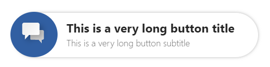
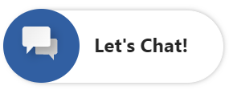
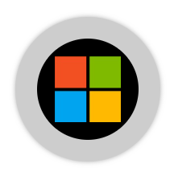
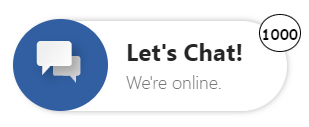
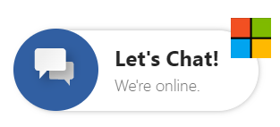

# Chat Button

## Table of contents

- [Interfaces](#interfaces)
  - [IChatButtonProps](#ichatbuttonprops)
  - [IChatButtonComponentOverrides](#ichatbuttoncomponentoverrides)
  - [IChatButtonControlProps](#ichatbuttoncontrolprops)
  - [IChatButtonStyleProps](#ichatbuttonstyleprops)
  - [IChatButtonClassNames](#ichatbuttonclassnames)
- [Sample Scenarios](#sample-scenarios)
  - [Extending button width](#extending-button-width)
  - [Hiding chat button subtitle](#hiding-chat-button-subtitle)
  - [Hiding text container](#hiding-text-container)
  - [Customizing icon and overall styles](#customizing-icon-and-overall-styles)
  - [Customizing the notification bubble](#customizing-the-notification-bubble)
  - [Adding animations to the chat button](#adding-animations-to-the-chat-button)
  - [Overriding default sub-components for ad-hoc needs](#overriding-default-sub-components-for-ad-hoc-needs)

## Interfaces

### [IChatButtonProps](https://github.com/microsoft/omnichannel-chat-widget/blob/main/chat-components/src/components/chatbutton/interfaces/IChatButtonProps.ts)

The top-level interface for customizing `ChatButton`.

| Property | Type | Required | Description | Default |
| - | - | - | - | - |
| componentOverrides     | [IChatButtonComponentOverrides](#ichatbuttoncomponentoverrides)     | No | Used for overriding default `ChatButton` components, e.g., title, subtitle, notification bubble, etc. | -
controlProps | [IChatButtonControlProps](#ichatbuttoncontrolprops) | No | Properties that control the element behaviors | -
styleProps | [IChatButtonStyleProps](#ichatbuttonstyleprops) | No | Properties that control the element styles | -

### [IChatButtonComponentOverrides](https://github.com/microsoft/omnichannel-chat-widget/blob/main/chat-components/src/components/chatbutton/interfaces/IChatButtonComponentOverrides.ts)

Custom React components can be passed as input to override the default sub-components. Alternatively, you can stringify the React component before passing it in. The `chat-components` library provides one util function that can be used: [encodeComponentString](https://github.com/microsoft/omnichannel-chat-widget/blob/main/chat-components/src/common/encodeComponentString.ts).

| Property | Type | Required | Description | Default |
| - | - | - | - | - |
| title | ReactNode\|string | No | Used for overriding default chat button title | -
subtitle | ReactNode\|string | No | Used for overriding default chat button subtitle | -
notificationBubble | ReactNode\|string | No | Used for overriding default notification bubble on unread message count | -
iconContainer | ReactNode\|string | No | Used for overriding default icon element | -
textContainer | ReactNode\|string | No | Used for overriding default text container (container of title and subtitle) | -

### [IChatButtonControlProps](https://github.com/microsoft/omnichannel-chat-widget/blob/main/chat-components/src/components/chatbutton/interfaces/IChatButtonControlProps.ts)

| Property | Type | Required | Description | Default |
| - | - | - | - | - |
| id     | string     | No | The top-level element id for the chat button | "oc-lcw-chat-button"
hideChatButton | boolean | No | Whether to hide the chat button completely | false
hideChatIcon | boolean | No | Whether to hide the icon on the chat button | false
hideChatTextContainer | boolean | No | Whether to hide the text container (containing title and subtitle) on the chat button | false
hideChatTitle | boolean | No | Whether to hide the chat title on the chat button | false
hideChatSubtitle | boolean | No | Whether to hide the chat subtitle on the chat button | false
hideNotificationBubble | boolean | No | Whether to hide the notification bubbble (container unread message count) on the chat button | true
role | string | No | Sets the `role` attribute at the top level element of the chat button | "button"
titleText | string | No | The chat button title | "Let's Chat!"
subtitleText | string | No | The chat button subtitle | "We're online."
unreadMessageCount | string | No | Sets the content inside the notification bubble | "0"
unreadMessageString | string | No | This text (appending after `unreadMessageCount` or `largeUnreadMessageString`) will be announced by screen readers | "new messages"
largeUnreadMessageString | string | No | This text (appended by `unreadMessageString`) will be announced by screen readers when there are more than 99 unread messages | "99+"
ariaLabelUnreadMessageString | string | No | Sets the `aria-label` attribute on the notification bubble | "you have new messages"
dir | "rtl"\|"ltr"\|"auto" | No | The locale direction under the `ChatButton` component | "ltr"
onClick | () => void | No | Sets the behavior after the chat button is clicked | [Starts the chat flow]

> :pushpin: If both `hide-` option and `componentOverride` are used on the same sub-component, that sub-component will be hidden. hide-` options take higher priority.

### [IChatButtonStyleProps](https://github.com/microsoft/omnichannel-chat-widget/blob/main/chat-components/src/components/chatbutton/interfaces/IChatButtonStyleProps.ts)

[IStyle](https://github.com/microsoft/fluentui/blob/master/packages/merge-styles/src/IStyle.ts) is the interface provided by [FluentUI](https://developer.microsoft.com/en-us/fluentui#/).

| Property | Type | Required | Description | Default |
| - | - | - | - | - |
| generalStyleProps | [IStyle](https://github.com/microsoft/fluentui/blob/master/packages/merge-styles/src/IStyle.ts) | No | Overall styles of the `ChatButton` component, including the container | [defaultChatButtonGeneralStyles](https://github.com/microsoft/omnichannel-chat-widget/blob/main/chat-components/src/components/chatbutton/common/defaultStyles/defaultChatButtonGeneralStyles.ts) |
| iconStyleProps | [IStyle](https://github.com/microsoft/fluentui/blob/master/packages/merge-styles/src/IStyle.ts) | No | Styles of the chat button icon | [defaultChatButtonIconContainerStyles](https://github.com/microsoft/omnichannel-chat-widget/blob/main/chat-components/src/components/chatbutton/common/defaultStyles/defaultChatButtonIconContainerStyles.ts) |
| titleStyleProps | [IStyle](https://github.com/microsoft/fluentui/blob/master/packages/merge-styles/src/IStyle.ts) | No | Styles of the chat button title | [defaultChatButtonTitleStyles](https://github.com/microsoft/omnichannel-chat-widget/blob/main/chat-components/src/components/chatbutton/common/defaultStyles/defaultChatButtonTitleStyles.ts) |
| subtitleStyleProps | [IStyle](https://github.com/microsoft/fluentui/blob/master/packages/merge-styles/src/IStyle.ts) | No | Styles of the chat button subtitle | [defaultChatButtonSubTitleStyles](https://github.com/microsoft/omnichannel-chat-widget/blob/main/chat-components/src/components/chatbutton/common/defaultStyles/defaultChatButtonSubTitleStyles.ts) |
| textContainerStyleProps | [IStyle](https://github.com/microsoft/fluentui/blob/master/packages/merge-styles/src/IStyle.ts) | No | Styles of the container for title and subtitle | [defaultChatButtonTextContainerStyles](https://github.com/microsoft/omnichannel-chat-widget/blob/main/chat-components/src/components/chatbutton/common/defaultStyles/defaultChatButtonTextContainerStyles.ts) |
| notificationBubbleStyleProps | [IStyle](https://github.com/microsoft/fluentui/blob/master/packages/merge-styles/src/IStyle.ts) | No | Styles of the unread message notification bubble | [defaultChatButtonNotificationBubbleStyles](https://github.com/microsoft/omnichannel-chat-widget/blob/main/chat-components/src/components/chatbutton/common/defaultStyles/defaultChatButtonNotificationBubbleStyles.ts) |
| chatButtonHoveredStyleProps | [IStyle](https://github.com/microsoft/fluentui/blob/master/packages/merge-styles/src/IStyle.ts) | No | Styles of the chat button while hovered | - |
| classNames | [IChatButtonClassNames](#ichatbuttonclassnames) | No | Sets custom class names for sub-components | - |

### [IChatButtonClassNames](https://github.com/microsoft/omnichannel-chat-widget/blob/main/chat-components/src/components/chatbutton/interfaces/IChatButtonClassNames.ts)

| Property | Type | Required | Description | Default |
| - | - | - | - | - |
| titleClassName | string | No | Custom class name for title | -
| subtitleClassName | string | No | Custom class name for subtitle | -
| textContainerClassName | string | No | Custom class name for text container | -
| notificationBubbleClassName | string | No | Custom class name for notification bubble | -
| iconContainerClassName | string | No | Custom class name for icon container | -

## Sample Scenarios

Below samples are build upon the base sample, which can be found [here](https://github.com/microsoft/omnichannel-chat-widget#example-usage). The code snippets below will only show the changes needed to be added before `ReactDOM.render`.

--------------------------------

### Extending button width

<details>
    <summary>Show code</summary>

```tsx
...
liveChatWidgetProps = {
    ...liveChatWidgetProps,
    chatButtonProps: {
        controlProps: {
            titleText: "This is a very long button title",
            subtitleText: "This is a very long button subtitle"
        },
        styleProps: {
            generalStyleProps: {
                width: "330px"
            },
            titleStyleProps: {
                width: "100%",
                padding: "0px"
            },
            subtitleStyleProps: {
                width: "100%",
                padding: "0px"
            }
        }
    }
};
...
```

</details>



--------------------------------

### Hiding chat button subtitle

<details>
    <summary>Show code</summary>

```tsx
...
liveChatWidgetProps = {
    ...liveChatWidgetProps,
    chatButtonProps: {
        controlProps: {
            hideChatSubtitle: true
        }
    }
};
...
```

</details>



--------------------------------

### Hiding text container

<details>
    <summary>Show code</summary>

```tsx
...
liveChatWidgetProps = {
    ...liveChatWidgetProps,
    chatButtonProps: {
        controlProps: {
            hideChatTextContainer: true
        },
        styleProps: {
            generalStyleProps: {
                minWidth: "60px",
                width: "60px",
                height: "60px"
            }
        }
    }
};
...
```

</details>


--------------------------------

### Customizing icon and overall styles

<details>
    <summary>Show code</summary>

```tsx
...
liveChatWidgetProps = {
    ...liveChatWidgetProps,
    chatButtonProps: {
        controlProps: {
            hideChatTextContainer: true
        },
        styleProps: {
            generalStyleProps: {
                height: "120px",
                width: "120px",
                backgroundColor: "black",
                justifyContent: "center",
                alignItems: "center",
                borderStyle: "none",
                "&:hover": {
                    backgroundColor: "#cdcdcd",
                }
            },
            iconStyleProps: {
                width: "70%",
                height: "70%",
                cursor: "pointer",
                backgroundImage: "url(https://msft-lcw-trial.azureedge.net/public/resources/microsoft.jpg)",
                backgroundColor: "black",
                borderStyle: "none",
                margin: "0px"
            }
        }
    }
};
...
```

</details>



--------------------------------

### Customizing the notification bubble

<details>
    <summary>Show code</summary>

```tsx
...
liveChatWidgetProps = {
    ...liveChatWidgetProps,
    chatButtonProps: {
        controlProps: {
            hideNotificationBubble: false,
            unreadMessageCount: "1000"
        },
        styleProps: {
            notificationBubbleStyleProps: {
                right: "-10px",
                fontSize: "10px",
                backgroundColor: "white",
                fontFamily: "Comic Sans MS",
                borderStyle: "solid",
                borderWidth: "1px",
                borderColor: "black",
                color: "black"
            }
        }
    }
};
...
```

</details>



> :pushpin: If `unreadMessageCount` is `"0"` or empty, then the notification bubble will be hidden.

--------------------------------

### Adding animations to the chat button

The ChatButton component supports CSS animations through the `generalStyleProps.animation` property. You can create engaging effects like shake, bounce, pulse, and glow animations.

> 📝 **Live Demo**: See the animations in action with the [Chat Button Animation Demo](../examples/chat-button-animations-demo.html)

#### Option 1: Using the provided CSS file

Download and include the [chat-button-animations.css](../styles/chat-button-animations.css) file in your application, then use the animation names directly:

<details>
    <summary>Show code</summary>

```tsx
....
// Shake animation on page load (perfect for Power Pages)
liveChatWidgetProps = {
    ...liveChatWidgetProps,
    chatButtonProps: {
        styleProps: {
            generalStyleProps: {
                animation: "chatButtonShake 0.5s ease-in-out 3 0.5s"
            }
        }
    }
};

// Bounce animation on page load
liveChatWidgetProps = {
    ...liveChatWidgetProps,
    chatButtonProps: {
        styleProps: {
            generalStyleProps: {
                animation: "chatButtonBounce 0.6s ease-in-out 2 1s"
            }
        }
    }
};

// Continuous pulse effect
liveChatWidgetProps = {
    ...liveChatWidgetProps,
    chatButtonProps: {
        styleProps: {
            generalStyleProps: {
                animation: "chatButtonPulse 1s ease-in-out infinite"
            }
        }
    }
};

// Continuous glow effect
liveChatWidgetProps = {
    ...liveChatWidgetProps,
    chatButtonProps: {
        styleProps: {
            generalStyleProps: {
                animation: "chatButtonGlow 2s ease-in-out infinite"
            }
        }
    }
};
....
```

</details>

#### Option 2: Using the animation property with predefined values

Create a simple JavaScript object with the animation values:

<details>
    <summary>Show code</summary>

```tsx
....
// Define animation configurations
const chatButtonAnimations = {
    shakeOnLoad: "chatButtonShake 0.5s ease-in-out 3 0.5s",
    bounceOnLoad: "chatButtonBounce 0.6s ease-in-out 2 1s",
    pulseContinuous: "chatButtonPulse 1s ease-in-out infinite",
    glowContinuous: "chatButtonGlow 2s ease-in-out infinite"
};

// Apply the animation
liveChatWidgetProps = {
    ...liveChatWidgetProps,
    chatButtonProps: {
        styleProps: {
            generalStyleProps: {
                animation: chatButtonAnimations.shakeOnLoad
            }
        }
    }
};
....
```

</details>

#### Option 3: Custom animations

You can define your own keyframe animations and apply them:

<details>
    <summary>Show code</summary>

```css
/* Add this to your CSS file */
@keyframes myCustomAnimation {
    0% { transform: rotate(0deg); }
    25% { transform: rotate(90deg); }
    50% { transform: rotate(180deg); }
    75% { transform: rotate(270deg); }
    100% { transform: rotate(360deg); }
}
```

```tsx
....
liveChatWidgetProps = {
    ...liveChatWidgetProps,
    chatButtonProps: {
        styleProps: {
            generalStyleProps: {
                animation: "myCustomAnimation 2s linear infinite"
            }
        }
    }
};
....
```

</details>

#### Available animations

The provided CSS file includes these animations:

| Animation | Description | Usage Example |
|-----------|-------------|---------------|
| `chatButtonShake` | Horizontal shake movement | `"chatButtonShake 0.5s ease-in-out 3 0.5s"` |
| `chatButtonBounce` | Vertical bounce movement | `"chatButtonBounce 0.6s ease-in-out 2 1s"` |
| `chatButtonPulse` | Scale pulse effect | `"chatButtonPulse 1s ease-in-out infinite"` |
| `chatButtonGlow` | Glowing shadow effect | `"chatButtonGlow 2s ease-in-out infinite"` |

#### Animation syntax

The CSS animation property follows this format:
```
animation: "name duration timing-function iteration-count delay"
```

- **name**: The keyframe name (e.g., `chatButtonShake`)
- **duration**: How long the animation takes (e.g., `0.5s`)
- **timing-function**: Animation easing (e.g., `ease-in-out`)
- **iteration-count**: How many times to repeat (e.g., `3` or `infinite`)
- **delay**: When to start the animation (e.g., `0.5s`)

--------------------------------

### Overriding default sub-components for ad-hoc needs

<details>
    <summary>Show code</summary>

```tsx
...
const CustomImage = () => {
    return (
        </img>
    );
};

liveChatWidgetProps = {
    ...liveChatWidgetProps,
    chatButtonProps: {
        controlProps: {
            hideNotificationBubble: false,
            unreadMessageCount: "1000"
        },
        componentOverrides: {
            notificationBubble: <CustomImage/>
        }
    }
};
...
```

</details>



--------------------------------

### Adding animations to the chat button

You can add various animations to the chat button using the `generalStyleProps`. The component provides predefined animations that can be imported and used directly.

<details>
    <summary>Show code</summary>

```tsx
...
import { chatButtonShakeOnLoad, chatButtonBounceRepeating, chatButtonPulseAnimation } from "@microsoft/omnichannel-chat-components";

// Shake animation on page load
liveChatWidgetProps = {
    ...liveChatWidgetProps,
    chatButtonProps: {
        styleProps: {
            generalStyleProps: {
                ...chatButtonShakeOnLoad
            }
        }
    }
};

// Or use custom animation properties
liveChatWidgetProps = {
    ...liveChatWidgetProps,
    chatButtonProps: {
        styleProps: {
            generalStyleProps: {
                animation: "chatButtonShake 0.5s ease-in-out 3 0.5s" // shake 3 times after 0.5s delay
            }
        }
    }
};

// Continuous pulse animation
liveChatWidgetProps = {
    ...liveChatWidgetProps,
    chatButtonProps: {
        styleProps: {
            generalStyleProps: {
                ...chatButtonPulseAnimation
            }
        }
    }
};
...
```

Available predefined animations:
- `chatButtonShakeAnimation`: Single shake effect
- `chatButtonBounceAnimation`: Single bounce effect  
- `chatButtonPulseAnimation`: Continuous pulse effect
- `chatButtonGlowAnimation`: Continuous glow effect
- `chatButtonShakeRepeating`: Shake 3 times
- `chatButtonBounceRepeating`: Bounce 2 times
- `chatButtonShakeOnLoad`: Shake 3 times with 0.5s delay (ideal for page load)
- `chatButtonBounceOnLoad`: Bounce 2 times with 1s delay (ideal for page load)

Available keyframe animations:
- `chatButtonShake`: Horizontal shake movement
- `chatButtonBounce`: Vertical bounce movement
- `chatButtonPulse`: Scale pulse effect
- `chatButtonGlow`: Glowing shadow effect

</details>
