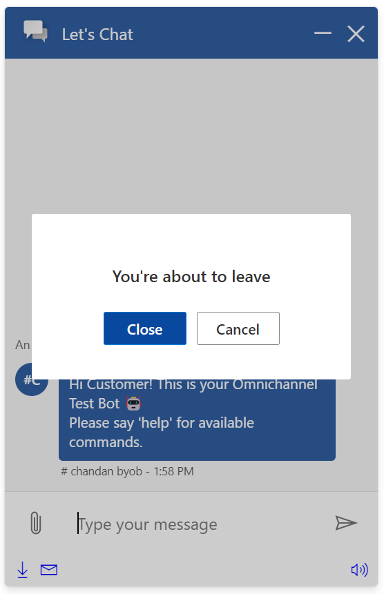
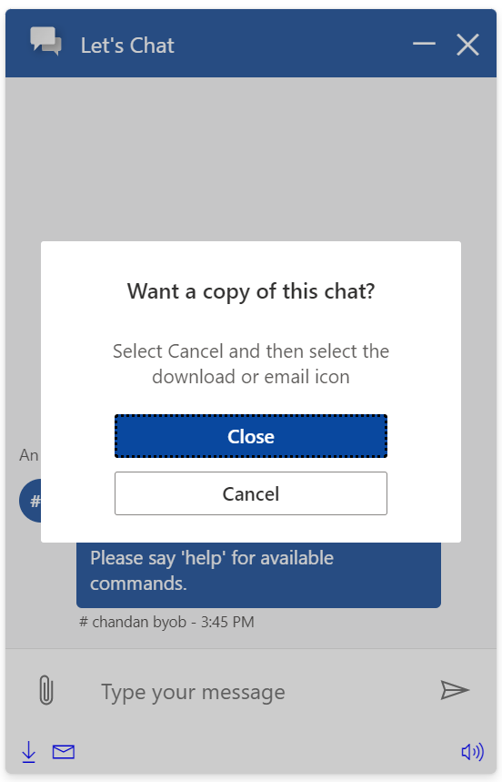
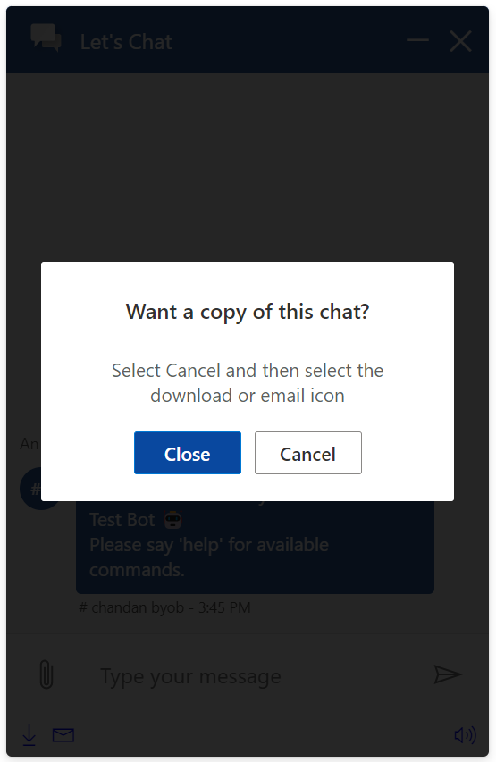
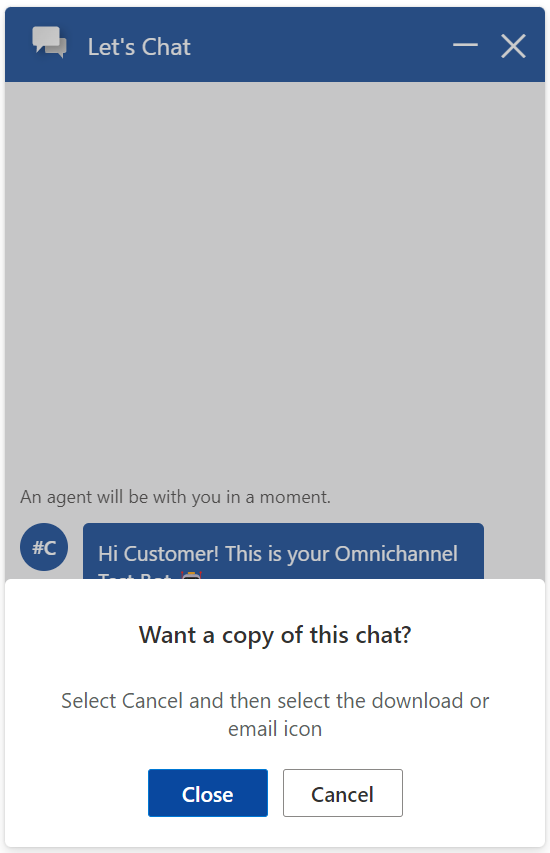
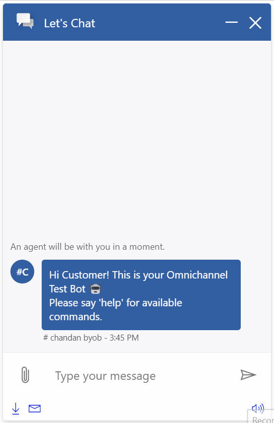

# Confirmation Pane

## Table of contents

- [Interfaces](#interfaces)
  - [IConfirmationPaneProps](#iconfirmationpaneprops)
  - [IConfirmationPaneComponentOverrides](#iconfirmationpanecomponentoverrides)
  - [IConfirmationPaneControlProps](#iconfirmationpanecontrolprops)
  - [IConfirmationPaneStyleProps](#iconfirmationpanestyleprops)
  - [IConfirmationPaneClassNames](#iconfirmationpaneclassnames)
- [Sample Scenarios](#sample-scenarios)
  - [Hiding subtitle](#hiding-subtitle)
  - [Changing button group flow](#changing-button-group-flow)
  - [Changing background chat brightness](#changing-background-chat-brightness)
  - [Changing position and size](#changing-position-and-size)
  - [Customizing overall styles](#customizing-overall-styles)

## Interfaces

### [IConfirmationPaneProps](https://github.com/microsoft/omnichannel-chat-widget/blob/main/chat-components/src/components/confirmationpane/interfaces/IConfirmationPaneProps.ts)

The top-level interface for customizing `ChatButton`.

| Property | Type | Required | Description | Default |
| - | - | - | - | - |
| componentOverrides     | [IConfirmationPaneComponentOverrides](#iconfirmationpanecomponentoverrides)     | No | Used for overriding default `ConfirmationPane` components, e.g., title, subtitle, confirm button, cancel button, etc. | -
controlProps | [IConfirmationPaneControlProps](#iconfirmationpanecontrolprops) | No | Properties that control the element behaviors | -
styleProps | [IConfirmationPaneStyleProps](#iconfirmationpanestyleprops) | No | Properties that control the element styles | -

### [IConfirmationPaneComponentOverrides](https://github.com/microsoft/omnichannel-chat-widget/blob/main/chat-components/src/components/confirmationpane/interfaces/IConfirmationPaneComponentOverrides.ts)

Custom React components can be passed as input to override the default sub-components. Alternatively, you can stringify the React component before passing it in. The `chat-components` library provides one util function that can be used: [encodeComponentString](https://github.com/microsoft/omnichannel-chat-widget/blob/main/chat-components/src/common/encodeComponentString.ts).

| Property | Type | Required | Description | Default | 
| - | - | - | - | - |
| title     | ReactNode\|string     | No | Used for overriding default title | -
subtitle | ReactNode\|string | No | Used for overriding default subtitle | -
confirmButton | ReactNode\|string | No | Used for overriding default confirm button| -
cancelButton | ReactNode\|string | No | Used for overriding default cancel button | -

### [IConfirmationPaneControlProps](https://github.com/microsoft/omnichannel-chat-widget/blob/main/chat-components/src/components/confirmationpane/interfaces/IConfirmationPaneControlProps.ts)

| Property | Type | Required | Description | Default | 
| - | - | - | - | - |
| id     | string     | No | The top-level element id for the confirmation pane | "lcw-components-confirmation-pane"
hideConfirmationPane | boolean | No | Whether to hide the confirmation pane completely | false
hideTitle | boolean | No | Whether to hide the title | false
hideSubtitle | boolean | No | Whether to hide the subtitle | false
hideConfirmButton | boolean | No | Whether to hide the button that closes the chat | false
hideCancelButton | boolean | No | Whether to hide the button that returns to chat | false
titleText | string | No | The confirmation title text | "Close chat"
subtitleText | string | No | The confirmation subtitle text | "Do you really want to close this chat?"
confirmButtonText | string | No | Sets the text inside the confirm button | "Close"
confirmButtonAriaLabel | string | No | Sets the `aria-label` attribute on the confirm button | "Close chat"
cancelButtonText | string | No | Sets the text inside the cancel button | "Cancel"
cancelButtonAriaLabel | string | No | Sets the `aria-label` attribute on the cancel button | "Cancel. Return to Chat"
brightnessValueOnDim | string | No | When the confirmation pane is brought to front, the background (chat widget) will be dimmed. This prop sets the background brightness value. Range: 0 (transparent) ~ 1 | "0.2"
dir | "rtl"\|"ltr"\|"auto" | No | The locale direction under the `ConfirmationPane` component | "ltr"
onConfirm | () => void | No | Sets the behavior after the confirm button is clicked | [Proceeds to close the chat widget]
onCancel | () => void | No | Sets the behavior after the calcen button is clicked | [Returns to chat]

> :pushpin: If both `hide-` option and `componentOverride` are used on the same sub-component, that sub-component will be hidden. `hide-` options take higher priority.

### [IConfirmationPaneStyleProps](https://github.com/microsoft/omnichannel-chat-widget/blob/main/chat-components/src/components/confirmationpane/interfaces/IConfirmationPaneStyleProps.ts)

[IStyle](https://github.com/microsoft/fluentui/blob/master/packages/merge-styles/src/IStyle.ts) is the interface provided by [FluentUI](https://developer.microsoft.com/en-us/fluentui#/).

| Property | Type | Required | Description | Default | 
| - | - | - | - | - |
| generalStyleProps | [IStyle](https://github.com/microsoft/fluentui/blob/master/packages/merge-styles/src/IStyle.ts) | No | Overall styles of the `ConfirmationPane` component, including the container | [defaultConfirmationPaneGeneralStyles](https://github.com/microsoft/omnichannel-chat-widget/blob/main/chat-components/src/components/confirmationpane/common/defaultStyles/defaultConfirmationPaneGeneralStyles.ts) |
| titleStyleProps | [IStyle](https://github.com/microsoft/fluentui/blob/master/packages/merge-styles/src/IStyle.ts) | No | Styles of the confirmation pane title | [defaultConfirmationPaneTitleStyles](https://github.com/microsoft/omnichannel-chat-widget/blob/main/chat-components/src/components/confirmationpane/common/defaultStyles/defaultConfirmationPaneTitleStyles.ts) |
| subtitleStyleProps | [IStyle](https://github.com/microsoft/fluentui/blob/master/packages/merge-styles/src/IStyle.ts) | No | Styles of the confirmation pane subtitle | [defaultConfirmationPaneSubtitleStyles](https://github.com/microsoft/omnichannel-chat-widget/blob/main/chat-components/src/components/confirmationpane/common/defaultStyles/defaultConfirmationPaneSubtitleStyles.ts) |
| buttonGroupStyleProps | [IStyle](https://github.com/microsoft/fluentui/blob/master/packages/merge-styles/src/IStyle.ts) | No | Styles of the chat button group (container of both buttons) | [defaultConfirmationPaneButtonGroupStyles](https://github.com/microsoft/omnichannel-chat-widget/blob/main/chat-components/src/components/confirmationpane/common/defaultStyles/defaultConfirmationPaneButtonGroupStyles.ts) |
| confirmButtonStyleProps | [IStyle](https://github.com/microsoft/fluentui/blob/master/packages/merge-styles/src/IStyle.ts) | No | Styles of the confirm button | [defaultConfirmationPaneConfirmButtonStyles](https://github.com/microsoft/omnichannel-chat-widget/blob/main/chat-components/src/components/confirmationpane/common/defaultStyles/defaultConfirmationPaneConfirmButtonStyles.ts) |
| confirmButtonHoveredStyleProps | [IStyle](https://github.com/microsoft/fluentui/blob/master/packages/merge-styles/src/IStyle.ts) | No | Styles of the confirm button while hovered | [defaultConfirmationPaneConfirmButtonHoveredStyles](https://github.com/microsoft/omnichannel-chat-widget/blob/main/chat-components/src/components/confirmationpane/common/defaultStyles/defaultConfirmationPaneConfirmButtonHoveredStyles.ts) |
| confirmButtonFocusedStyleProps | [IStyle](https://github.com/microsoft/fluentui/blob/master/packages/merge-styles/src/IStyle.ts) | No | Styles of the confirm button while focused | [defaultConfirmationPaneConfirmButtonFocusedStyles](https://github.com/microsoft/omnichannel-chat-widget/blob/main/chat-components/src/components/confirmationpane/common/defaultStyles/defaultConfirmationPaneConfirmButtonFocusedStyles.ts) |
| cancelButtonStyleProps | [IStyle](https://github.com/microsoft/fluentui/blob/master/packages/merge-styles/src/IStyle.ts) | No | Styles of the cancel button | [defaultConfirmationPaneCancelButtonStyles](https://github.com/microsoft/omnichannel-chat-widget/blob/main/chat-components/src/components/confirmationpane/common/defaultStyles/defaultConfirmationPaneCancelButtonStyles.ts) |
| cancelButtonHoveredStyleProps | [IStyle](https://github.com/microsoft/fluentui/blob/master/packages/merge-styles/src/IStyle.ts) | No | Styles of the cancel button while hovered | [defaultConfirmationPaneCancelButtonHoveredStyles](https://github.com/microsoft/omnichannel-chat-widget/blob/main/chat-components/src/components/confirmationpane/common/defaultStyles/defaultConfirmationPaneCancelButtonHoveredStyles.ts) |
| cancelButtonFocusedStyleProps | [IStyle](https://github.com/microsoft/fluentui/blob/master/packages/merge-styles/src/IStyle.ts) | No | Styles of the cancel button while hovered | [defaultConfirmationPaneCancelButtonFocusedStyles](https://github.com/microsoft/omnichannel-chat-widget/blob/main/chat-components/src/components/confirmationpane/common/defaultStyles/defaultConfirmationPaneCancelButtonFocusedStyles.ts) |
| classNames | [IConfirmationPaneClassNames](#iconfirmationpaneclassnames) | No | Sets custom class names for sub-components | - |

### [IConfirmationPaneClassNames](https://github.com/microsoft/omnichannel-chat-widget/blob/main/chat-components/src/components/confirmationpane/interfaces/IConfirmationPaneClassNames.ts)

| Property | Type | Required | Description | Default | 
| - | - | - | - | - |
| titleClassName | string | No | Custom class name for title | -
| subtitleClassName | string | No | Custom class name for subtitle | -
| buttonGroupClassName | string | No | Custom class name for button group | -
| confirmButtonClassName | string | No | Custom class name for confirm button | -
| cancelButtonClassName | string | No | Custom class name for cancel button | -

## Sample Scenarios

Below samples are build upon the base sample, which can be found [here](https://github.com/microsoft/omnichannel-chat-widget#example-usage). The code snippets below will only show the changes needed to be added before `ReactDOM.render`.

--------------------------------

### Hiding subtitle

<details>
    <summary>Show code</summary>

```tsx
...
liveChatWidgetProps = {
    ...liveChatWidgetProps,
    confirmationPaneProps: {
        controlProps: {
            titleText: "You're about to leave",
            hideSubtitle: true
        },
        styleProps: {
            titleStyleProps: {
                margin: "20px 0"
            }
        }
    }
};
...
```

</details>



--------------------------------

### Changing button group flow

<details>
    <summary>Show code</summary>

```tsx
...
liveChatWidgetProps = {
    ...liveChatWidgetProps,
    confirmationPaneProps: {
        styleProps: {
            buttonGroupStyleProps: {
                flexFlow: "column"
            },
            confirmButtonStyleProps: {
                minWidth: "200px"
            },
            cancelButtonStyleProps: {
                minWidth: "200px"
            }
        }
    }
};
...
```

</details>



--------------------------------

### Changing background chat brightness

<details>
    <summary>Show code</summary>

```tsx
...
liveChatWidgetProps = {
    ...liveChatWidgetProps,
    confirmationPaneProps: {
        controlProps: {
            brightnessValueOnDim: "0.85"
        }
    }
};
...
```

</details>



--------------------------------

### Changing position and size

<details>
    <summary>Show code</summary>

```tsx
...
liveChatWidgetProps = {
    ...liveChatWidgetProps,
    confirmationPaneProps: {
        styleProps: {
            generalStyleProps: {
                position: "absolute",
                bottom: 0,
                left: 0,
                width: "100%",
                borderRadius: "inherit"
            }
        }
    }
};
...
```

</details>



--------------------------------

### Customizing overall styles

<details>
    <summary>Show code</summary>

```tsx
...
liveChatWidgetProps = {
    ...liveChatWidgetProps,
    confirmationPaneProps: {
        controlProps: {
            hideTitle: true,
            hideSubtitle: true
        },
        styleProps: {
            generalStyleProps: {
                position: "absolute",
                width: "100px",
                height: "90px",
                right: "10px",
                top: "10px",
                left: "unset",
                minHeight: "unset",
                maxHeight: "unset",
                borderRadius: "10px"
            },
            buttonGroupStyleProps: {
                marginBottom: 0,
                flexFlow: "column"
            },
            confirmButtonStyleProps: {
                borderColor: "black",
                color: "black",
                borderRadius: "10px",
                backgroundColor: "#ffdae9"
            },
            confirmButtonHoveredStyleProps: {
                borderColor: "black",
                color: "black",
                borderRadius: "10px",
                backgroundColor: "#ffa8cb"
            },
            confirmButtonFocusedStyleProps: {
                borderColor: "black",
                color: "black",
                borderRadius: "10px",
                backgroundColor: "#ffa8cb"
            },
            cancelButtonStyleProps: {
                borderRadius: "10px"
            },
            cancelButtonHoveredStyleProps: {
                borderRadius: "10px"
            },
            cancelButtonFocusedStyleProps: {
                borderRadius: "10px"
            }
        }
    }
};
...
```

</details>


