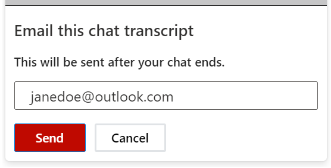
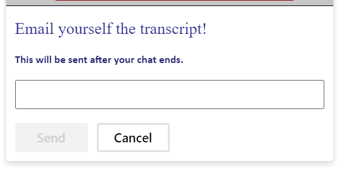

# EmailTranscript Pane (InputValidation Pane)

## Table of contents

- [Interfaces](#interfaces)
  - [IInputValidationPaneProps](#iinputvalidationpaneprops)
  - [IInputValidationPaneComponentOverrides](#iinputvalidationpanecomponentoverrides)
  - [IInputValidationPaneControlProps](#iinputvalidationpanecontrolprops)
  - [IInputValidationPaneStyleProps](#iinputvalidationpanestyleprops)
  - [IInputValidationPaneClassNames](#iinputvalidationpaneclassnames)
- [Sample Scenarios](#sample-scenarios)
  - [Edit example initial text](#edit-example-initial-text)
  - [Edit the text styles](#edit-the-text-styles)

Althought the `InputValidationPane` is used primarily as a UI to verify email addresses before sending the transcript (thus renamed as `EmailTranscriptPane` in the `chat-widget` project), it can be used in other scenarios as well, like credit card number validation, etc.

## Interfaces

### [IInputValidationPaneProps](https://github.com/microsoft/omnichannel-chat-widget/blob/main/chat-components/src/components/inputvalidationpane/interfaces/IInputValidationPaneProps.ts)

The top-level interface for customizing the `input email transcript pane (validation pane)`.

| Attribute | Type  | Required | Description      | Default |
| ------------------ | ----------------------- | -------- | ------------------------------ | ------- |
| componentOverrides | [IInputValidationPaneComponentOverrides](#iinputvalidationpanecomponentoverrides) | No       | Used for overriding default `IInputValidationPane` components | -       |
| controlProps       | [IInputValidationPaneControlProps](#iinputvalidationpanecontrolprops)             | No       | Properties that control the element behariors                 | -       |
| styleProps         | [IInputValidationPaneStyleProps](#iinputvalidationpanestyleprops)                 | No       | Properties that control the element styles                    | -       |

### [IInputValidationPaneComponentOverrides](https://github.com/microsoft/omnichannel-chat-widget/blob/main/chat-components/src/components/inputvalidationpane/interfaces/IInputValidationPaneComponentOverrides.ts)

Custom React components can be passed as input to override the default sub-components. Alternatively, you can stringify the React component before passing it in.

| Attribute                | Type              | Required | Description                                             | Default |
| ------------------------ | ----------------- | -------- | ------------------------------------------------------- | ------- |
| title                    | ReactNode\|string | No       | Used for overriding default title                       | -       |
| subtitle                 | ReactNode\|string | No       | Used for overriding default subtitle                    | -       |
| input                    | ReactNode\|string | No       | Used for overriding default input                       | -       |
| invalidInputErrorMessage | ReactNode\|string | No       | Used for overriding default invalid input error message | -       |
| sendButton               | ReactNode\|string | No       | Used for overriding default send button                 | -       |
| cancelButton             | ReactNode\|string | No       | Used for overriding default cancel button               | -       |

### [IInputValidationPaneControlProps](https://github.com/microsoft/omnichannel-chat-widget/blob/main/chat-components/src/components/inputvalidationpane/interfaces/IInputValidationPaneControlProps.ts)

| Attribute        | Type              | Required | Description      | Default  |
| -------------------------------- | --------------------------- | -------- | --------------------------------------------------------------------------------------- | --------------------------------------- |
| id                               | string                      | No       | The top-level element id for the email transcript (input validation) pane               | "oclcw-emailTranscriptDialogContainer"  |
| dir                              | "rtl"\|"ltr"\|"auto"        | No       | The locale direction under the `IInputValidationPane` component                         | "ltr"                                   |
| hideInputValidationPane          | boolean                     | No       | Whether to hide the email transcript (input validation) pane completely                 | false                                   |
| inputValidationPaneAriaLabel     | string                      | No       | Sets the `aria-label` attribute on the general email transcript (input validation) pane | "Email Chat Transcript Pane"                      |
| hideTitle                        | boolean                     | No       | Whether to hide the title                                                               | false                                   |
| titleText                        | string                      | No       | The email transcript (input validation) pane title text                                 | "Please provide e-mail address to send transcript."                 |
| hideSubtitle                     | boolean                     | No       | Whether to hide the subtitle                                                            | false                                   |
| subtitleText                     | string                      | No       | The email transcript (input validation) pane subtitle text                              | "The transcript will be sent after the chat ends."     |
| inputId                          | string                      | No       | The element id for the input field                                                      | "lcw-components-input-validation-input" |
| inputInitialText                 | string                      | No       | The email transcript (input validation) pane input text                                 | "" (If an email address is filled out in the pre-chat survey, that email will show up here automatically)                   |
| hideInput                        | boolean                     | No       | Whether to hide the email transcript (input validation) pane input completely           | false                                   |
| inputAriaLabel                   | string                      | No       | Sets the `aria-label` attribute on the email transcipt (input validation) input         | "Please provide e-mail address to send transcript. The transcript will be sent after the chat ends. Email address text area"                 |
| inputPlaceholder                 | string                      | No       | Describe the proper format for an email address              | johnsmith@outlook.com                        |
| inputWithErrorMessageBorderColor | string                      | No       | Sets the color when there is an error                                                   | "rgb(164, 38, 44)"                               |
| invalidInputErrorMessageText     | string                      | No       | The email transcript (input validation) error message text                              | "Enter a valid email address."         |
| isButtonGroupHorizontal          | boolean                     | No       | Whether the directions of the buttons are horizontal                                    | true                                    |
| hideSendButton                   | boolean                     | No       | Whether to hide the send button                                                         | false                                   |
| enableSendButton                 | boolean                     | No       | Whether to enable the send button                                                       | false                                    |
| sendButtonText                   | string                      | No       | Sets the text inside the send button                                                    | "Send"                                  |
| sendButtonAriaLabel              | string                      | No       | Sets the `aria-label` attribute on the send button                                      | "Send"                                  |
| hideCancelButton                 | boolean                     | No       | Whether to hide the cancel button                                                       | false                                   |
| cancelButtonText                 | string                      | No       | Sets the text inside the cancel button                                                  | "Cancel"                                |
| cancelButtonAriaLabel            | string                      | No       | Sets the `aria-label` attribute on the cancel button                                    | "Cancel"                                |
| onSend                           | (input: string) => void     | No       | Sets the behavior after the send button is clicked                                      | [Sends the transcript to the input email address]                       |
| onCancel                         | () => void                  | No       | Sets the behavior after the cancel button is clicked                                    | [Proceeds to cancel the screen]         |
| checkInput                       | (input: string) => boolean; | No       | Sets the behavior after checking the input                                              | [Validates the input]                   |
| brightnessValueOnDim             | string                      | No       | Sets the brightness of the input validation pane                                        | "0.2"                                |

> :pushpin: If both `hide-` option and `componentOverride` are used on the same sub-component, that sub-component will be hidden. `hide-` options take higher priority.

### [IInputValidationPaneStyleProps](https://github.com/microsoft/omnichannel-chat-widget/blob/main/chat-components/src/components/inputvalidationpane/interfaces/IInputValidationPaneStyleProps.ts)

[IStyle](https://github.com/microsoft/fluentui/blob/master/packages/merge-styles/src/IStyle.ts) is the interface provided by [FluentUI](https://developer.microsoft.com/en-us/fluentui#/).

| Attribute                               | Type                                                                                            | Required | Description                                                                             | Default                                                                                                                                                                                                                                                                              |
| --------------------------------------- | ----------------------------------------------------------------------------------------------- | -------- | --------------------------------------------------------------------------------------- | ------------------------------------------------------------------------------------------------------------------------------------------------------------------------------------------------------------------------------------------------------------------------------------ |
| generalStyleProps    | [IStyle](https://github.com/microsoft/fluentui/blob/master/packages/merge-styles/src/IStyle.ts) | No  | Overall styles of the `IInputValidationPane` component, including the container  | [defaultInputValidationPaneGeneralStyles](https://github.com/microsoft/omnichannel-chat-widget/blob/main/chat-components/src/components/inputvalidationpane/common/default/defaultStyles/defaultInputValidationPaneGeneralStyles.ts)                                                       |
| headerGroupStyleProps   | [IStyle](https://github.com/microsoft/fluentui/blob/master/packages/merge-styles/src/IStyle.ts) | No       | Styles of the email transcript pane (input validation pane) header container    | [defaultInputValidationPaneHeaderGroupStyles](https://github.com/microsoft/omnichannel-chat-widget/blob/main/chat-components/src/components/inputvalidationpane/common/default/defaultStyles/defaultInputValidationPaneHeaderGroupStyles.ts)                                               |
| titleStyleProps   | [IStyle](https://github.com/microsoft/fluentui/blob/master/packages/merge-styles/src/IStyle.ts) | No       | Styles of the email transcript pane (input validation pane) title     | [defaultInputValidationPaneTitleStyles](https://github.com/microsoft/omnichannel-chat-widget/blob/main/chat-components/src/components/inputvalidationpane/common/default/defaultStyles/defaultInputValidationPaneTitleStyles.ts)                                                           |
| subtitleStyleProps                      | [IStyle](https://github.com/microsoft/fluentui/blob/master/packages/merge-styles/src/IStyle.ts) | No       | Styles of the email transcript pane (input validation pane) subtitle                    | [defaultInputValidationPaneSubtitleStyles](https://github.com/microsoft/omnichannel-chat-widget/blob/main/chat-components/src/components/inputvalidationpane/common/default/defaultStyles/defaultInputValidationPaneSubtitleStyles.ts)                                                     |
| inputStyleProps                         | [IStyle](https://github.com/microsoft/fluentui/blob/master/packages/merge-styles/src/IStyle.ts) | No       | Styles of the email transcript pane (input validation pane) input container             | [defaultInputValidationPaneInputStyles](https://github.com/microsoft/omnichannel-chat-widget/blob/main/chat-components/src/components/inputvalidationpane/common/default/defaultStyles/defaultInputValidationPaneInputStyles.ts)                                                           |
| invalidInputErrorMessageStyleProps | [IStyle](https://github.com/microsoft/fluentui/blob/master/packages/merge-styles/src/IStyle.ts) | No       | Styles of the email transcript pane (input validation pane) invalid input error message | [defaultInputValidationPaneInvalidInputErrorMessageStyles](https://github.com/microsoft/omnichannel-chat-widget/blob/main/chat-components/src/components/inputvalidationpane/common/default/defaultStyles/defaultInputValidationPaneInvalidInputErrorMessageStyles.ts) |
| buttonGroupStyleProps                   | [IStyle](https://github.com/microsoft/fluentui/blob/master/packages/merge-styles/src/IStyle.ts) | No       | Styles of the email transcript pane (input validation pane) button group                | [defaultInputValidationPaneButtonGroupStyles](https://github.com/microsoft/omnichannel-chat-widget/blob/main/chat-components/src/components/inputvalidationpane/common/default/defaultStyles/defaultInputValidationPaneButtonGroupStyles.ts)                                               |
| sendButtonStyleProps                    | [IStyle](https://github.com/microsoft/fluentui/blob/master/packages/merge-styles/src/IStyle.ts) | No       | Styles of the email transcript pane (input validation pane) send button                 | [defaultInputValidationPaneSendButtonStyles](https://github.com/microsoft/omnichannel-chat-widget/blob/main/chat-components/src/components/inputvalidationpane/common/default/defaultStyles/defaultInputValidationPaneSendButtonStyles.ts)                                                 |
| sendButtonHoveredStyleProps             | [IStyle](https://github.com/microsoft/fluentui/blob/master/packages/merge-styles/src/IStyle.ts) | No       | Styles of the email transcript pane (input validation pane) send button when hovered    | [defaultInputValidationPaneSendButtonHoveredStyles](https://github.com/microsoft/omnichannel-chat-widget/blob/main/chat-components/src/components/inputvalidationpane/common/default/defaultStyles/defaultInputValidationPaneSendButtonHoveredStyles.ts)                                   |
| cancelButtonStyleProps                  | [IStyle](https://github.com/microsoft/fluentui/blob/master/packages/merge-styles/src/IStyle.ts) | No       | Styles of the email transcript pane (input validation pane) cancel button               | [defaultInputValidationPaneCancelButtonStyles](https://github.com/microsoft/omnichannel-chat-widget/blob/main/chat-components/src/components/inputvalidationpane/common/default/defaultStyles/defaultInputValidationPaneCancelButtonStyles.ts)                                             |
| cancelButtonHoveredStyleProps           | [IStyle](https://github.com/microsoft/fluentui/blob/master/packages/merge-styles/src/IStyle.ts) | No       | Styles of the email transcript pane (input validation pane) cancel button when hovered  | [defaultInputValidationPaneCancelButtonHoveredStyles](https://github.com/microsoft/omnichannel-chat-widget/blob/main/chat-components/src/components/inputvalidationpane/common/default/defaultStyles/defaultInputValidationPaneCancelButtonHoveredStyles.ts)                               |
| classNames            | [IInputValidationPaneClassNames](#iinputvalidationpaneclassnames)                                | No       | Sets custom class names for sub-components                                              | -       |

### [IInputValidationPaneClassNames](https://github.com/microsoft/omnichannel-chat-widget/blob/main/chat-components/src/components/inputvalidationpane/interfaces/IInputValidationPaneClassNames.ts)

| Attribute                         | Type   | Required | Description                                       | Default |
| --------------------------------- | ------ | -------- | ------------ | ------- |
| titleClassName                    | string | No       | Custom class name for title                       | -       |
| subtitleClassName                 | string | No       | Custom class name for subtitle                    | -       |
| containerClassName                | string | No       | Custom class name for container                   | -       |
| headerGroupClassName              | string | No       | Custom class name for header group                | -       |
| inputClassName                    | string | No       | Custom class name for input container             | -       |
| invalidInputErrorMessageClassName | string | No       | Custom class name for invalid input error message | -       |
| buttonGroupClassName              | string | No       | Custom class name for button group                | -       |
| sendButtonClassName               | string | No       | Custom class name for send button                 | -       |
| cancelButtonClassName             | string | No       | Custom class name for cancel button               | -       |

## Sample Scenarios

Below samples are build upon the base sample, which can be found [here](https://github.com/microsoft/omnichannel-chat-widget#example-usage). The code snippets below will only show the changes needed to be added before `ReactDOM.render`.

---

### Edit example initial text

<details>
    <summary>Show code</summary>

```tsx
...
liveChatWidgetProps = {
    ...liveChatWidgetProps,
    emailTranscriptPane: {
        controlProps: {
            hideIInputValidationPane: false,
            inputInitialText: "janedoe@outlook.com"
        }
    }
};
...
```

</details>



### Edit the text styles

<details>
    <summary>Show code</summary>

```tsx
...
liveChatWidgetProps = {
    ...liveChatWidgetProps,
    emailTranscriptPane: {
        controlProps: {
            hideTitle: false,
            titleText: "Email yourself the transcript!",
        },
        styleProps:{
            titleStyleProps: {
                color: "#323190",
                fontFamily: "Garamound",
                fontSize: "18px",
                fontWeight: "50",
                marginBottom: "5px"
            },
            subtitleStyleProps: {
                color: "#262670",
                fontFamily: "Calibri",
                fontSize: "12px",
                lineHeight: "16px",
                marginBottom: "10px"
            }
        }
    }
};
...
```

</details>


