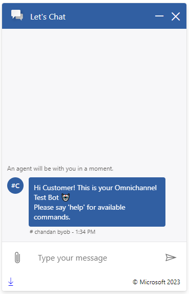
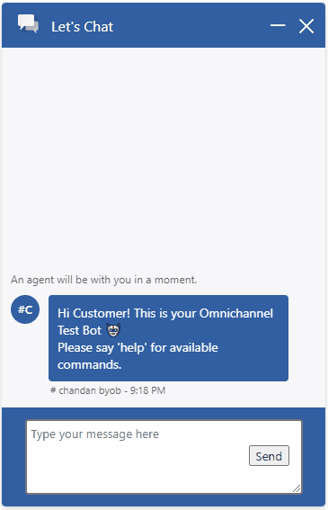
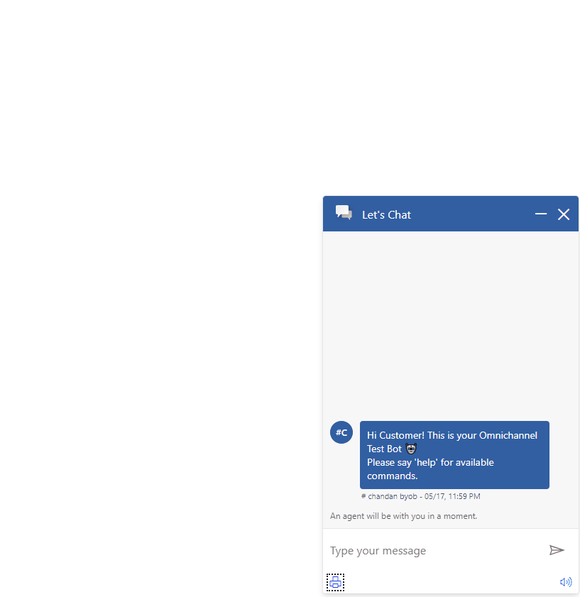

# Footer

## Table of contents

- [Interfaces](#interfaces)
  - [IFooterProps](#ifooterprops)
  - [IFooterComponentOverrides](#ifootercomponentoverrides)
  - [IFooterControlProps](#ifootercontrolprops)
  - [IFooterStyleProps](#ifooterstyleprops)
- [Sample Scenarios](#sample-scenarios)
  - [Replacing default sub-components with custom components](#replacing-default-sub-components-with-custom-components)
  - [Using a custom send box in the footer](#using-a-custom-send-box-in-the-footer)
  - [Overriding default button behaviors](#overriding-default-button-behaviors)

## Interfaces

### [IFooterProps](https://github.com/microsoft/omnichannel-chat-widget/blob/main/chat-components/src/components/footer/interfaces/IFooterProps.ts)

The top-level interface for customizing `Footer`.

| Property | Type | Required | Description | Default |
| - | - | - | - | - |
| componentOverrides     | [IFooterComponentOverrides](#ifootercomponentoverrides)     | No | Used for overriding default `Footer` components, including all the default buttons | -
controlProps | [IFooterControlProps](#ifootercontrolprops) | No | Properties that control the element behaviors | -
styleProps | [IFooterStyleProps](#ifooterstyleprops) | No | Properties that control the element styles | -

### [IFooterComponentOverrides](https://github.com/microsoft/omnichannel-chat-widget/blob/main/chat-components/src/components/footer/interfaces/IFooterComponentOverrides.ts)

Custom React components can be passed as input to override the default sub-components. Alternatively, you can stringify the React component before passing it in. The `chat-components` library provides one util function that can be used: [encodeComponentString](https://github.com/microsoft/omnichannel-chat-widget/blob/main/chat-components/src/common/encodeComponentString.ts).

| Property | Type | Required | Description | Default | 
| - | - | - | - | - |
| DownloadTranscriptButton     | ReactNode\|string     | No | Used for overriding default download transcript button | -
EmailTranscriptButton | ReactNode\|string | No | Used for overriding default email transcript button | -
AudioNotificationButton | ReactNode\|string | No | Used for overriding default audio toggle button | -

### [IFooterControlProps](https://github.com/microsoft/omnichannel-chat-widget/blob/main/chat-components/src/components/footer/interfaces/IFooterControlProps.ts)

| Property | Type | Required | Description | Default | 
| - | - | - | - | - |
| id     | string     | No | The top-level element id for the footer | "oc-lcw-footer"
hideDownloadTranscriptButton | boolean | No | Whether to hide the download transcript button on the footer | false
hideEmailTranscriptButton | boolean | No | Whether to hide the email transcript button on the footer | false
hideAudioNotificationButton | boolean | No | Whether to hide the audio notification button on the footer | false
onDownloadTranscriptClick | () => void | No | The callback function that will be triggered when the download transcript button is clicked | [Starts downloading the whole transcript]
onEmailTranscriptClick | () => void | No | The callback function that will be triggered when the email transcript button is clicked | [Opens the pane for sending transcript over email]
onAudioNotificationClick | () => void | No | The callback function that will be triggered when the audio notification button is clicked | [Toggles audio notification on/off]
downloadTranscriptButtonProps | [ICommandButtonControlProps](https://github.com/microsoft/omnichannel-chat-widget/blob/main/chat-components/src/components/common/interfaces/ICommandButtonControlProps.ts) | No | Properties to further customize the download transcript button | [defaultFooterControlProps](https://github.com/microsoft/omnichannel-chat-widget/blob/main/chat-components/src/components/footer/common/defaultProps/defaultFooterControlProps.ts)
emailTranscriptButtonProps | [ICommandButtonControlProps](https://github.com/microsoft/omnichannel-chat-widget/blob/main/chat-components/src/components/common/interfaces/ICommandButtonControlProps.ts) | No | Properties to further customize the email transcript button | [defaultFooterControlProps](https://github.com/microsoft/omnichannel-chat-widget/blob/main/chat-components/src/components/footer/common/defaultProps/defaultFooterControlProps.ts)
audioNotificationButtonProps | [ICommandButtonControlProps](https://github.com/microsoft/omnichannel-chat-widget/blob/main/chat-components/src/components/common/interfaces/ICommandButtonControlProps.ts) | No | Properties to further customize the audio notification button | [defaultFooterControlProps](https://github.com/microsoft/omnichannel-chat-widget/blob/main/chat-components/src/components/footer/common/defaultProps/defaultFooterControlProps.ts)
dir | "rtl"\|"ltr"\|"auto" | No | The locale direction under the `Footer` component | "ltr"
leftGroup | {children: ReactNode[]\|string[]} | No | Additional custom components to be added on the left side of the footer (right of the default sub-components)| -
middleGroup | {children: ReactNode[]\|string[]} | No | Additional custom components to be added on the middle section of the footer | -
rightGroup | {children: ReactNode[]\|string[]} | No | Additional custom components to be added on the right side of the footer (left of the default sub-components) | -

> :pushpin: If both `hide-` option and `componentOverride` are used on the same sub-component, that sub-component will be hidden. `hide-` options take higher priority.

> :pushpin: `leftGroup`, `middleGroup`, and `rightGroup` take in the same kind of input types as with `componentOverrides` inputs.

### [IFooterStyleProps](https://github.com/microsoft/omnichannel-chat-widget/blob/main/chat-components/src/components/footer/interfaces/IFooterStyleProps.ts)

[IStyle](https://github.com/microsoft/fluentui/blob/master/packages/merge-styles/src/IStyle.ts) is the interface provided by [FluentUI](https://developer.microsoft.com/en-us/fluentui#/).

| Property | Type | Required | Description | Default | 
| - | - | - | - | - |
| generalStyleProps | [IStyle](https://github.com/microsoft/fluentui/blob/master/packages/merge-styles/src/IStyle.ts) | No | Overall styles of the `Footer` component, including the container | [defaultFooterStyleProps](https://github.com/microsoft/omnichannel-chat-widget/blob/main/chat-components/src/components/footer/common/defaultStyles/defaultFooterStyleProps.ts) |
| downloadTranscriptButtonStyleProps | [IStyle](https://github.com/microsoft/fluentui/blob/master/packages/merge-styles/src/IStyle.ts) | No | Styles of the download transcript button | [defaultFooterStyleProps](https://github.com/microsoft/omnichannel-chat-widget/blob/main/chat-components/src/components/footer/common/defaultStyles/defaultFooterStyleProps.ts) |
| downloadTranscriptButtonHoverStyleProps | [IStyle](https://github.com/microsoft/fluentui/blob/master/packages/merge-styles/src/IStyle.ts) | No | Styles of the download transcript button while hovered | [defaultFooterStyleProps](https://github.com/microsoft/omnichannel-chat-widget/blob/main/chat-components/src/components/footer/common/defaultStyles/defaultFooterStyleProps.ts) |
| emailTranscriptButtonStyleProps | [IStyle](https://github.com/microsoft/fluentui/blob/master/packages/merge-styles/src/IStyle.ts) | No | Styles of the email transcript button | [defaultFooterStyleProps](https://github.com/microsoft/omnichannel-chat-widget/blob/main/chat-components/src/components/footer/common/defaultStyles/defaultFooterStyleProps.ts) |
| emailTranscriptButtonHoverStyleProps | [IStyle](https://github.com/microsoft/fluentui/blob/master/packages/merge-styles/src/IStyle.ts) | No | Styles of the email transcript button while hovered | [defaultFooterStyleProps](https://github.com/microsoft/omnichannel-chat-widget/blob/main/chat-components/src/components/footer/common/defaultStyles/defaultFooterStyleProps.ts) |
| audioNotificationButtonStyleProps | [IStyle](https://github.com/microsoft/fluentui/blob/master/packages/merge-styles/src/IStyle.ts) | No | Styles of the audio notification button | [defaultFooterStyleProps](https://github.com/microsoft/omnichannel-chat-widget/blob/main/chat-components/src/components/footer/common/defaultStyles/defaultFooterStyleProps.ts) |
| audioNotificationButtonHoverStyleProps | [IStyle](https://github.com/microsoft/fluentui/blob/master/packages/merge-styles/src/IStyle.ts) | No | Styles of the audio notification button while hovered | [defaultFooterStyleProps](https://github.com/microsoft/omnichannel-chat-widget/blob/main/chat-components/src/components/footer/common/defaultStyles/defaultFooterStyleProps.ts) |
| footerItemFocusStyleProps | [IStyle](https://github.com/microsoft/fluentui/blob/master/packages/merge-styles/src/IStyle.ts) | No | Styles of the footer sub-components while focused | [defaultFooterStyleProps](https://github.com/microsoft/omnichannel-chat-widget/blob/main/chat-components/src/components/footer/common/defaultStyles/defaultFooterStyleProps.ts) |

## Sample Scenarios

Below samples are build upon the base sample, which can be found [here](https://github.com/microsoft/omnichannel-chat-widget#example-usage). The code snippets below will only show the changes needed to be added before `ReactDOM.render`.

--------------------------------

### Replacing default sub-components with custom components

<details>
    <summary>Show code</summary>

```tsx
...
const Copyright = () => {
    return (
        <div style={{"fontSize":"12px", "fontFamily":"Segoe UI, Arial", "padding":"2px"}}>© Microsoft 2023</div>
    );
};

liveChatWidgetProps = {
    ...liveChatWidgetProps,
    footerProps: {
        controlProps: {
            hideEmailTranscriptButton: true,
            hideAudioNotificationButton: true,
            rightGroup: {
                children: [
                    <Copyright/>
                    // Since this is a static element, alternatively we can use the string format: 
                    // '{"$$typeof":"$$Symbol:react.element","type":"div","key":"1","ref":null,"props":{"style":{"fontSize":"12px","fontFamily":"Bradley Hand,cursive","padding":"2px"},"children":"© Microsoft 2023"},"_owner":null,"_store":{}}',
                ]
            }
        },
    }
};
...
```

</details>



--------------------------------

### Using a custom send box in the footer

<details>
    <summary>Show code</summary>

```tsx
import { hooks } from "botframework-webchat";
...
const SendBox = () => {
    const { useSendMessage } = hooks;
    const sendMessage = useSendMessage();
    
    let message = "";
    const onSend = () => {
        sendMessage(message);
        message = "";
        document.getElementById("sendbox").value = "";
    };
    const onMessageChange = (input) => {
        message = input.target.value;
    };

    return (
        <>
            <textarea id="sendbox" type="text"
                placeholder="Type your message here"
                style={{ padding:"5px", paddingRight:"70px", width:"230px", height:"70px", borderStyle:"solid", borderWidth:"2px", borderRadius:"4px", fontFamily:"'Segoe UI', Arial"}}
                onChange={onMessageChange}>
            </textarea>
            <button onClick={onSend} style={{ position:"absolute", fontFamily:"'Segoe UI', Arial", right:"40px", bottom:"45px"}}>
                Send
            </button>
        </>
    );
};

liveChatWidgetProps = {
    ...liveChatWidgetProps,
    webChatContainerProps: {
        webChatStyles: {
            hideSendBox: true
        }
    },
    footerProps: {
        controlProps: {
            hideDownloadTranscriptButton: true,
            hideEmailTranscriptButton: true,
            hideAudioNotificationButton: true,
            middleGroup: {
                children: [
                    <SendBox/>
                ]
            }
        },
        styleProps: {
            generalStyleProps: {
                backgroundColor: "#315FA2",
                height: "150px"
            }
        }
    }
};
...
```

</details>



--------------------------------

### Overriding default button behaviors

<details>
    <summary>Show code</summary>

```tsx
...
const onPrintPageClick = () => {
    window.print();
};

liveChatWidgetProps = {
    ...liveChatWidgetProps,
    footerProps: {
        controlProps: {
            hideEmailTranscriptButton: true,
            onDownloadTranscriptClick: onPrintPageClick,
            downloadTranscriptButtonProps: {
                iconName: "Print"
            }
        }
    }
};
...
```

</details>


