# Get Started With Customizations

Welcome to this developer's guide on Chat Widget customizations. You just started you first step to make your chat widget more aligned with your business needs and website themes.

**IMPORTANT!!!**
**If you are using the Omnichannel out-of-box chat widget (script offering), please read [this](./MustReadForScriptLayerUsers.md) first before you go through this dev guide. Although the script offering uptakes the `<LiveChatWidget/>` React component and shares the same interfaces, it does offer less customizabilities than the React counterpart. In addition, some implementation details might differ as well.**

## UI Components

Each single page of this guide will mainly focus on two parts - Interfaces and Samples. In Interfaces, the guide will elaborate on all the interfaces related to that component, including those in deeper levels and subcomponents. In Samples, a few popular configurations or common use-cases will be shown with screenshots and gifs. As the number of users grows and more common scenarios are identified, we may constantly update these samples. Stay tuned.

### List of components

- [LiveChatWidget](#livechatwidget)
- [ChatButton](#chatbutton)
- [PreChatSurveyPane](#prechatsurveypane)
- [LoadingPane](#loadingpane)
- [Header](#header)
- [WebChatContainer](#webchatcontainer)
- [Footer](#footer)
- [ConfirmationPane](#confirmationpane)
- [EmailTranscriptPane](#emailtranscriptpane)
- [OOOHPane](#ooohpane)
- [CallingContainer](#callingcontainer)
- [PostChatLoadingPane](#postchatloadingpane)
- [PostChatSurveyPane](#postchatsurveypane)
- [ProactiveChatPane](#proactivechatpane)
- [ReconnectChatPane](#reconnectchatpane)
- [StartChatErrorPane](#startchaterrorpane)

--------------------------------

### [LiveChatWidget](./livechatwidget.md)

This is the top level component this package offers which stitches together all the individual components. All other components' customizations will need to start from the `ILiveChatWidgetProps` interface. If you're new to this repo, start your exploration here.

--------------------------------

### [ChatButton](./chatbutton.md)

The default landing UI component when the widget loads.

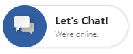

--------------------------------

### [PreChatSurveyPane](./prechatsurveypane.md)

If configured, will show up once chat button is clicked.

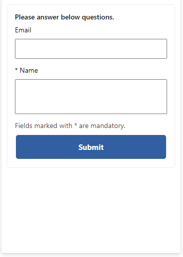

--------------------------------

### [LoadingPane](./loadingpane.md)

The loading screen that will show up after chat button is clicked or prechat is submitted.

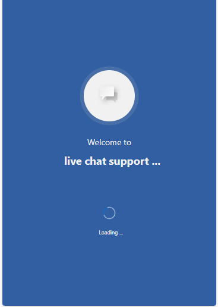

--------------------------------

### [Header](./header.md)

The header bar on top of the chat widget.

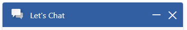

--------------------------------

### [WebChatContainer](./webchatcontainer.md)

The container that holds the messages between the agent and the customer.

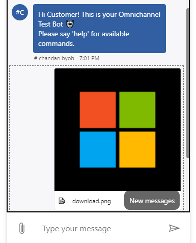

--------------------------------

### [Footer](./footer.md)

The container that holds the messages between the agent and the customer.

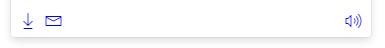

--------------------------------

### [ConfirmationPane](./confirmationpane.md)

The popup that shows up when the customer clicks the "X" button to try to close the chat.

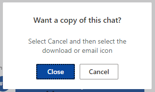

--------------------------------

### [EmailTranscriptPane](./emailtranscriptpane.md)

The popup that shows up asking for more information when the customer clicks the "Email Transcript" button.

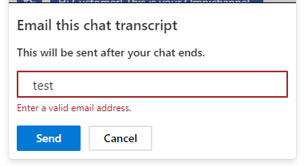

--------------------------------

### [OOOHPane](./ooohpane.md)

The screen that alerts the customer that the widget id currently out of operating hours.

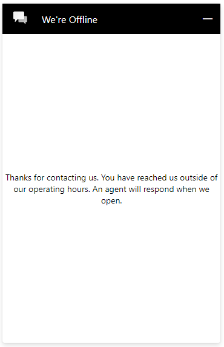

--------------------------------

### [CallingContainer](./callingcontainer.md)

The container for voice and video controls when the agent initiates a voice/video call request.

--------------------------------

### [PostChatLoadingPane](./loadingpane.md)

The loading screen that will show up after the chat ends, if embedded mode post chat survey is configured. The props is the same as Loading Pane. Default styles can be found here:
[styleProps -> generalStyleProps](https://github.com/microsoft/omnichannel-chat-widget/blob/main/chat-widget/src/components/postchatloadingpanestateful/common/defaultgeneralPostChatLoadingPaneStyleProps.ts)
[controlProps](https://github.com/microsoft/omnichannel-chat-widget/blob/main/chat-widget/src/components/postchatloadingpanestateful/PostChatLoadingPaneStateful.tsx#L26)

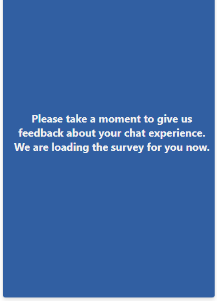

--------------------------------

### [PostChatSurveyPane](./postchatsurveypane.md)

The container that will load the Customer Voice survey configured in the Customer Service admin center.

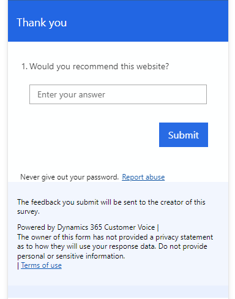

### [ProactiveChatPane](./proactivechatpane.md)

The container for voice and video controls when the agent initiates a voice/video call request.

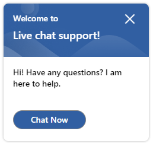

### [ReconnectChatPane](./reconnectchatpane.md)

The container that shows up for auth chat users who, after disconnected from the conversation, return to the chat before the reconnect timer expires.

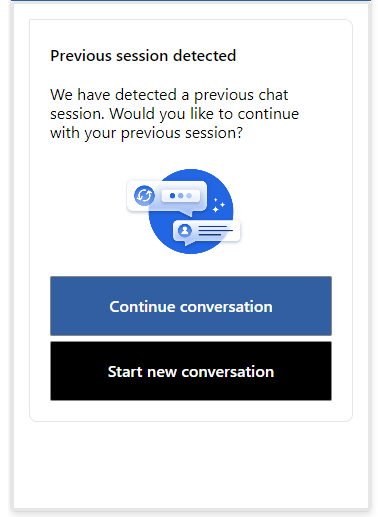

### StartChatErrorPane

The screen that shows up when the start chat process encounters an error.

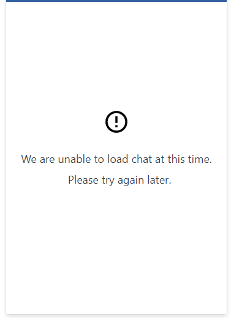
