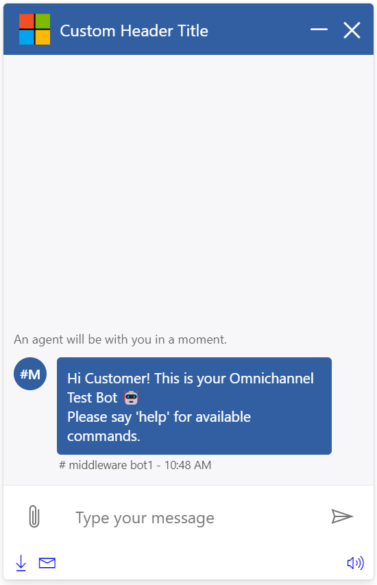
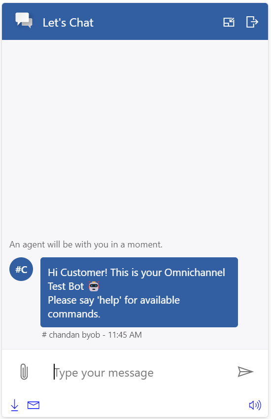
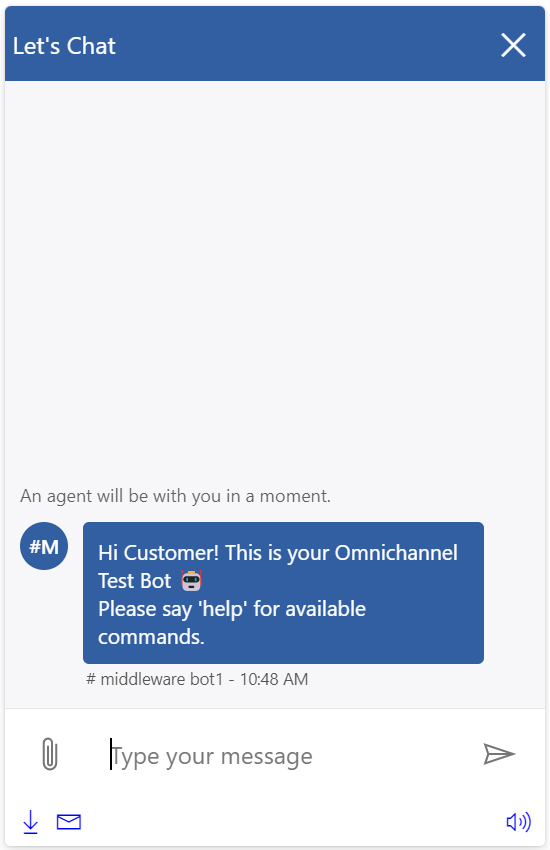
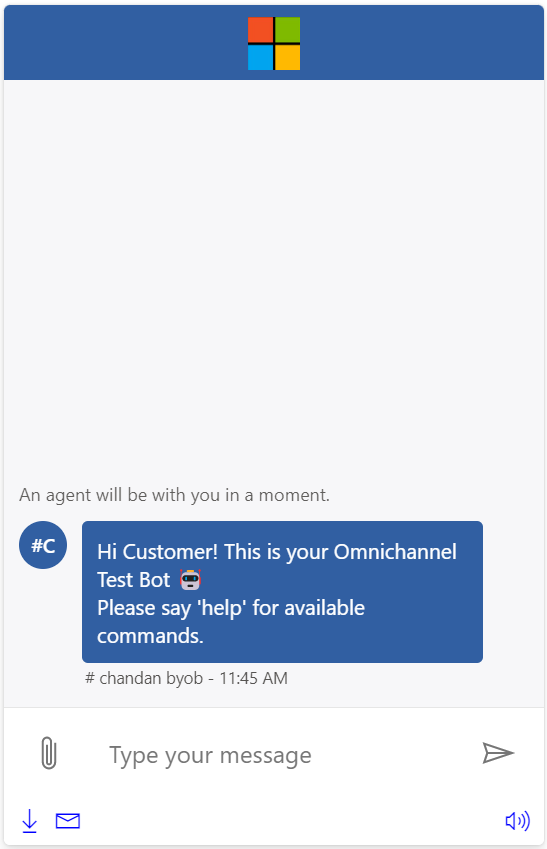
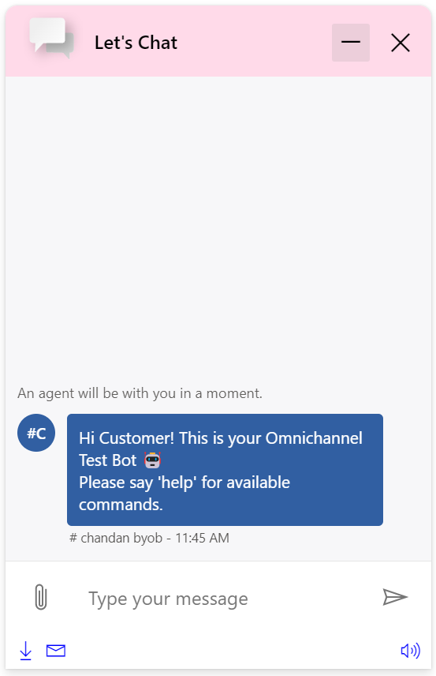

# Header

## Table of contents

- [Interfaces](#interfaces)
  - [IHeaderProps](#iheaderprops)
  - [IHeaderComponentOverrides](#iheadercomponentoverrides)
  - [IHeaderControlProps](#iheadercontrolprops)
  - [IHeaderStyleProps](#iheaderstyleprops)
- [Sample Scenarios](#sample-scenarios)
  - [Changing header title and icon](#changing-header-title-and-icon)
  - [Changing button icons](#changing-button-icons)
  - [Hiding sub-components](#hiding-sub-components)
  - [Adding a custom button](#adding-a-custom-button)
  - [Adding a custom image](#adding-a-custom-image)
  - [Changing element styles](#changing-element-styles)

## Interfaces

### [IHeaderProps](https://github.com/microsoft/omnichannel-chat-widget/blob/main/chat-components/src/components/header/interfaces/IHeaderProps.ts)

The top-level interface for customizing `Header`.

| Property | Type | Required | Description | Default |
| - | - | - | - | - |
| componentOverrides     | [IHeaderComponentOverrides](#iheadercomponentoverrides)     | No | Used for overriding default `Header` components, e.g., icon, title, minimize button, and close button | -
controlProps | [IHeaderControlProps](#iheadercontrolprops) | No | Properties that control the element behaviors | -
styleProps | [IHeaderStyleProps](iheaderstyleprops) | No | Properties that control the element styles | -

### [IHeaderComponentOverrides](https://github.com/microsoft/omnichannel-chat-widget/blob/main/chat-components/src/components/header/interfaces/IHeaderComponentOverrides.ts)

Custom React components can be passed as input to override the default sub-components. Alternatively, you can stringify the React component before passing it in. The `chat-components` library provides one util function that can be used: [encodeComponentString](https://github.com/microsoft/omnichannel-chat-widget/blob/main/chat-components/src/common/encodeComponentString.ts).

| Property | Type | Required | Description | Default | 
| - | - | - | - | - |
| headerIcon     | ReactNode\|string     | No | Used for overriding default header icon | -
headerTitle | ReactNode\|string | No | Used for overriding default header title | -
headerMinimizeButton | ReactNode\|string | No | Used for overriding default minimize button | -
headerCloseButton | ReactNode\|string | No | Used for overriding default close button | -

### [IHeaderControlProps](https://github.com/microsoft/omnichannel-chat-widget/blob/main/chat-components/src/components/header/interfaces/IHeaderControlProps.ts)

| Property | Type | Required | Description | Default |
| - | - | - | - | - |
| id     | string     | No | The top-level element id for the header | "lcw-header"
hideIcon | boolean | No | Whether to hide the icon on the header | false
hideTitle | boolean | No | Whether to hide the title string on the header | false
hideMinimizeButton | boolean | No | Whether to hide the minimize button on the header | false
hideCloseButton | ReactNode\|string | No | Whether to hide the close button on the header | false
onMinimizeClick | () => void | No | The callback function that will be triggered when the minimize button is clicked | [Minimizes the chat widget](https://github.com/microsoft/omnichannel-chat-widget/blob/main/chat-widget/src/components/headerstateful/HeaderStateful.tsx#L35-L38)
onCloseClick | () => void | No | The callback function that will be triggered when the close button is clicked | [Closes the chat widget](https://github.com/microsoft/omnichannel-chat-widget/blob/main/chat-widget/src/components/headerstateful/HeaderStateful.tsx#L39)
minimizeButtonProps | [ICommandButtonControlProps](https://github.com/microsoft/omnichannel-chat-widget/blob/main/chat-components/src/components/common/interfaces/ICommandButtonControlProps.ts) | No | Properties to further customize the default minimize button | [defaultHeaderControlProps](https://github.com/microsoft/omnichannel-chat-widget/blob/main/chat-components/src/components/header/common/defaultProps/defaultHeaderControlProps.ts)
closeButtonProps | [ICommandButtonControlProps](https://github.com/microsoft/omnichannel-chat-widget/blob/main/chat-components/src/components/common/interfaces/ICommandButtonControlProps.ts) | No | Properties to further customize the default close button | [defaultHeaderControlProps](https://github.com/microsoft/omnichannel-chat-widget/blob/main/chat-components/src/components/header/common/defaultProps/defaultHeaderControlProps.ts)
headerIconProps | [IImageControlProps](https://github.com/microsoft/omnichannel-chat-widget/blob/main/chat-components/src/components/common/interfaces/IImageControlProps.ts) | No | Properties to further customize the default header icon | [defaultHeaderControlProps](https://github.com/microsoft/omnichannel-chat-widget/blob/main/chat-components/src/components/header/common/defaultProps/defaultHeaderControlProps.ts)
headerTitleProps | [ILabelControlProps](https://github.com/microsoft/omnichannel-chat-widget/blob/main/chat-components/src/components/common/interfaces/ILabelControlProps.ts) | No | Properties to further customize the default header title | [defaultHeaderControlProps](https://github.com/microsoft/omnichannel-chat-widget/blob/main/chat-components/src/components/header/common/defaultProps/defaultHeaderControlProps.ts)
dir | "rtl"\|"ltr"\|"auto" | No | The locale direction under the `Header` component | "ltr"
leftGroup | {children: ReactNode[]\|string[]} | No | Additional custom components to be added on the left side of the header (right of the default sub-components)| -
middleGroup | {children: ReactNode[]\|string[]} | No | Additional custom components to be added on the middle section of the header | -
rightGroup | {children: ReactNode[]\|string[]} | No | Additional custom components to be added on the right side of the header (left of the default sub-components) | -

> :pushpin: If both `hide-` option and `componentOverride` are used on the same sub-component, that sub-component will be hidden. `hide-` options take higher priority.

> :pushpin: `leftGroup`, `middleGroup`, and `rightGroup` take in the same kind of input types as with `componentOverrides` inputs.

### [IHeaderStyleProps](https://github.com/microsoft/omnichannel-chat-widget/blob/main/chat-components/src/components/header/interfaces/IHeaderStyleProps.ts)

[IStyle](https://github.com/microsoft/fluentui/blob/master/packages/merge-styles/src/IStyle.ts) is the interface provided by [FluentUI](https://developer.microsoft.com/en-us/fluentui#/).

| Property | Type | Required | Description | Default | 
| - | - | - | - | - |
| generalStyleProps | [IStyle](https://github.com/microsoft/fluentui/blob/master/packages/merge-styles/src/IStyle.ts) | No | Overall styles of the `Header` component, including the container | [defaultHeaderStyleProps](https://github.com/microsoft/omnichannel-chat-widget/blob/main/chat-components/src/components/header/common/defaultStyles/defaultHeaderStyleProps.ts) |
| iconStyleProps | [IStyle](https://github.com/microsoft/fluentui/blob/master/packages/merge-styles/src/IStyle.ts) | No | Styles of the header icon | [defaultHeaderStyleProps](https://github.com/microsoft/omnichannel-chat-widget/blob/main/chat-components/src/components/header/common/defaultStyles/defaultHeaderStyleProps.ts) |
| titleStyleProps | [IStyle](https://github.com/microsoft/fluentui/blob/master/packages/merge-styles/src/IStyle.ts) | No | Styles of the header title | [defaultHeaderStyleProps](https://github.com/microsoft/omnichannel-chat-widget/blob/main/chat-components/src/components/header/common/defaultStyles/defaultHeaderStyleProps.ts) |
| closeButtonStyleProps | [IStyle](https://github.com/microsoft/fluentui/blob/master/packages/merge-styles/src/IStyle.ts) | No | Styles of the header close button | [defaultHeaderStyleProps](https://github.com/microsoft/omnichannel-chat-widget/blob/main/chat-components/src/components/header/common/defaultStyles/defaultHeaderStyleProps.ts) |
| closeButtonHoverStyleProps | [IStyle](https://github.com/microsoft/fluentui/blob/master/packages/merge-styles/src/IStyle.ts) | No | Styles of the header close button while hovered | [defaultHeaderStyleProps](https://github.com/microsoft/omnichannel-chat-widget/blob/main/chat-components/src/components/header/common/defaultStyles/defaultHeaderStyleProps.ts) |
| minimizeButtonStyleProps | [IStyle](https://github.com/microsoft/fluentui/blob/master/packages/merge-styles/src/IStyle.ts) | No | Styles of the header minimize button | [defaultHeaderStyleProps](https://github.com/microsoft/omnichannel-chat-widget/blob/main/chat-components/src/components/header/common/defaultStyles/defaultHeaderStyleProps.ts) |
| minimizeButtonHoverStyleProps | [IStyle](https://github.com/microsoft/fluentui/blob/master/packages/merge-styles/src/IStyle.ts) | No | Styles of the header close button while hovered | [defaultHeaderStyleProps](https://github.com/microsoft/omnichannel-chat-widget/blob/main/chat-components/src/components/header/common/defaultStyles/defaultHeaderStyleProps.ts) |
| headerItemFocusStyleProps | [IStyle](https://github.com/microsoft/fluentui/blob/master/packages/merge-styles/src/IStyle.ts) | No | Styles of the header sub-components while focused | [defaultHeaderStyleProps](https://github.com/microsoft/omnichannel-chat-widget/blob/main/chat-components/src/components/header/common/defaultStyles/defaultHeaderStyleProps.ts) |

## Sample Scenarios

Below samples are build upon the base sample, which can be found [here](https://github.com/microsoft/omnichannel-chat-widget#example-usage). The code snippets below will only show the changes needed to be added before `ReactDOM.render`.

--------------------------------

### Changing header title and icon

<details>
    <summary>Show code</summary>

```tsx
...
liveChatWidgetProps = {
    ...liveChatWidgetProps,
    headerProps: {
        controlProps: {
            headerIconProps: {
                src: "https://msft-lcw-trial.azureedge.net/public/resources/microsoft.jpg"
            },
            headerTitleProps: {
                text: "Contoso Coffee"
            },
        }
    }
};
...
```

</details>



--------------------------------

### Changing button icons

<details>
    <summary>Show code</summary>

```tsx
...
liveChatWidgetProps = {
    ...liveChatWidgetProps,
    headerProps: {
        controlProps: {
            minimizeButtonProps: {
                iconName: "MiniContract"
            },
            closeButtonProps: {
                iconName: "Leave"
            },
        }
    }
};
...
```

</details>



--------------------------------

### Hiding sub-components

<details>
    <summary>Show code</summary>

```tsx
...
liveChatWidgetProps = {
    ...liveChatWidgetProps,
    headerProps: {
        controlProps: {
            hideMinimizeButton: true,
            hideIcon: true
        }
    }
};
...
```

</details>



--------------------------------

### Adding a custom button

<details>
    <summary>Show code</summary>

```tsx
...
const CustomButton = () => {
    const onClick = () => {
        alert("Clicked custom button!");
    };
    return (
        <button onClick={onClick}>Custom Button</button>
    );
};

liveChatWidgetProps = {
    ...liveChatWidgetProps,
    headerProps: {
        controlProps: {
            rightGroup: {
                children: [
                    <CustomButton/>
                ]
            }
        }
    }
};
...
```

</details>


--------------------------------

### Adding a custom image

<details>
    <summary>Show code</summary>

```tsx
...
const CustomImage = () => {
    return (
        </img>
    );
};

liveChatWidgetProps = {
    ...liveChatWidgetProps,
    headerProps: {
        controlProps: {
            hideIcon: true,
            hideTitle: true,
            hideMinimizeButton: true,
            hideCloseButton: true,
            middleGroup: {
                children: [
                    <CustomImage/>
                ]
            }
        }
    }
};
...
```

</details>



--------------------------------

### Changing element styles

<details>
    <summary>Show code</summary>

```tsx
...
liveChatWidgetProps = {
    ...liveChatWidgetProps,
    styleProps: {
        ...liveChatWidgetProps.styleProps,
        generalStyles: {
            ...liveChatWidgetProps.styleProps.generalStyles,
            borderRadius: "10px 10px 0 0",
        }
    },
    headerProps: {
        styleProps: {
            generalStyleProps: {
                borderRadius: "10px 10px 0 0",
                backgroundColor: "#ffdae9",
            },
            iconStyleProps: {
                width: "50px",
                height: "50px"
            },
            titleStyleProps: {
                color: "black",
                fontWeight: 600
            },
            closeButtonStyleProps: {
                margin: "10px 5px 5px 5px",
                color: "black"
            },
            closeButtonHoverStyleProps: {
                backgroundColor: "rgb(200, 200, 200, 0.2)",
                margin: "10px 5px 5px 5px",
                color: "black"
            },
            minimizeButtonStyleProps: {
                margin: "10px 5px 5px 5px",
                color: "black"
            },
            minimizeButtonHoverStyleProps: {
                backgroundColor: "rgb(200, 200, 200, 0.2)",
                margin: "10px 5px 5px 5px",
                color: "black"
            }
        }
    }
};
...
```

</details>


