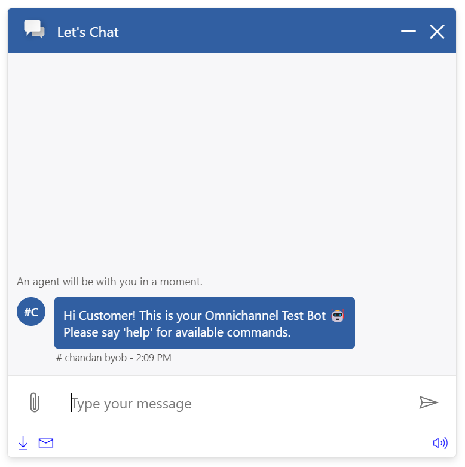
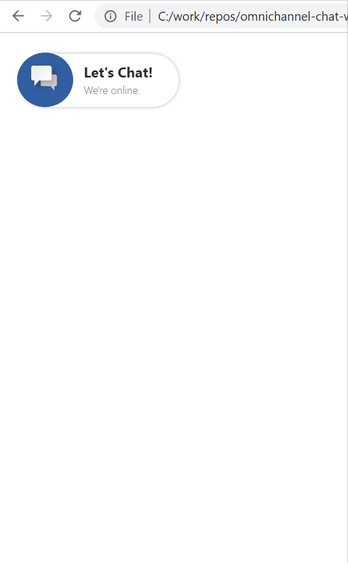
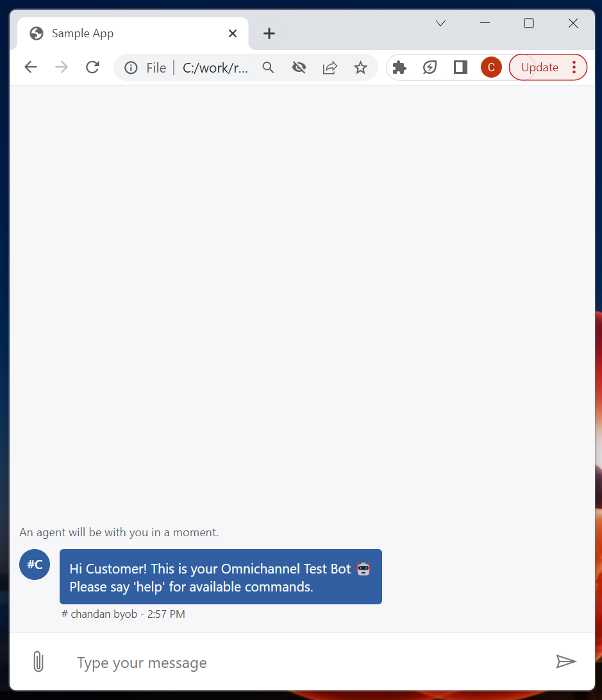

# LiveChatWidget

## Table of contents

- [Introduction](#introduction)
- [Interfaces](#interfaces)
  - [ILiveChatWidgetProps](#ilivechatwidgetprops)
  - [IAudioNotificationProps](#iaudionotificationprops)
  - [IDownloadTranscriptProps](#idownloadtranscriptprops)
  - [ILiveChatWidgetComponentOverrides](#ilivechatwidgetcomponentoverrides)
  - [ILiveChatWidgetControlProps](#ilivechatwidgetcontrolprops)
  - [ILiveChatWidgetStyleProps](#ilivechatwidgetstyleprops)
  - [IScrollBarProps](#iscrollbarprops)
  - [IDraggableChatWidgetProps](#idraggablechatwidgetprops)
- [Sample Scenarios](#sample-scenarios)
  - [Changing overall widget size](#changing-overall-widget-size)
  - [Changing widget position on the page](#changing-widget-position-on-the-page)
  - [Sample popout chat experience](#sample-popout-chat-experience)

## Introduction

`<LiveChatWidget/>` is the top level component that this package offers. All the features and customizations will be coming from this component. As shown in this [example](https://github.com/microsoft/omnichannel-chat-widget#example-usage), this component will need to take in a required property, `liveChatWidgetProps`, for it to be fully functional. The property will implement the `ILiveChatWidgetProps` interface, explained in details below.

## Interfaces

### [ILiveChatWidgetProps](https://github.com/microsoft/omnichannel-chat-widget/blob/main/chat-widget/src/components/livechatwidget/interfaces/ILiveChatWidgetProps.ts)

The top-level interface for customizing `LiveChatWidget`. For more details for each of the attribute, click into the interface related to it. It will redirect you to the corresponding page dedicated to introduce that particular component. The samples on this page will only contain customizations for the overall styles. For samples on how to modify each of the component individually, go to their dedicated dev page.

| Property | Type | Required | Description | Default |
| - | - | - | - | - |
| audioNotificationProps     | [IAudioNotificationProps](#iaudionotificationprops)     | No | Controls the properties of the sound notification on new messages | -
| callingContainerProps | [ICallingContainerProps](./callingcontainer.md) | No | Controls the properties of the voice/video container when a voice/video call request is initiated from the agent side | [defaultCallingContainerProps](https://github.com/microsoft/omnichannel-chat-widget/blob/main/chat-components/src/components/callingcontainer/common/defaultProps/defaultCallingContainerProps.ts)
| chatButtonProps | [IChatButtonProps](./chatbutton.md) | No | Controls the properties of the chat button | [defaultChatButtonProps](https://github.com/microsoft/omnichannel-chat-widget/blob/main/chat-components/src/components/chatbutton/common/defaultProps/defaultChatButtonProps.ts)
| chatConfig | [ChatConfig](https://github.com/microsoft/omnichannel-chat-sdk/blob/main/src/core/ChatConfig.ts) | Yes | This is the `Config` object generated by Chat SDK after the SDK is initialized. The config object contains UI/UX settings set on admin page, default color and theme, locale, etc. You can retrieve the config by calling `await chatSDK.getLiveChatConfig()`. This attribute is mandatory | -
| chatSDK | [OmnichannelChatSDK](https://github.com/microsoft/omnichannel-chat-sdk/blob/main/src/OmnichannelChatSDK.ts) | Yes | This is the [ChatSDK](https://github.com/microsoft/omnichannel-chat-sdk) instance. Since the widget needs to interact with OC and ACS at multiple places, Chat SDK is utilized within the component to make those calls. The instance needs to be initialized before being passed in | -
| componentOverrides | [ILiveChatWidgetComponentOverrides](#ilivechatwidgetcomponentoverrides) | No | Used for overriding default sub-components | -
| confirmationPaneProps | [IConfirmationPaneStatefulProps](./confirmationpane.md) | No | Controls the properties of the confirmation pane, shown when a users trys to close the widget | [defaultConfirmationPaneProps](https://github.com/microsoft/omnichannel-chat-widget/blob/main/chat-components/src/components/confirmationpane/common/defaultProps/defaultConfirmationPaneProps.ts)
| controlProps | [ILiveChatWidgetControlProps](#ilivechatwidgetcontrolprops) | No | Controls whether to hide a certain sub-component, and setting cache config | -
| directLine | any | No | **Important:** This is the same property as `webChatContainerProps.directLine` and you should use the latter at all times. This property is included here only to keep parity with our storybook testing, which has a conflict if we directly modify `webChatContainerProps.directLine` | -
| downloadTranscriptProps | [IDownloadTranscriptProps](#idownloadtranscriptprops) | No | Controls the properties of the downloaded transcript | -
| emailTranscriptPane | [IEmailTranscriptPaneProps](./emailtranscriptpane.md) | No | Controls the properties of the email transcript pane, after the email transcript button is clicked | -
| footerProps | [IFooterProps](./footer.md) | No | Controls the properties of the footer | [defaultFooterProps](https://github.com/microsoft/omnichannel-chat-widget/blob/main/chat-components/src/components/footer/common/defaultProps/defaultFooterProps.ts)
| headerProps | [IHeaderProps](./header.md) | No | Controls the properties of the header | [defaultHeaderProps](https://github.com/microsoft/omnichannel-chat-widget/blob/main/chat-components/src/components/header/common/defaultProps/defaultHeaderProps.ts)
| loadingPaneProps | [ILoadingPaneProps](./loadingpane.md) | No | Controls the properties of the loading pane | [defaultLoadingPaneProps](https://github.com/microsoft/omnichannel-chat-widget/blob/main/chat-components/src/components/loadingpane/common/defaultProps/defaultLoadingPaneProps.ts)
| outOfOfficeChatButtonProps | [IChatButtonProps](./chatbutton.md) | No | Controls the properties of the chat button when the widget is outside operating hours | See [Chat Button](./chatbutton.md)
| outOfOfficeHeaderProps | [IHeaderProps](./header.md) | No | Controls the properties of the header when the widget is outside operating hours | See [Header](./header.md)
| outOfOfficeHoursPaneProps | [IOOOHPaneProps](./ooohpane.md) | No | Controls the properties of the out of operating hours pane, when chat button is clicked outside of operating hours | [defaultOOOHPaneProps](https://github.com/microsoft/omnichannel-chat-widget/blob/main/chat-components/src/components/outofofficehourspane/common/defaultProps/defaultOOOHPaneProps.ts)
| postChatLoadingPaneProps | [ILoadingPaneProps](./loadingpane.md) | No | Controls the properties of the loading pane before showing post chat survey | See [PostChatLoadingPane](./postchatloadingpane.md)
| postChatSurveyPaneProps | [IPostChatSurveyPaneStatefulProps](./postchatsurveypane.md) | No | Controls the properties of the post chat survey pane, after the chat ends | See [PostChatSurvey](./postchatsurvey.md)
| preChatSurveyPaneProps | [IPreChatSurveyPaneProps](./prechatsurveypane.md) | No | Controls the properties of the post chat survey pane, before the chat starts | [defaultPreChatSurveyPaneProps](../../chat-components/src/components/prechatsurveypane/common/defaultProps/defaultPreChatSurveyPaneProps.ts)
| proactiveChatPaneProps | [IProactiveChatPaneStatefulProps](./proactivechatpane.md) | No | Controls the properties of the proactive chat pane | [defaultProactiveChatPaneProps](https://github.com/microsoft/omnichannel-chat-widget/blob/main/chat-components/src/components/proactivechatpane/common/default/defaultProps/defaultProactiveChatPaneProps.ts)
| reconnectChatPaneProps | [IReconnectChatPaneStatefulProps](./reconnectchatpane.md) | No | Controls the properties of the reconnect pane, when an auth chat user returns to the chat before the Reconnect timer expires | [defaultReconnectChatPaneProps](https://github.com/microsoft/omnichannel-chat-widget/blob/main/chat-components/src/components/reconnectchatpane/common/default/defaultProps/defaultReconnectChatPaneProps.ts)
| startChatErrorPaneProps | IStartChatErrorPaneProps | No | Controls the properties of the pane that shows up when start chat process has an error and is unble to proceed to conversation | -
| styleProps | [ILiveChatWidgetStyleProps](#ilivechatwidgetstyleprops) | No | Controls the styles of the top layer container | [defaultLiveChatWidgetGeneralStyles](https://github.com/microsoft/omnichannel-chat-widget/blob/main/chat-widget/src/components/livechatwidget/common/defaultStyles/defaultLiveChatWidgetGeneralStyles.ts)
| telemetryConfig | [ITelemetryConfig](https://github.com/microsoft/omnichannel-chat-widget/blob/main/chat-widget/src/common/telemetry/interfaces/ITelemetryConfig.ts) | Yes | Sets the config for telemetry, whether to enable telemetry, any custom loggers, etc. For details, turn to the [Telemetry](../Telemetry.md) documentation | [defaultTelemetryConfiguration](https://github.com/microsoft/omnichannel-chat-widget/blob/main/chat-widget/src/common/telemetry/defaultConfigs/defaultTelemetryConfiguration.ts)
| webChatContainerProps | [IWebChatContainerStatefulProps](./webchatcontainer.md) | No | Controls the properties of the web chat container, the main package to host the messages and send box | [defaultWebChatContainerStatefulProps](https://github.com/microsoft/omnichannel-chat-widget/blob/main/chat-widget/src/components/webchatcontainerstateful/common/defaultProps/defaultWebChatContainerStatefulProps.ts)
| liveChatContextFromCache | [ILiveChatWidgetContext](https://github.com/microsoft/omnichannel-chat-widget/blob/main/chat-widget/src/contexts/common/ILiveChatWidgetContext.ts) | No | If set, this prop will be used for telemetry context, instead of creating new ones | -
| contextDataStore | [IContextDataStore](https://github.com/microsoft/omnichannel-chat-widget/blob/main/chat-widget/src/common/interfaces/IContextDataStore.ts) | No | Sets the custom data store. For details, see [Telemetry](../Telemetry.md) documentation | localStorage
| getAuthToken | (authClientFunction?: string) => Promise<string \| null> | No | For auth chat, sets this attribute to the callback that will return the auth token/auth code. This will later be passed to Chat SDK to authenticate conversations | -
| scrollBarProps | [IScrollBarProps](#iscrollbarprops) | No | Modifies the overall scroll bar styles | [defaultScrollBarProps](https://github.com/microsoft/omnichannel-chat-widget/blob/main/chat-widget/src/components/livechatwidget/common/defaultProps/defaultScrollBarProps.ts)
| useSessionStorage | boolean | No | Whether to use sessionStorage or localStorage for the default data storage | false
| allowSdkChatSupport | boolean | No | Whether to support these [SDK methods](https://learn.microsoft.com/en-us/dynamics365/customer-service/developer/omnichannel-reference#methods) for the out of box widget. If you're using this npm package directly, setting this to false is recommended  | true
| initialCustomContext | any | No | The custom context that will be sent to the Omnichannel backend on first started chat | -
| draggableChatWidgetProps | [IDraggableChatWidgetProps.ts](#idraggablechatwidgetprops) | No | Controls the properties of draggable chat widget | - |

### [IAudioNotificationProps](https://github.com/microsoft/omnichannel-chat-widget/blob/main/chat-widget/src/components/footerstateful/audionotificationstateful/interfaces/IAudioNotificationProps.ts)

| Property | Type | Required | Description | Default |
| - | - | - | - | - |
| audioSrc     | string  | No | Changes the sound source played when a new message arrives while focus is not on the chat widget | -

### [IDownloadTranscriptProps](https://github.com/microsoft/omnichannel-chat-widget/blob/main/chat-widget/src/components/footerstateful/downloadtranscriptstateful/interfaces/IDownloadTranscriptProps.ts)

| Property | Type | Required | Description | Default |
| - | - | - | - | - |
| attachmentMessage     | string  | No | The message that will show up in the transcript as a placeholder where an attachment was uploaded. The real attachment will not be included in the transcript | "The following attachment was uploaded during the conversation:"
| bannerMessageOnError     | string  | No | The error message shown on the chat container error banner when failed to download chat transcript | "Download transcript failed."
| renderMarkDown    | (transcriptContent: string) => string;  | No | Callback function for markdown render for chat transcript | -

### [ILiveChatWidgetComponentOverrides](https://github.com/microsoft/omnichannel-chat-widget/blob/main/chat-widget/src/components/livechatwidget/interfaces/ILiveChatWidgetComponentOverrides.ts)

Custom React components can be passed as input to override the default sub-components. Alternatively, you can stringify the React component before passing it in. The `chat-components` library provides one util function that can be used: [`encodeComponentString`](https://github.com/microsoft/omnichannel-chat-widget/blob/main/chat-components/src/common/encodeComponentString.ts).

| Property | Type | Required | Description | Default |
| - | - | - | - | - |
| chatButton     | ReactNode|string     | No | Used for overriding default chat button | -
| confirmationPane | ReactNode|string | No | Used for overriding default confirmation pane | -
| footer | ReactNode|string | No | Used for overriding default footer | -
| emailTranscriptPane | ReactNode|string | No | Used for overriding default email transcript pane, after the email transcript button is clicked | -
| header | ReactNode|string | No | Used for overriding default header | -
| loadingPane | ReactNode|string | No | Used for overriding default loading screen | -
| outOfOfficeHoursPane | ReactNode|string | No | Used for overriding default OOOH Pane when the chat widget is outside operating hours | -
| postChatLoadingPane | ReactNode|string | No | Used for overriding default loading pane before rendering post chat survey | -
| postChatSurveyPane | ReactNode|string | No | Used for overriding default post chat survey pane | -
| preChatSurveyPane | ReactNode|string | No | Used for overriding default pre chat survey pane | -
| proactiveChatPane | ReactNode|string | No | Used for overriding default proactive chat pane | -
| reconnectChatPane | ReactNode|string | No | Used for overriding default reconnect pane, when an auth user returns | -
| webChatContainer | ReactNode|string | No | Used for overriding default chat container and message bubbles | -

### [ILiveChatWidgetControlProps](https://github.com/microsoft/omnichannel-chat-widget/blob/main/chat-widget/src/components/livechatwidget/interfaces/ILiveChatWidgetControlProps.ts)

| Property | Type | Required | Description | Default |
| - | - | - | - | - |
| id  | string    | No | The top-level element id for `LiveChatWidget` | "oc-lcw" |
| dir | "rtl"\|"ltr"\|"auto" | No | The locale direction under the `LiveChatWidget` component | "ltr"`
| hideCallingContainer | boolean | No | Whether to hide the default calling container | false
| hideChatButton | boolean | No | Whether to hide the default chat button | false
| hideConfirmationPane | boolean | No | Whether to hide the default confirmation pane | false
| hideErrorUIPane | boolean | No | Whether to hide the default error pane when start chat fails | false
| hideFooter | boolean | No | Whether to hide the default footer | false
| hideHeader | boolean | No | Whether to hide the default header | false
| hideLoadingPane | boolean | No | Whether to hide the default loading screen | false
| hideOutOfOfficeHoursPane | boolean | No | Whether to hide the default OOOH screen | false
| hidePostChatLoadingPane | boolean | No | Whether to hide the default post chat loading screen | false
| hidePreChatSurveyPane | boolean | No | Whether to hide the default pre chat pane. **If this is set to true, prechat survey rendering will be skipped and chat will directly start** | false
| hideProactiveChatPane | boolean | No | Whether to hide the default proactive chat screen | false
| hideReconnectChatPane | boolean | No | Whether to hide the default reconnect pane | false
| hideWebChatContainer | boolean | No | Whether to hide the default chat container | false
| hideStartChatButton | boolean | No | **If this is set to true, the chat will directly start, without showing the chat button first** | false
| widgetInstanceId | string\|undefined | No | This id will be used to identify unique widgets. Widgets with different `widgetInstanceId` will not share the same local storage thus will not persist each other's chat history on page refresh | -
| cacheTtlInMins | number | No | The callback function that will be triggered when the audio notification button is clicked | 15`

> :pushpin: If both `hide-` option and `componentOverride` are used on the same sub-component, that sub-component will be hidden. `hide-` options take higher priority.

### [ILiveChatWidgetStyleProps](https://github.com/microsoft/omnichannel-chat-widget/blob/main/chat-widget/src/components/livechatwidget/interfaces/ILiveChatWidgetStyleProps.ts)

| Property | Type | Required | Description | Default |
| - | - | - | - | - |
| generalStyles     | [IStyle](https://github.com/microsoft/fluentui/blob/master/packages/merge-styles/src/IStyle.ts)     | No | The general css styles for the top layer container | [defaultLiveChatWidgetGeneralStyles](https://github.com/microsoft/omnichannel-chat-widget/blob/main/chat-widget/src/components/livechatwidget/common/defaultStyles/defaultLiveChatWidgetGeneralStyles.ts) |
| className     | string | No | The class name for the top layer container | - |

### [IScrollBarProps](https://github.com/microsoft/omnichannel-chat-widget/blob/main/chat-widget/src/components/livechatwidget/interfaces/IScrollBarProps.ts)

| Property | Type | Required | Description | Default |
| - | - | - | - | - |
| width | string | No | Scrollbar width in px | "7px" |
| trackBackgroundColor | string | No | Scrollbar track background color | "#f1f1f1" |
| thumbBackgroundColor | string | No | Scrollbar thumb background color | "#888" |
| thumbBorderRadius | string | No | Scrollbar thumb border radius in px | "10px" |
| thumbHoverColor | string | No | Scrollbar thumb hover color | "#555" |

### [IDraggableChatWidgetProps](https://github.com/microsoft/omnichannel-chat-widget/blob/main/chat-widget/src/components/livechatwidget/interfaces/IDraggableChatWidgetProps.ts)

The top-level interface for customizing `DraggableChatWidget`

| Property | Type | Required | Description | Default |
| - | - | - | - | - |
| disabled | boolean | No | Whether to disable the feature | False |
| targetIframe | boolean | No | Specify whether the chat widget is being used within an iframe or not | False |

## Sample Scenarios

Below samples are build upon the base sample, which can be found [here](https://github.com/microsoft/omnichannel-chat-widget#example-usage). The code snippets below will only show the changes needed to be added before `ReactDOM.render`.

--------------------------------

### Changing overall widget size

<details>
    <summary>Show code</summary>

```tsx
...
liveChatWidgetProps = {
    ...liveChatWidgetProps,
    styleProps: {
        generalStyles: {
            width: "500px",
            height: "500px"
        }
    }
};
...
```

</details>



--------------------------------

### Changing widget position on the page

<details>
    <summary>Show code</summary>

```tsx
...
liveChatWidgetProps = {
    ...liveChatWidgetProps,
    styleProps: {
        generalStyles: {
            width: "360px",
            height: "560px",
            top: "20px",
            left: "20px",
            bottom: "unset",
            right: "unset"
        }
    },
    chatButtonProps: {
        styleProps: {
            generalStyleProps: {
                top: "0px",
                left: "0px",
                bottom: "unset",
                right: "unset"
            }
        }
    }
};
...
```

</details>



> :pushpin: Since the widget needs a container element to hold it, make sure the container itself is at the correct position.

--------------------------------

### Sample popout chat experience

<details>
    <summary>Show code</summary>

```tsx
...
liveChatWidgetProps = {
    ...liveChatWidgetProps,
    controlProps: {
        hideHeader: true,
        hideFooter: true,
        hideStartChatButton: true
    },
    styleProps: {
        generalStyles: {
            width: "100%",
            height: "100%",
            bottom: "0px",
            right: "0px"
        }
    }
};
...
```

</details>



> :pushpin: This sample might be useful if you want to render the chat in a popout window. Combining with the `hideStartChatButton: true` option, the chat will automatically start when the page loads.
