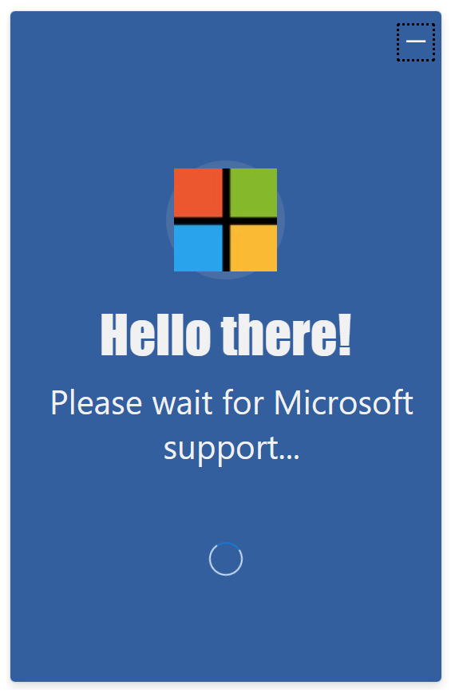
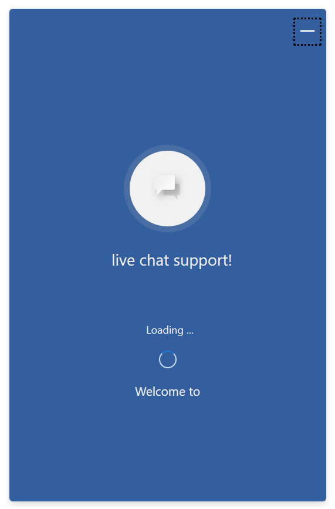

# Loading Pane

## Table of contents

- [Interfaces](#interfaces)
  - [ILoadingPaneProps](#iloadingpaneprops)
  - [ILoadingPaneComponentOverrides](#iloadingpanecomponentoverrides)
  - [ILoadingPaneControlProps](#iloadingpanecontrolprops)
  - [ILoadingPaneStyleProps](#iloadingpanestyleprops)
  - [ILoadingPaneClassNames](#iloadingpaneclassnames)
- [Sample Scenarios](#sample-scenarios)
  - [Changing order of components](#changing-loading-pane-title-subtitle-spinner-icon-and-hiding-spinner-text)
  - [Changing loading pane element ordering](#changing-loading-pane-element-ordering)

## Interfaces

### [ILoadingPaneProps](https://github.com/microsoft/omnichannel-chat-widget/blob/main/chat-components/src/components/loadingpane/interfaces/ILoadingPaneProps.ts)

The top-level interface for customizing `LoadingPane`.

| Property | Type | Required | Description | Default |
| - | - | - | - | - |
| componentOverrides     | [ILoadingPaneComponentOverrides](#iloadingpanecomponentoverrides)     | No | Used for overriding default `LoadingPane` components, e.g., icon, title, subtitle, spinner, and spinner text | -
controlProps | [ILoadingPaneControlProps](#iloadingpanecontrolprops) | No | Properties that control the element behaviors | -
styleProps | [ILoadingPaneStyleProps](#iloadingpanestyleprops) | No | Properties that control the element styles | -
windowWidth | number | No | Property is used internally to set width such that icon does not show when there is not enough room to render it, please do not modify without good reason | -
windowHeight | number | No | Property is used internally to set height such that icon does not show when there is not enough room to render it, please do not modify without good reason  | -

### [ILoadingPaneComponentOverrides](https://github.com/microsoft/omnichannel-chat-widget/blob/main/chat-components/src/components/loadingpane/interfaces/ILoadingPaneComponentOverrides.ts)

Custom React components can be passed as input to override the default sub-components. Alternatively, you can stringify the React component before passing it in. The `chat-components` library provides one util function that can be used: [encodeComponentString](https://github.com/microsoft/omnichannel-chat-widget/blob/main/chat-components/src/common/encodeComponentString.ts).

| Property | Type | Required | Description | Default |
| - | - | - | - | - |
| icon     | ReactNode\|string     | No | Used for overriding default loading pane icon | -
title | ReactNode\|string | No | Used for overriding default loading pane title | -
subtitle | ReactNode\|string | No | Used for overriding default loading pane subtitle | -
spinner | ReactNode\|string | No | Used for overriding default loading pane spinner | -
spinnerText | ReactNode\|string | No | Used for overriding default loading pane spinner text | -

### [ILoadingPaneControlProps](https://github.com/microsoft/omnichannel-chat-widget/blob/main/chat-components/src/components/loadingpane/interfaces/ILoadingPaneControlProps.ts)

| Property | Type | Required | Description | Default |
| - | - | - | - | - |
| id     | string     | No | The top-level element id for the loading pane | "oc-lcw-loadingpane"
role | string | No | Sets the `role` attribute at the top level element of the loading pane | "undefined"
dir | "rtl"\|"ltr"\|"auto" | No | The locale direction under the `LoadingPane` component | "auto"
hideLoadingPane | boolean | No | Whether to hide the loading pane | false
hideIcon | boolean | No | Whether to hide the icon on the loading pane | false
hideTitle | boolean | No | Whether to hide the title string on the loading pane | false
titleText | string | No | The title text of the loading pane | "Welcome to"
hideSubtitle | boolean | No | Whether to hide the subtitle on the loading pane | false
subtitleText | string | No | The subtitle text of the loading pane | "live chat support..."
hideSpinner | boolean | No | Whether to hide the spinner on the loading pane | false
spinnerSize | SpinnerSize | No | The size of the spinner on the loading pane | -
spinnerText | string | No | The spinner text of the loading pane | "Loading..."
hideSpinnerText | boolean | No | Whether to hide the spinner text on the loading pane | false

> :pushpin: If both `hide-` option and `componentOverride` are used on the same sub-component, that sub-component will be hidden. `hide-` options take higher priority.

### [ILoadingPaneStyleProps](https://github.com/microsoft/omnichannel-chat-widget/blob/main/chat-components/src/components/loadingpane/interfaces/ILoadingPaneStyleProps.ts)

[IStyle](https://github.com/microsoft/fluentui/blob/master/packages/merge-styles/src/IStyle.ts) is the interface provided by [FluentUI](https://developer.microsoft.com/en-us/fluentui#/).

| Property | Type | Required | Description | Default |
| - | - | - | - | - |
| generalStyleProps | [IStyle](https://github.com/microsoft/fluentui/blob/master/packages/merge-styles/src/IStyle.ts) | No | Overall styles of the `LoadingPane` component, including the container | [defaultLoadingPaneGeneralStyles](https://github.com/microsoft/omnichannel-chat-widget/blob/d9ea24e14e0363dce0d771e6d8686edd95a32335/chat-components/src/components/loadingpane/common/defaultProps/defaultStyles/defaultLoadingPaneGeneralStyles.ts) |
| titleStyleProps | [IStyle](https://github.com/microsoft/fluentui/blob/master/packages/merge-styles/src/IStyle.ts) | No | Styles of the loading pane title | [defaultLoadingPaneTitleStyles](https://github.com/microsoft/omnichannel-chat-widget/blob/d9ea24e14e0363dce0d771e6d8686edd95a32335/chat-components/src/components/loadingpane/common/defaultProps/defaultStyles/defaultLoadingPaneTitleStyles.ts) |
| subtitleStyleProps | [IStyle](https://github.com/microsoft/fluentui/blob/master/packages/merge-styles/src/IStyle.ts) | No | Styles of the loading pane subtitle | [defaultLoadingPaneSubtitleStyles](https://github.com/microsoft/omnichannel-chat-widget/blob/d9ea24e14e0363dce0d771e6d8686edd95a32335/chat-components/src/components/loadingpane/common/defaultProps/defaultStyles/defaultLoadingPaneSubtitleStyles.ts) |
| iconStyleProps | [IStyle](https://github.com/microsoft/fluentui/blob/master/packages/merge-styles/src/IStyle.ts) | No | Styles of the loading pane icon | [defaultLoadingPaneIconStyles](https://github.com/microsoft/omnichannel-chat-widget/blob/d9ea24e14e0363dce0d771e6d8686edd95a32335/chat-components/src/components/loadingpane/common/defaultProps/defaultStyles/defaultLoadingPaneIconStyles.ts) |
| iconImageProps | [IStyle](https://github.com/microsoft/fluentui/blob/master/packages/merge-styles/src/IStyle.ts) | No | Styles of the loading pane icon image | [defaultLoadingPaneIconImageProps](https://github.com/microsoft/omnichannel-chat-widget/blob/d9ea24e14e0363dce0d771e6d8686edd95a32335/chat-components/src/components/loadingpane/common/defaultProps/defaultStyles/defaultLoadingPaneIconImageProps.ts) |
| spinnerStyleProps | [IStyle](https://github.com/microsoft/fluentui/blob/master/packages/merge-styles/src/IStyle.ts) | No | Styles of the loading pane spinner | [defaultLoadingPaneSpinnerStyles](https://github.com/microsoft/omnichannel-chat-widget/blob/d9ea24e14e0363dce0d771e6d8686edd95a32335/chat-components/src/components/loadingpane/common/defaultProps/defaultStyles/defaultLoadingPaneSpinnerStyles.ts) |
| spinnerTextStyleProps | [IStyle](https://github.com/microsoft/fluentui/blob/master/packages/merge-styles/src/IStyle.ts) | No | Styles of the loading pane spinner text | [defaultLoadingPaneSpinnerTextStyles](https://github.com/microsoft/omnichannel-chat-widget/blob/d9ea24e14e0363dce0d771e6d8686edd95a32335/chat-components/src/components/loadingpane/common/defaultProps/defaultStyles/defaultLoadingPaneSpinnerTextStyles.ts) |
| classNames | [ILoadingPaneClassNames](https://github.com/microsoft/omnichannel-chat-widget/blob/d9ea24e14e0363dce0d771e6d8686edd95a32335/chat-components/src/components/loadingpane/interfaces/ILoadingPaneClassNames.ts) | No | Sets custom class names for sub-components | - |

### [ILoadingPaneClassNames](https://github.com/microsoft/omnichannel-chat-widget/blob/d9ea24e14e0363dce0d771e6d8686edd95a32335/chat-components/src/components/loadingpane/interfaces/ILoadingPaneClassNames.ts)

| Property | Type | Required | Description | Default |
| - | - | - | - | - |
| iconClassName | string | No | Custom class name for icon | -
| titleClassName | string | No | Custom class name for title | -
| subtitleClassName | string | No | Custom class name for subtitle | -
| spinnerClassName | string | No | Custom class name for spinner | -
| spinnerTextClassName | string | No | Custom class name for spinner text | -

## Sample Scenarios

Below samples are build upon the base sample, which can be found [here](https://github.com/microsoft/omnichannel-chat-widget#example-usage). The code snippets below will only show the changes needed to be added before `ReactDOM.render`.

--------------------------------

### Changing loading pane title, subtitle, spinner, icon, and hiding spinner text

<details>
    <summary>Show code</summary>

```tsx
...
liveChatWidgetProps = {
    ...liveChatWidgetProps,
    loadingPaneProps: {
        controlProps: {
            titleText: "Hello there!",
            subtitleText: "Please wait for Microsoft support...",
            hideSpinnerText: true,
            spinnerSize: 3
        },
        styleProps: {
            titleStyleProps: {
                fontFamily: "Impact",
                fontSize: "44px"
            },
            subtitleStyleProps: {
                fontSize: "28px"
            },
            iconImageProps: {
                src: "https://msft-lcw-trial.azureedge.net/public/resources/microsoft.jpg",
            }
        }
    }
};
...
```

</details>



--------------------------------

### Changing loading pane element ordering

<details>
    <summary>Show code</summary>

```tsx
...
liveChatWidgetProps = {
    ...liveChatWidgetProps,
    loadingPaneProps: {
        styleProps: {
            titleStyleProps: {
                order: 5
            },
            subtitleStyleProps: {
                order: 2
            },
            iconStyleProps: {
                order: 1
            },
            spinnerStyleProps: {
                order: 4
            },
            spinnerTextStyleProps: {
                order: 3
            }
        },
    }
};
...
```

</details>


