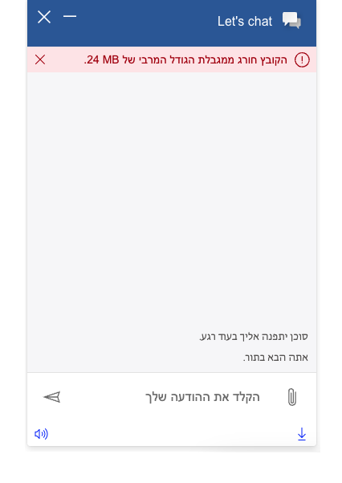

# Notification Pane

> :pushpin: Customization of the notification pane is currently limited to private preview.

## Table of contents

- [Interfaces](#interfaces)
  - [INotificationPaneProps](#inotificationpaneprops)
  - [INotificationPaneComponentOverrides ](#inotificationpanecomponentoverrides)
  - [INotificationPaneControlProps](#inotificationpanecontrolprops)
  - [INotificationPaneStyleProps](#inotificationpanestyleprops)
  - [INotificationPaneClassNames](#inotificationpaneclassnames)
  - [Chat Disconnect Notification Scenario](#chat-disconnect-notification-scenario)
    - [IChatDisconnectNotificationProps](#ichatdisconnectnotificationprops)
    - [IChatDisconnectControlProps](#ichatdisconnectcontrolprops)
    - [IChatDisconnectStyleProps](#ichatdisconnectstyleprops)
    - [IChatDisconnectClassNames](#ichatdisconnectclassnames)
- [Sample Scenarios](#sample-scenarios)
  - [Changing chat disconnect notification pane styling](#changing-chat-disconnect-notification-pane-styling)
  - [Default chat disconnect notification view in accordion format](#default-chat-disconnect-notification-view-in-accordion-format)
  - [Customizing RTL alignment of notifications in the notification pane](#customizing0-rtl-alignment-of-notifications-in-the-notification-pane)

## Interfaces

### [INotificationPaneProps](https://github.com/microsoft/omnichannel-chat-widget/blob/main/chat-components/src/components/notificationpane/interfaces/INotificationPaneProps.ts)

The top-level interface for customizing `NotificationPane`, containing all the supported customizable notification scenarios.

| Property | Type | Required | Description | Default |
| - | - | - | - | - |
| chatDisconnectNotificationProps     | [IChatDisconnectNotificationProps](#ichatdisconnectnotificationprops)     | No | Used for customizing the chat disconnect notification scenario | -

### [INotificationPaneComponentOverrides](https://github.com/microsoft/omnichannel-chat-widget/blob/main/chat-components/src/components/notificationpane/interfaces/common/INotificationPaneComponentOverrides.ts)

Custom React components can be passed as input to override the default sub-components. Alternatively, you can stringify the React component before passing it in. The `chat-components` library provides one util function that can be used: [encodeComponentString](https://github.com/microsoft/omnichannel-chat-widget/blob/main/chat-components/src/common/encodeComponentString.ts).

| Property | Type | Required | Description | Default |
| - | - | - | - | - |
| title | ReactNode\|string | No | Used for overriding default notification title | -
subtitle | ReactNode\|string | No | Used for overriding default notification subtitle | -
dismissButton | ReactNode\|string | No | Used for overriding default notification dismiss button | -
hyperlink | ReactNode\|string | No | Used for overriding default notification hyperlink | -
notificationIcon | ReactNode\|string | No | Used for overriding default notification icon | -

### [INotificationPaneControlProps](https://github.com/microsoft/omnichannel-chat-widget/blob/main/chat-components/src/components/notificationpane/interfaces/common/INotificationPaneControlProps.ts)

| Property | Type | Required | Description | Default |
| - | - | - | - | - |
| id     | string     | No | The top-level element id for the notification pane | -
dir | "rtl"\|"ltr"\|"auto" | No | The locale direction under the `NotificationPane` component | -
hideNotificationPane | boolean | No | Whether to hide the notification pane | -
hideTitle | boolean | No | Whether to hide the title string on the notification pane | -
titleText | string | No | The title text of the notification pane | -
hideSubtitle | boolean | No | Whether to hide the subtitle on the notification pane | -
subtitleText | string | No | The subtitle text of the notification pane | -
hideDismissButton | boolean | No | Whether to hide the dismiss button on the notification pane | -
dismissButtonProps | [ICommandButtonControlProps](https://github.com/microsoft/omnichannel-chat-widget/blob/main/chat-components/src/components/common/interfaces/ICommandButtonControlProps.ts) | No | The size of the spinner on the notification pane | -
hideHyperlink | boolean | No | Whether to hide the subtitle on the notification pane | -
hyperlinkText | string | No | The hyperlink text of the notification pane | -
hyperlinkAriaLabel | string | No | The hyperlink aria label of the notification pane | -
hyperlinkHref | string | No | The hyperlink link of the notification panee | -
hideIcon | boolean | No | Whether to hide the icon on the notification pane | -
notificationIconProps | [IImageControlProps](https://github.com/microsoft/omnichannel-chat-widget/blob/main/chat-components/src/components/common/interfaces/IImageControlProps.ts) | No | The notification icon control props | -

> :pushpin: If both `hide-` option and `componentOverride` are used on the same sub-component, that sub-component will be hidden. `hide-` options take higher priority.

### [INotificationPaneStyleProps](https://github.com/microsoft/omnichannel-chat-widget/blob/main/chat-components/src/components/notificationpane/interfaces/common/INotificationPaneStyleProps.ts)

[IStyle](https://github.com/microsoft/fluentui/blob/master/packages/merge-styles/src/IStyle.ts) is the interface provided by [FluentUI](https://developer.microsoft.com/en-us/fluentui#/).

| Property | Type | Required | Description | Default |
| - | - | - | - | - |
| generalStyleProps | [IStyle](https://github.com/microsoft/fluentui/blob/master/packages/merge-styles/src/IStyle.ts) | No | Overall styles of the `NotificationPane` component, including the container | - |
| titleStyleProps | [IStyle](https://github.com/microsoft/fluentui/blob/master/packages/merge-styles/src/IStyle.ts) | No | Styles of the notification pane title | - |
| subtitleStyleProps | [IStyle](https://github.com/microsoft/fluentui/blob/master/packages/merge-styles/src/IStyle.ts) | No | Styles of the notification pane subtitle | - |
| dismissButtonStyleProps | [IStyle](https://github.com/microsoft/fluentui/blob/master/packages/merge-styles/src/IStyle.ts) | No | Styles of the notification pane dismiss button | - |
| dismissButtonHoverStyleProps | [IStyle](https://github.com/microsoft/fluentui/blob/master/packages/merge-styles/src/IStyle.ts) | No | Styles of the notification pane dismiss button when hovered | - |
| hyperlinkStyleProps | [IStyle](https://github.com/microsoft/fluentui/blob/master/packages/merge-styles/src/IStyle.ts) | No | Styles of the notification pane hyperlink | - |
| hyperlinkHoverStyleProps | [IStyle](https://github.com/microsoft/fluentui/blob/master/packages/merge-styles/src/IStyle.ts) | No | Styles of the notification pane hyperlink when hovered | - |
| notificationIconStyleProps | [IStyle](https://github.com/microsoft/fluentui/blob/master/packages/merge-styles/src/IStyle.ts) | No | Styles of the notification pane icon | - |
| notificationIconContainerStyleProps | [IStyle](https://github.com/microsoft/fluentui/blob/master/packages/merge-styles/src/IStyle.ts) | No | Styles of the notification pane icon container | - |
| infoGroupStyleProps | [IStyle](https://github.com/microsoft/fluentui/blob/master/packages/merge-styles/src/IStyle.ts) | No | Styles of the container encompassing title, subtitle, and hyperlink | - |


### [INotificationPaneClassNames](https://github.com/microsoft/omnichannel-chat-widget/blob/main/chat-components/src/components/notificationpane/interfaces/common/INotificationPaneClassNames.ts)

| Property | Type | Required | Description | Default |
| - | - | - | - | - |
| containerClassName | string | No | Custom class name for container | -
| titleClassName | string | No | Custom class name for title | -
| subtitleClassName | string | No | Custom class name for subtitle | -
| dismissButtonClassName | string | No | Custom class name for dismiss button | -
| hyperlinkClassName | string | No | Custom class name for hyperlink | -
| notificationIconClassName | string | No | Custom class name for notification icon | -

## Chat Disconnect Notification Scenario

### [IChatDisconnectNotificationProps](https://github.com/microsoft/omnichannel-chat-widget/blob/main/chat-components/src/components/notificationpane/interfaces/chatdisconnect/IChatDisconnectNotificationProps.ts)

The top-level interface for customizing the chat disconnect notification, a scenario covered by the `NotificationPane`.

| Property | Type | Required | Description | Default |
| - | - | - | - | - |
| componentOverrides     | [INotificationPaneComponentOverrides](#inotificationpanecomponentoverrides)     | No | Used for overriding default `NotificationPane` components, e.g., title, subtitle, dismiss button, hyperlink, icon | -
controlProps | [IChatDisconnectControlProps](#ichatdisconnectcontrolprops) | No | Properties that control the element behaviors | [defaultChatDisconnectControlProps](https://github.com/microsoft/omnichannel-chat-widget/blob/main/chat-widget/src/components/notificationpanestateful/defaultProps/defaultChatDisconnectControlProps.ts)
styleProps | [IChatDisconnectStyleProps](#ichatdisconnectstyleprops) | No | Properties that control the element styles | [defaultChatDisconnectStyleProps](https://github.com/microsoft/omnichannel-chat-widget/blob/main/chat-widget/src/components/notificationpanestateful/defaultProps/defaultChatDisconnectStyleProps.ts)

### [IChatDisconnectControlProps](https://github.com/microsoft/omnichannel-chat-widget/blob/main/chat-components/src/components/notificationpane/interfaces/chatdisconnect/IChatDisconnectControlProps.ts)

This interface extends the `INotificationPaneControlProps` interface.

| Property | Type | Required | Description | Default |
| - | - | - | - | - |
| hideCloseChatButton     | boolean     | No | Whether to hide the close chat button on the chat disconnect pane | false
| closeChatButtonProps     | [ICommandButtonControlProps](https://github.com/microsoft/omnichannel-chat-widget/blob/main/chat-components/src/components/common/interfaces/ICommandButtonControlProps.ts)     | No | Control props for customizing the close chat button control props | [defaultChatDisconnectControlProps](https://github.com/microsoft/omnichannel-chat-widget/blob/main/chat-widget/src/components/notificationpanestateful/defaultProps/defaultChatDisconnectControlProps.ts)

### [IChatDisconnectStyleProps](https://github.com/microsoft/omnichannel-chat-widget/blob/main/chat-components/src/components/notificationpane/interfaces/chatdisconnect/IChatDisconnectStyleProps.ts)

This interface extends the `INotificationPaneStyleProps` interface.

| Property | Type | Required | Description | Default |
| - | - | - | - | - |
| closeChatButtonStyleProps     | [IStyle](https://github.com/microsoft/fluentui/blob/master/packages/merge-styles/src/IStyle.ts)     | No | Styles of the chat disconnect notification close chat button | [defaultChatDisconnectStyleProps](https://github.com/microsoft/omnichannel-chat-widget/blob/main/chat-widget/src/components/notificationpanestateful/defaultProps/defaultChatDisconnectStyleProps.ts)
| closeChatButtonHoverStyleProps     | [IStyle](https://github.com/microsoft/fluentui/blob/master/packages/merge-styles/src/IStyle.ts)     | No | Styles of the chat disconnect notification close chat button when hovered | [defaultChatDisconnectStyleProps](https://github.com/microsoft/omnichannel-chat-widget/blob/main/chat-widget/src/components/notificationpanestateful/defaultProps/defaultChatDisconnectStyleProps.ts)
| buttonGroupStyleProps     | [IStyle](https://github.com/microsoft/fluentui/blob/master/packages/merge-styles/src/IStyle.ts)     | No | Styles of the container encompassing chat disconnect notification buttons | [defaultChatDisconnectStyleProps](https://github.com/microsoft/omnichannel-chat-widget/blob/main/chat-widget/src/components/notificationpanestateful/defaultProps/defaultChatDisconnectStyleProps.ts)
| classNames     | [IChatDisconnectClassNames](https://github.com/microsoft/omnichannel-chat-widget/blob/main/chat-components/src/components/notificationpane/interfaces/chatdisconnect/IChatDisconnectClassNames.ts)     | No | Sets custom class names for sub-components | [defaultChatDisconnectStyleProps](https://github.com/microsoft/omnichannel-chat-widget/blob/main/chat-widget/src/components/notificationpanestateful/defaultProps/defaultChatDisconnectStyleProps.ts)

### [IChatDisconnectClassNames](https://github.com/microsoft/omnichannel-chat-widget/blob/main/chat-components/src/components/notificationpane/interfaces/chatdisconnect/IChatDisconnectClassNames.ts)

This interface extends the `INotificationPaneClassNames` interface.

| Property | Type | Required | Description | Default |
| - | - | - | - | - |
| closeChatButtonClassName | string | No | Custom class name for close chat button | -

## Sample Scenarios

Below samples are build upon the base sample, which can be found [here](https://github.com/microsoft/omnichannel-chat-widget#example-usage). The code snippets below will only show the changes needed to be added before `ReactDOM.render`.

--------------------------------

### Changing chat disconnect notification pane styling

<details>
    <summary>Show code</summary>

```tsx
...
liveChatWidgetProps = {
    ...liveChatWidgetProps,
    notificationPaneProps: {
        chatDisconnectNotificationProps: {
            controlProps: {
                titleText: "Chat disconnected :(",
                subtitleText: "Please close the chat and try again.",
                hideHyperlink: false,
                hyperlinkText: "Why did this happen?",
                hyperlinkHref: "https://www.google.com",
                hideDismissButton: true,
            },
            styleProps: {
                titleStyleProps: {
                    fontFamily: "Impact",
                },
                subtitleStyleProps: {
                    color: "red",
                },
                closeChatButtonStyleProps: {
                    backgroundColor: "purple",
                },
                buttonGroupStyleProps: {
                    justifyContent: "flex-start",
                },
            },
        },
    },
};
...
```

</details>


--------------------------------

### Default chat disconnect notification view in accordion format

<details>
    <summary>Show code</summary>

```tsx
...
liveChatWidgetProps = {
    ...liveChatWidgetProps,
    // no customizations necessary for this default
    // customizing the accordion which renders the chat disconnect notification is not supported
};
...
```

</details>


--------------------------------
### Customizing RTL alignment of notifications in the notification pane

<details>
    <summary>Show code</summary>

```tsx
...
liveChatWidgetProps = {
    ...liveChatWidgetProps,
    webChatContainerProps: {
        containerStyles: {
            direction: "rtl",
        }
    }
};
...
```

</details>

