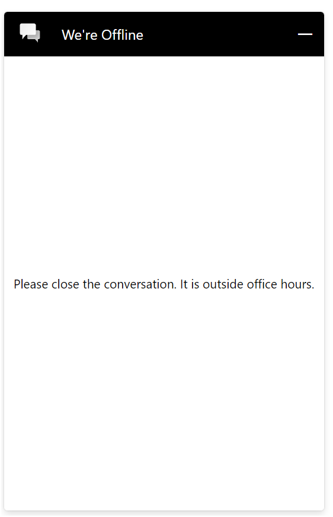

# OOOH Pane

## Table of contents

- [Interfaces](#interfaces)
  - [IOOOHPaneProps](#iooohpaneprops)
  - [IOOOHPaneComponentOverrides](#iooohpanecomponentoverrides)
  - [IOOOHPaneControlProps](#iooohpanecontrolprops)
  - [IOOOHPaneStyleProps](#iooohpanestyleprops)
  - [IOOOHPaneClassNames](#iooohpaneclassnames)
- [Sample Scenarios](#sample-scenarios)
  - [Editing title text](#editing-title-text)
  - [Changing background color](#changing-background-color)

## Interfaces

### [IOOOHPaneProps](https://github.com/microsoft/omnichannel-chat-widget/blob/main/chat-components/src/components/outofofficehourspane/interfaces/IOOOHPaneProps.ts)

The top-level interface for customizing the `Out of Office Hours (OOOH) Pane`.

| Property | Type | Required | Description | Default |
| - | - | - | - | - |
| componentOverrides     | [IOOOHPaneComponentOverrides](#iooohpanecomponentoverrides)     | No | Used for overriding default `OOOHPane` components | -
controlProps | [IOOOHPaneControlProps](#iooohpanecontrolprops) | No | Properties that control the element behaviors | -
styleProps | [IOOOHPaneStyleProps](#iooohpanestyleprops) | No | Properties that control the element styles | -

### [IOOOHPaneComponentOverrides](https://github.com/microsoft/omnichannel-chat-widget/blob/main/chat-components/src/components/outofofficehourspane/interfaces/IOOOHPaneComponentOverrides.ts)

Custom React components can be passed as input to override the default sub-components. Alternatively, you can stringify the React component before passing it in.

| Property | Type | Required | Description | Default |
| - | - | - | - | - |
| title     | ReactNode\|string     | No | Used for overriding default title | -

### [IOOOHPaneControlProps](https://github.com/microsoft/omnichannel-chat-widget/blob/main/chat-components/src/components/outofofficehourspane/interfaces/IOOOHPaneControlProps.ts)

| Property | Type | Required | Description | Default |
| - | - | - | - | - |
| id     | string     | No | The top-level element id for the OOOH Pane | "lcw-out-of-office-hours-pane"
hideOOOHPane | boolean | No | Whether to hide the OOOH Pane completely | false
hideTitle | boolean | No | The oooh title text | false
dir | "rtl"\|"ltr"\|"auto" | No | The locale direction under the OOOH Pane | "auto"
role | string | No | Sets the `role` attribute of the OOOH Pane | "alert"
titleText | string | No | The oooh title text | "Thanks for contacting us. You have reached us outside of our operating hours. An agent will respond when we open."
openLinkInNewTab | boolean | No | Whether to open any hyperlinks in OOOH pane text in a new tab | false

### [IOOOHPaneStyleProps](https://github.com/microsoft/omnichannel-chat-widget/blob/main/chat-components/src/components/outofofficehourspane/interfaces/IOOOHPaneStyleProps.ts)

[IStyle](https://github.com/microsoft/fluentui/blob/master/packages/merge-styles/src/IStyle.ts) is the interface provided by [FluentUI](https://developer.microsoft.com/en-us/fluentui#/).

| Property | Type | Required | Description | Default |
| - | - | - | - | - |
| generalStyleProps | [IStyle](https://github.com/microsoft/fluentui/blob/master/packages/merge-styles/src/IStyle.ts) | No | Overall styles of the `OOOHPane` component, including the container | [defaultOOOHPaneGeneralStyles](https://github.com/microsoft/omnichannel-chat-widget/blob/main/chat-components/src/components/outofofficehourspane/common/defaultProps/defaultStyles/defaultOOOHPaneGeneralStyles.ts) |
| titleStyleProps | [IStyle](https://github.com/microsoft/fluentui/blob/master/packages/merge-styles/src/IStyle.ts) | No | Styles of the OOOH Pane title | [defaultOOOHPaneTitleStyles](https://github.com/microsoft/omnichannel-chat-widget/blob/main/chat-components/src/components/outofofficehourspane/common/defaultProps/defaultStyles/defaultOOOHPaneTitleStyles.ts) |
| classNames | [IOOOHPaneClassNames](#iooohpaneclassnames) | No | Sets custom class names for sub-components | - |

### [IOOOHPaneClassNames](https://github.com/microsoft/omnichannel-chat-widget/blob/main/chat-components/src/components/outofofficehourspane/interfaces/IOOOHPaneClassNames.ts)

| Property | Type | Required | Description | Default |
| - | - | - | - | - |
| titleClassName | string | No | Custom class name for title | -

## Sample Scenarios

Below samples are build upon the base sample, which can be found [here](https://github.com/microsoft/omnichannel-chat-widget#example-usage). The code snippets below will only show the changes needed to be added before `ReactDOM.render`.

--------------------------------

### Editing title text

<details>
    <summary>Show code</summary>

```tsx
...
liveChatWidgetProps = {
    ...liveChatWidgetProps,
    ooohPaneProps: {
        controlProps: {
            titleText: "Please close the conversation. It is outside office hours."
        }
    }
};
...
```

</details>



--------------------------------

### Changing background color

<details>
    <summary>Show code</summary>

```tsx
...
liveChatWidgetProps = {
    ...liveChatWidgetProps,
    ooohPaneProps: {
        styleProps: {
            backgroundColor: "#777777"
        }
    }
};
...
```

</details>


