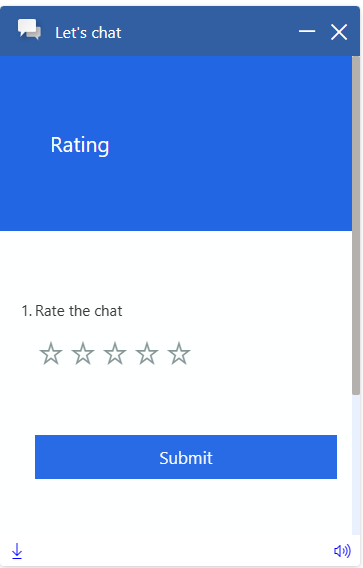

# PostChatSurvey Pane

## Table of contents

- [Interfaces](#interfaces)
  - [IPostChatSurveyPaneProps](#ipostchatsurveypaneprops)
  - [IPostChatSurveyPaneControlProps](#ipostchatsurveypanecontrolprops)
  - [IPostChatSurveyPaneStyleProps](#ipostchatsurveypanestyleprops)
  - [IPostChatSurveyPaneClassNames](#ipostchatsurveypaneclassnames)
- [Sample Scenarios](#sample-scenarios)
  - [Changing post chat survey pane survey URL](#changing-post-chat-survey-pane-survey-url)
  - [Changing post chat survey pane container title](#changing-post-chat-survey-pane-container-title)

## Interfaces

### [IPostChatSurveyPaneProps](https://github.com/microsoft/omnichannel-chat-widget/blob/main/chat-components/src/components/postchatsurveypane/interfaces/IPostChatSurveyPaneProps.ts)

The top-level interface for customizing `PostChatSurveyPane`.

| Property | Type | Required | Description | Default |
| - | - | - | - | - |
| controlProps | [IPostChatSurveyPaneControlProps](#ipostchatsurveypanecontrolprops) | No | Properties that control the element behaviors | -
styleProps | [IPostChatSurveyPaneStyleProps](#ipostchatsurveypanestyleprops) | No | Properties that control the element styles | -

### [IPostChatSurveyPaneControlProps](https://github.com/microsoft/omnichannel-chat-widget/blob/main/chat-components/src/components/postchatsurveypane/interfaces/IPostChatSurveyPaneControlProps.ts)

| Property | Type | Required | Description | Default |
| - | - | - | - | - |
| id     | string     | No | The top-level element id for the post chat survey pane | "lcw-postchat-survey-pane"
title | string | No | The post chat survey pane title | "Post chat survey pane"
role | string | No | Sets the `role` attribute at the top level element of the post chat survey pane | -
surveyURL | string | No | Sets the Customer Voice Survey URL that will show up in the container iframe| -

### [IPostChatSurveyPaneStyleProps](https://github.com/microsoft/omnichannel-chat-widget/blob/main/chat-components/src/components/postchatsurveypane/interfaces/IPostChatSurveyPaneStyleProps.ts)

[IStyle](https://github.com/microsoft/fluentui/blob/master/packages/merge-styles/src/IStyle.ts) is the interface provided by [FluentUI](https://developer.microsoft.com/en-us/fluentui#/).

| Property | Type | Required | Description | Default |
| - | - | - | - | - |
| generalStyleProps | [IStyle](https://github.com/microsoft/fluentui/blob/master/packages/merge-styles/src/IStyle.ts) | No | Overall styles of the `PostChatSurveyPane` component, including the container | [defaultPostChatSurveyPaneGeneralStyles](https://github.com/microsoft/omnichannel-chat-widget/blob/main/chat-components/src/components/postchatsurveypane/common/defaultProps/defaultStyles/defaultPostChatSurveyPaneGeneralStyles.ts) |
| classNames | [IPostChatSurveyPaneClassNames](#ipostchatsurveypaneclassnames) | No | Sets custom class names for sub-components | - |

### [IPostChatSurveyPaneClassNames](https://github.com/microsoft/omnichannel-chat-widget/blob/main/chat-components/src/components/postchatsurveypane/interfaces/IPostChatSurveyPaneClassNames.ts)

| Property | Type | Required | Description | Default |
| - | - | - | - | - |
| iframeClassName | string | No | Custom class name for `PostChatSurveyPane` iframe | -

## Sample Scenarios

Below samples are build upon the base sample, which can be found [here](https://github.com/microsoft/omnichannel-chat-widget#example-usage). The code snippets below will only show the changes needed to be added before `ReactDOM.render`.

--------------------------------

### Changing post chat survey pane survey URL

<details>
    <summary>Show code</summary>

```tsx
...
liveChatWidgetProps = {
    ...liveChatWidgetProps,
    postChatSurveyPaneProps: {
        controlProps: {
            surveyURL: "https://tip.dcv.ms/CouM7itE1c"
        }
    }
};
...
```

</details>

Default:


Custom:


--------------------------------

### Changing post chat survey pane container title

<details>
    <summary>Show code</summary>

```tsx
...
liveChatWidgetProps = {
    ...liveChatWidgetProps,
    postChatSurveyPaneProps: {
        controlProps: {
            title: "This is custom title"
        }
    }
};
...
```

</details>


