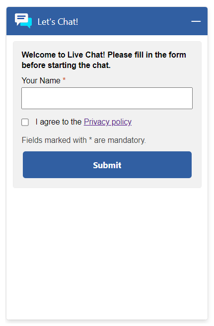
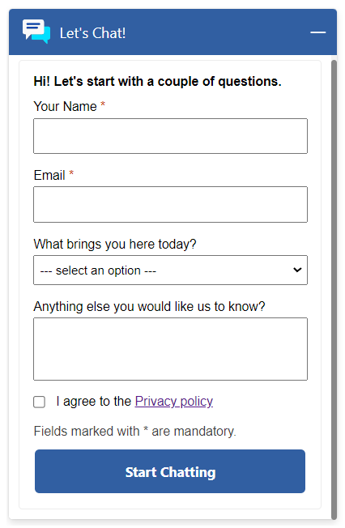

# Pre-Chat Survey Pane

## Table of Contents

- [Interfaces](#interfaces)
  - [IPreChatSurveyPaneStatefulParams](#iprechatsurveypanestatefulparams)
  - [IPreChatSurveyPaneProps](#iprechatsurveypaneprops)
  - [IPreChatSurveyPaneControlProps](#iprechatsurveypanecontrolprops)
  - [IPreChatSurveyPaneStyleProps](#iprechatsurveypanestyleprops)
- [Sample Scenarios](#sample-scenarios)
  - [Changing adaptive card host config background color](#changing-adaptive-card-host-config-background-color)
  - [Changing adaptive card payload](#changing-adaptive-card-payload)

## Interfaces

### IPreChatSurveyPaneStatefulParams

| Property | Type | Required | Description | Default |
| --- | --- | --- | --- | --- |
| surveyProps | [IPreChatSurveyPaneProps](#iprechatsurveypaneprops) | No | Used for overriding default `PreChatSurveyPane` components | - |

### IPreChatSurveyPaneProps

| Property | Type | Required | Description | Default |
| --- | --- | --- | --- | --- |
| controlProps | [IPreChatSurveyPaneControlProps](#iprechatsurveypanecontrolprops) | No | Properties that control the element behaviors | [defaultPreChatSurveyPaneControlProps](../../chat-components//src/components/prechatsurveypane/common/defaultProps/defaultPreChatSurveyPaneControlProps.ts) |
| styleProps | [IPreChatSurveyPaneStyleProps](#iprechatsurveypanestyleprops) | No | Properties that control the element styles | [defaultPreChatSurveyPaneStyles.ts](../../chat-components/src/components/prechatsurveypane/common/defaultProps/defaultStyles/defaultPreChatSurveyPaneStyles.ts) |

### IPreChatSurveyPaneControlProps

| Property | Type | Required | Description | Default |
| --- | --- | --- | --- | --- |
| id | string | No | The top-level element id for the header | "lcw-prechat-survey-pane-default" |
| role | string | No | Sets the `role` attribute at the top level element of the `PreChatSurveyPane` component | "alert" |
| dir | string | No | The locale direction under the `PreChatSurveyPane` component | "auto" |
| payload | string | No | Adaptive Card payload of `PreChatSurvey` | - |
| adaptiveCardHostConfig | string | No | Sets how an Adaptive Card Renderer generates UI | "{\"fontFamily\":\"Segoe UI, Helvetica Neue, sans-serif\",\"containerStyles\":{\"default\":{\"foregroundColors\":{\"default\":{\"default\":\"#000000\"}},\"backgroundColor\":\"#FFFFFF\"}},\"actions\":{\"actionsOrientation\":\"Vertical\",\"actionAlignment\":\"stretch\"}}" |
| requiredFieldMissingMessage | string | No | Error message on validating inputs | "{0} field is required" |
| onSubmit | () => void) | No | Sets the behavior after the `PreChatSurveyPane` is submitted | [Starts the chat flow] |

### IPreChatSurveyPaneStyleProps

| Property | Type | Required | Description | Default |
| --- | --- | --- | --- | --- |
| generalStyleProps | [IStyle](https://github.com/microsoft/fluentui/blob/master/packages/merge-styles/src/IStyle.ts) | No | Overall styles of `PreChatSurveyPane` | [defaultGeneralPreChatSurveyPaneStyleProps](./../../chat-widget/src/components/prechatsurveypanestateful/common/defaultStyles/defaultGeneralPreChatSurveyPaneStyleProps.ts)
| adaptiveCardContainerStyleProps | [IStyle](https://github.com/microsoft/fluentui/blob/master/packages/merge-styles/src/IStyle.ts) | No | Styles of the adaptive card container | [defaultPreChatSurveyPaneACContainerStyles.ts](../../chat-components/src/components/prechatsurveypane/common/defaultProps/defaultStyles/defaultPreChatSurveyPaneACContainerStyles.ts) |
| customButtonStyleProps | [IPreChatSurveyPaneButtonStyles](../../chat-components/src/components/prechatsurveypane/interfaces/IPreChatSurveyPaneButtonStyles.ts) | No | Styles of the `PreChatSurveyPane` submit button | [defaultPreChatSurveyPaneButtonStyles.ts](../../chat-components/src/components/prechatsurveypane/common/defaultProps/defaultStyles/defaultPreChatSurveyPaneButtonStyles.ts) |
| customTextStyleProps | [IPreChatSurveyPaneElementStyles](../../chat-components/src/components/prechatsurveypane/interfaces/IPreChatSurveyPaneElementStyles.ts) | No | Styles of the `PreChatSurveyPane` texts | - |
| customTextInputStyleProps | [IPreChatSurveyPaneElementStyles](../../chat-components/src/components/prechatsurveypane/interfaces/IPreChatSurveyPaneElementStyles.ts) | No | Styles of the `PreChatSurveyPane` text inputs | [defaultPreChatSurveyPaneTextInputStyles.ts](../../chat-components/src/components/prechatsurveypane/common/defaultProps/defaultStyles/defaultPreChatSurveyPaneTextInputStyles.ts) |
| customMultilineTextInputStyleProps | [IPreChatSurveyPaneElementStyles](../../chat-components/src/components/prechatsurveypane/interfaces/IPreChatSurveyPaneElementStyles.ts) | No | Styles of the `PreChatSurveyPane` multiple text inputs | [defaultPreChatSurveyPaneMultilineTextInputStyles.ts](../../chat-components/src/components/prechatsurveypane/common/defaultProps/defaultStyles/defaultPreChatSurveyPaneMultilineTextInputStyles.ts) |
| customMultichoiceInputStyleProps | [IPreChatSurveyPaneElementStyles](../../chat-components/src/components/prechatsurveypane/interfaces/IPreChatSurveyPaneElementStyles.ts) | No | Styles of the `PreChatSurveyPane` multiple choice inputs | [defaultPreChatSurveyPaneMultichoiceInputStyles.ts](../../chat-components/src/components/prechatsurveypane/common/defaultProps/defaultStyles/defaultPreChatSurveyPaneMultichoiceInputStyles.ts) |
| customToggleInputStyleProps | [IPreChatSurveyPaneToggleInputStyles](../../chat-components/src/components/prechatsurveypane/interfaces/IPreChatSurveyPaneToggleInputStyles.ts) | No | Styles of the `PreChatSurveyPane` toggle inputs | [defaultPreChatSurveyPaneToggleInputStyles.ts](../../chat-components/src/components/prechatsurveypane/common/defaultProps/defaultStyles/defaultPreChatSurveyPaneToggleInputStyles.ts) |

## Sample Scenarios

### Changing adaptive card host config background color

<details>
    <summary> Show code</summary>

```tsx
...
const adaptiveCardHostConfig = {
    fontFamily: "arial, serif", // font family
    actions: {
        actionAlignment: "stretch",
        actionsOrientation: "Vertical"
    },
    containerStyles: {
        default: {
            backgroundColor: "#f1f1f1", // background color
            foregroundColors: {
                default: {
                    default: "#000" // font color
                }
            }
        }
    }
};

liveChatWidgetProps = {
    ...liveChatWidgetProps,
    preChatSurveyPaneProps: {
        controlProps: {
            adaptiveCardHostConfig: JSON.stringify(adaptiveCardHostConfig),
        }
    }
};
...
```

</details>



----------

### Changing adaptive card payload

__NOTE__ : The goal of this sample, is to demonstrate HOW TO pass the props value to override the pre-chat survey, It is mandatory to match the format of the Adaptive Card with the same elements used by the Out-of-the-Box widget, which this sample may not fully cover. Specifically, this includes the format for the `Id` object.

<details>

<summary> Show code</summary>

```tsx
...
const payload = {
    "$schema": "http://adaptivecards.io/schemas/adaptive-card.json",
    "type": "AdaptiveCard",
    "version": "1.1",
    "body": [
        {
            "type": "TextBlock",
            "weight": "bolder",
            "text": "Hi! Let's start with a couple of questions."
        },
        {
            "type": "Input.Text",
            "id":"{\"Id\":\"1e5e4e7a-8f0b-ec11-b6e6-000d3a305d38\",\"Name\":\"Name\",\"IsOption\":false,\"Order\":1,\"IsRequired\":true,\"QuestionText\":\"First Name\"}",
            "maxLength": 100,
            "isRequired": true,
            "errorMessage": "Name is required"
        },
        {
            "type": "Input.Text",
            "id":"{\"Id\":\"487eee2b-41df-4548-bdfa-d27e8f123502\",\"Name\":\"Email\",\"IsOption\":false,\"Order\":2,\"IsRequired\":true,\"QuestionText\":\"Email\"}",
            "maxLength": 100,
            "isRequired": true,
            "errorMessage": "Email is required"
        },
        {
            "type": "Input.ChoiceSet",
            "id":"{\"Id\":\"e4bdf7cb-995e-ec11-8f8f-000d3a31376e\",\"Name\":\"ProductQuestion\",\"IsOption\":false,\"Order\":3,\"IsRequired\":true,\"QuestionText\":\"What brings you here today?\"}",
            "isMultiSelect": false,
            "value": "1",
            "style": "compact",
            "choices": [
                {
                    "title": "--- select an option ---",
                    "value": "1"
                },
                {
                    "title": "Product Question",
                    "value": "2"
                },
                {
                    "title": "Billing Question",
                    "value": "3"
                },
                {
                    "title": "Support Question",
                    "value": "4"
                },
                {
                    "title": "Others",
                    "value": "5"
                }
            ]
        },
        {
            "type": "Input.Text",
            "id":"{\"Id\":\"7f8f5d6d-995e-ec11-8f8f-000d3a31376e\",\"Name\":\"Email\",\"IsOption\":false,\"Order\":4,\"IsRequired\":false,\"QuestionText\":\"Anything else you would like us to know?\"}",
            "style": "text",
            "isMultiline": true,
            "maxLength": 250
        },
                {
            "type": "Input.Toggle",
            {\"Id\":\"b26011d2-995e-ec11-8f8f-000d3a31376e\",\"Name\":\"Consent\",\"IsOption\":false,\"Order\":5,\"IsRequired\":true,\"QuestionText\":\"I agree to the [Privacy policy](https://privacy.microsoft.com/en-us/privacystatement)\"}",            
            "title": "I agree to the [Privacy policy](https://privacy.microsoft.com/en-us/privacystatement)",
            "valueOn": "True",
            "valueOff": "False",
            "value": "false"
        },
        {
            "type": "TextBlock",
            "isSubtle": true,
            "text": "Fields marked with * are mandatory.",
            "wrap": true
        }
    ],
    "actions": [
        {
            "type": "Action.Submit",
            "title": "Start Chatting",
            "data": {
                "Type": "InputSubmit"
            }
        }
    ]
}

liveChatWidgetProps = {
    ...liveChatWidgetProps,
    preChatSurveyPaneProps: {
        controlProps: {
            payload: JSON.stringify(payload),
        }
    }
};
...
```

</details>



----------
