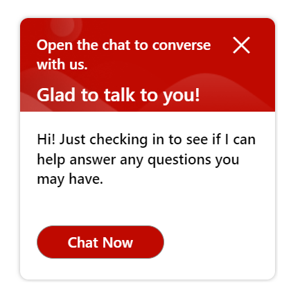
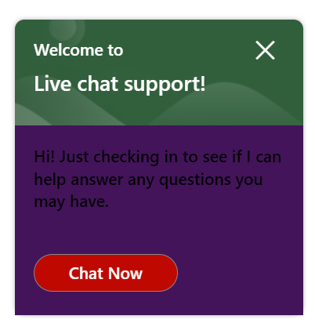

# Proactive Chat Pane

## Table of contents

- [Interfaces](#interfaces)
  - [IProactiveChatPaneProps](#iproactivechatpaneprops)
  - [IProactiveChatPaneComponentOverrides](#iproactivechatpanecomponentoverrides)
  - [IProactiveChatPaneControlProps](#iproactivechatpanecontrolprops)
  - [IProactiveChatPaneStyleProps](#iproactivechatpanestyleprops)
  - [IProactiveChatPaneClassNames](#iproactivechatpaneclassnames)
- [Sample Scenarios](#sample-scenarios)
  - [Edit the title and subtitle of the proactive chat pane](#edit-the-title-and-subtitle-of-the-proactive-chat-pane)
  - [Change colors on the proactive chat pane](#change-colors-on-the-proactive-chat-pane)

## Interfaces

### [IProactiveChatPaneProps](https://github.com/microsoft/omnichannel-chat-widget/blob/main/chat-components/src/components/proactivechatpane/interfaces/IProactiveChatPaneProps.ts)

The top-level interface for customizing the `ProactiveChatPane`.

| Attribute | Type | Required | Description | Default |
| - | - | - | - | - |
| componentOverrides     | [IProactiveChatPaneComponentOverrides](#iproactivechatpanecomponentoverrides)     | No | Used for overriding default `ProactiveChatPane` components | -
controlProps | [IProactiveChatPaneControlProps](#iproactivechatpanecontrolprops) | No | Properties that control the element behaviors | -
styleProps | [IProactiveChatPaneStyleProps](#iproactivechatpanestyleprops) | No | Properties that control the element styles | -

### [IProactiveChatPaneComponentOverrides](https://github.com/microsoft/omnichannel-chat-widget/blob/main/chat-components/src/components/proactivechatpane/interfaces/IProactiveChatPaneComponentOverrides.ts)

Custom React components can be passed as input to override the default sub-components. Alternatively, you can stringify the React component before passing it in.

| Attribute | Type | Required | Description | Default |
| - | - | - | - | - |
| title     | ReactNode\|string     | No | Used for overriding default title | -
| subtitle     | ReactNode\|string     | No | Used for overriding default subtitle | -
closeButton | ReactNode\|string | No | Used for overriding default close button| -
bodyTitle | ReactNode\|string | No | Used for overriding default body title| -
startButton | ReactNode\|string | No | Used for overriding default start button| -

### [IProactiveChatPaneControlProps](https://github.com/microsoft/omnichannel-chat-widget/blob/main/chat-components/src/components/proactivechatpane/interfaces/IProactiveChatPaneControlProps.ts)

| Attribute | Type | Required | Description | Default |
| - | - | - | - | - |
| id     | string     | No | The top-level element id for the proactive chat pane | "lcw-proactive-chat"
| dir | "rtl"\|"ltr"\|"auto" | No | The locale direction under the `ProactiveChatPane` component | "ltr"
| hideProactiveChatPane | boolean | No | Whether to hide the proactive chat pane completely | false
| proactiveChatPaneAriaLabel    | string     | No | Sets the `aria-label` attribute on the general proactive chat pane | "Proactive Chat Pane"
| hideTitle     | boolean    | No | Whether to hide the title| false
| titleText     | string     | No | The proactive chat pane title text | "Welcome to"
| hideSubtitle     | boolean     | No | Whether to hide the subtitle| false
| subtitleText     | string     | No | The proactive chat pane subtitle text | "Live chat support!"
| hideCloseButton     | boolean     | No | Whether to hide the button that closes the chat | false
| closeButtonProps     | ICommandButtonControlProps     | No | The control props for the `closeButton` screen | ```{type: "icon", iconName: "ChromeClose", hideButtonTitle: true```
| isBodyContainerHorizontal     | boolean     | No | Whether the main body container for the proactive chat is horizontal| false
| hideBodyTitle     | boolean     | No | Whether to hide the body title| false
| bodyTitleText     | string     | No | The proactive chat pane body title text | "iveChatPaneBodyTitleText = "Hi! Have any questions? I am here to help."
| hideStartButton   | boolean     | No | Whether to hide the button that starts the chat| false
| startButtonText     | string     | No | Sets the text inside the start button | "Start"
| startButtonAriaLabel     | string     | No | Sets the `aria-label` attribute on the start button | "Chat Now"
| onStart | () => void | No | Sets the behavior after the start button is clicked | [Starts the chat]
| onClose| () => void | No | Sets the behavior after the close button is clicked | [Proceeds to close the chat widget]

> :pushpin: If both `hide-` option and `componentOverride` are used on the same sub-component, that sub-component will be hidden. `hide-` options take higher priority.

### [IProactiveChatPaneStyleProps](https://github.com/microsoft/omnichannel-chat-widget/blob/main/chat-components/src/components/proactivechatpane/interfaces/IProactiveChatPaneStyleProps.ts)

[IStyle](https://github.com/microsoft/fluentui/blob/master/packages/merge-styles/src/IStyle.ts) is the interface provided by [FluentUI](https://developer.microsoft.com/en-us/fluentui#/).

| Attribute | Type | Required | Description | Default |
| - | - | - | - | - |
| generalStyleProps | [IStyle](https://github.com/microsoft/fluentui/blob/master/packages/merge-styles/src/IStyle.ts) | No | Overall styles of the `ProactiveChatPane` component, including the container | [defaultProactiveChatPaneGeneralStyles](https://github.com/microsoft/omnichannel-chat-widget/blob/main/chat-components/src/components/proactivechatpane/common/default/defaultStyles/defaultProactiveChatPaneGeneralStyles.ts) |
| headerContainerStyleProps | [IStyle](https://github.com/microsoft/fluentui/blob/master/packages/merge-styles/src/IStyle.ts) | No | Styles of the Proactive Chat Pane header container | [defaultProactiveChatPaneHeaderContainerStyles](https://github.com/microsoft/omnichannel-chat-widget/blob/main/chat-components/src/components/proactivechatpane/common/default/defaultStyles/defaultProactiveChatPaneHeaderContainerStyles.ts) |
| textContainerStyleProps | [IStyle](https://github.com/microsoft/fluentui/blob/master/packages/merge-styles/src/IStyle.ts) | No | Styles of the Proactive Chat Pane text container | [defaultProactiveChatPaneTextContainerStyles](https://github.com/microsoft/omnichannel-chat-widget/blob/main/chat-components/src/components/proactivechatpane/common/default/defaultStyles/defaultProactiveChatPaneTextContainerStyles.ts) |
| titleStyleProps | [IStyle](https://github.com/microsoft/fluentui/blob/master/packages/merge-styles/src/IStyle.ts) | No | Styles of the Proactive Chat Pane title | [defaultProactiveChatPaneTitleStyles](https://github.com/microsoft/omnichannel-chat-widget/blob/main/chat-components/src/components/proactivechatpane/common/default/defaultStyles/defaultProactiveChatPaneTitleStyles.ts) |
| subtitleStyleProps | [IStyle](https://github.com/microsoft/fluentui/blob/master/packages/merge-styles/src/IStyle.ts) | No | Styles of the Proactive Chat Pane subtitle | [defaultProactiveChatPaneSubtitleStyles](https://github.com/microsoft/omnichannel-chat-widget/blob/main/chat-components/src/components/proactivechatpane/common/default/defaultStyles/defaultProactiveChatPaneSubtitleStyles.ts) |
| closeButtonStyleProps | [IStyle](https://github.com/microsoft/fluentui/blob/master/packages/merge-styles/src/IStyle.ts) | No | Styles of the Proactive Chat Pane close button | [defaultProactiveChatPaneCloseButtonStyles](https://github.com/microsoft/omnichannel-chat-widget/blob/main/chat-components/src/components/proactivechatpane/common/default/defaultStyles/defaultProactiveChatPaneCloseButtonStyles.ts) |
| closeButtonHoveredStyleProps | [IStyle](https://github.com/microsoft/fluentui/blob/master/packages/merge-styles/src/IStyle.ts) | No | Styles of the Proactive Chat Pane close button when hovered | [defaultProactiveChatPaneCloseButtonHoveredStyles](https://github.com/microsoft/omnichannel-chat-widget/blob/main/chat-components/src/components/proactivechatpane/common/default/defaultStyles/defaultProactiveChatPaneCloseButtonHoveredStyles.ts) |
| bodyContainerStyleProps | [IStyle](https://github.com/microsoft/fluentui/blob/master/packages/merge-styles/src/IStyle.ts) | No | Styles of the Proactive Chat Pane body container | [defaultProactiveChatPaneBodyContainerStyles](https://github.com/microsoft/omnichannel-chat-widget/blob/main/chat-components/src/components/proactivechatpane/common/default/defaultStyles/defaultProactiveChatPaneBodyContainerStyles.ts) |
| bodyTitleStyleProps | [IStyle](https://github.com/microsoft/fluentui/blob/master/packages/merge-styles/src/IStyle.ts) | No | Styles of the Proactive Chat Pane body title | [defaultProactiveChatPaneBodyTitleStyles](https://github.com/microsoft/omnichannel-chat-widget/blob/main/chat-components/src/components/proactivechatpane/common/default/defaultStyles/defaultProactiveChatPaneBodyTitleStyles.ts) |
| startButtonStyleProps | [IStyle](https://github.com/microsoft/fluentui/blob/master/packages/merge-styles/src/IStyle.ts) | No | Styles of the Proactive Chat Pane start button | [defaultProactiveChatPaneStartButtonStyles](https://github.com/microsoft/omnichannel-chat-widget/blob/main/chat-components/src/components/proactivechatpane/common/default/defaultStyles/defaultProactiveChatPaneStartButtonStyles.ts) |
| startButtonHoveredStyleProps | [IStyle](https://github.com/microsoft/fluentui/blob/master/packages/merge-styles/src/IStyle.ts) | No | Styles of the Proactive Chat Pane start button when hovered | [defaultProactiveChatPaneStartButtonHoveredStyles](https://github.com/microsoft/omnichannel-chat-widget/blob/main/chat-components/src/components/proactivechatpane/common/default/defaultStyles/defaultProactiveChatPaneStartButtonHoveredStyles.ts) |
| classNames | [IProactiveChatPaneClassNames](#iproactivechatpaneclassnames) | No | Sets custom class names for sub-components | - |

### [IProactiveChatPaneClassNames](https://github.com/microsoft/omnichannel-chat-widget/blob/main/chat-components/src/components/proactivechatpane/interfaces/IProactiveChatPaneClassNames.ts)

| Attribute | Type | Required | Description | Default |
| - | - | - | - | - |
| titleClassName | string | No | Custom class name for title | -
| containerClassName | string | No | Custom class name for container | -
| headerContainerClassName | string | No | Custom class name for header container | -
| textContainerClassName | string | No | Custom class name for text container | -
| subtitleClassName | string | No | Custom class name for subtitle | -
| closeButtonClassName | string | No | Custom class name for close button | -
| startButtonClassName | string | No | Custom class name for start button| -
| bodyContainerClassName | string | No | Custom class name for body container | -
| bodyTitleClassName | string | No | Custom class name for body title | -

## Sample Scenarios

Below samples are build upon the base sample, which can be found [here](https://github.com/microsoft/omnichannel-chat-widget#example-usage). The code snippets below will only show the changes needed to be added before `ReactDOM.render`.

--------------------------------

### Edit the title and subtitle of the proactive chat pane

<details>
    <summary>Show code</summary>

```tsx
...
liveChatWidgetProps = {
    ...liveChatWidgetProps,
    proactiveChatPaneProps: {
        controlProps: {
            hideTitle: false,
            titleText: "Open the chat to converse with us.",
            hideSubtitle: false,
            subtitleText: "Glad to talk to you!",
        }
    }
};
...
```

</details>



--------------------------------

### Change colors on the proactive chat pane

<details>
    <summary>Show code</summary>

```tsx
...
liveChatWidgetProps = {
    ...liveChatWidgetProps,
    proactiveChatPaneProps: {
        styleProps: {
                headerContainerStyleProps: {
                    backgroundColor: "rgb(49, 95, 60)",
                },
                textContainerStyleProps: {
                    color: "rgb(255, 255, 255)",
                },
                bodyContainerStyleProps: {
                    backgroundColor: "rgb(67, 20, 90)",
                },
        }
    }
};
...
```

</details>


