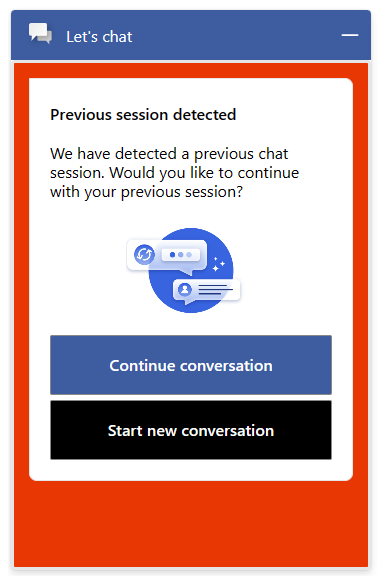
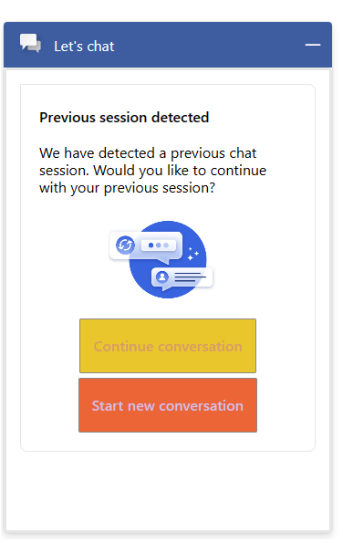
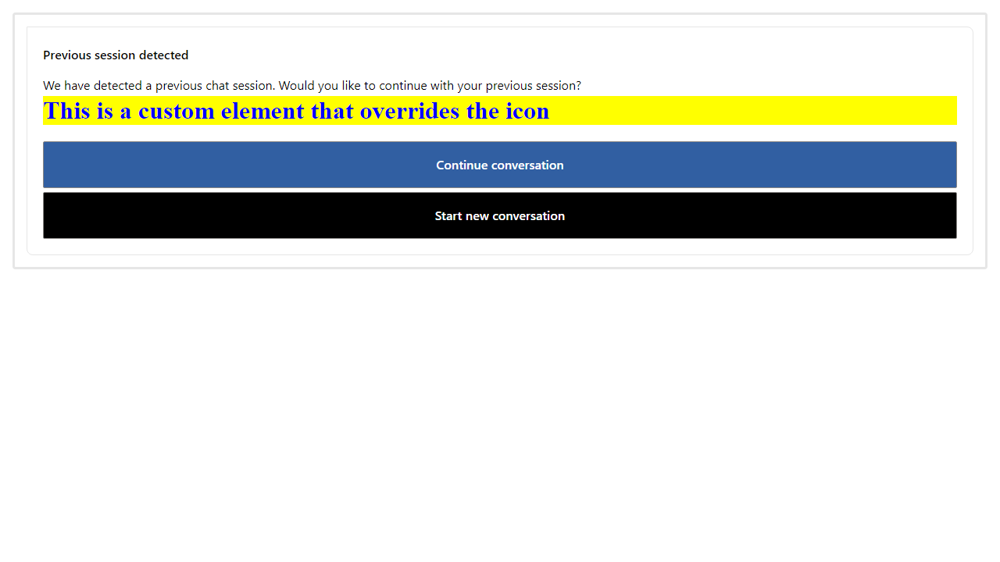

# Reconnect Chat Pane

## Table of contents

- [Interfaces](#interfaces)
  - [IReconnectChatPaneProps](#ireconnectchatpaneprops)
  - [IReconnectChatPaneControlProps](#ireconnectchatpanecontrolprops)
  - [IReconnectChatPaneStyleProps](#ireconnectchatpanestyleprops)
  - [IReconnectChatPaneComponentOverrides](#ireconnectchatpanecomponentoverrides)
  - [IReconnectChatPaneClassNames](#ireconnectchatpaneclassnames)
- [Sample scenarios](#sample-scenarios)
  - [Changing background color of the reconnect pane](#changing-background-color-of-the-reconnect-pane)
  - [Changing button styles of the reconnect pane](#changing-button-styles-of-the-reconnect-pane)
  - [Override of existing components in the UI](#override-of-existing-components-in-the-ui)

## Interfaces

### [IReconnectChatPaneProps](https://github.com/microsoft/omnichannel-chat-widget/blob/main/chat-components/src/components/reconnectchatpane/interfaces/IReconnectChatPaneProps.ts)

| Property | Type | Required | Description | Default |
| - | - | - | - | - |
|componentOverrides | [IReconnectChatPaneComponentOverrides](#ireconnectchatpanecomponentoverrides) | No | Used to override default `ReconnectChatPane` components| - |
| controlProps | [IReconnectChatPaneControlProps](#ireconnectchatpanecontrolprops) | No | Properties that control the element behavior | - |
| styleProps | [IReconnectChatPaneStyleProps](#ireconnectchatpanestyleprops) | No | Properties that control the element styles | - |

### [IReconnectChatPaneControlProps](https://github.com/microsoft/omnichannel-chat-widget/blob/main/chat-components/src/components/reconnectchatpane/interfaces/IReconnectChatPaneControlProps.ts)

| Property | Type | Required | Description | Default |
| - | - | - | - | - |
|id | string | No | Id of the reconnect pane | "lcw-reconnect-chat-pane" |
|dir| string | No | Specifies text direction ("ltr", "rtl", "auto")  | "ltr" |
|hideReconnectChatPane | boolean | No | Whether to hide the reconnectChatPane | false |
| reconnectChatPaneAriaLabel | string | No | Aria label of the reconnect pane | "Reconnect Chat Pane" |
| hideTitle | boolean | No | Wether to include the title attribute as part of the element | false |
| titleText | string | No | Title of the reconnect pane | "Previous session detected" |
| hideSubtitle | boolean | No | Wether to include the title attribute for the subtitle element  | false |
| subtitleText | string | No | Subtitle of the reconnect pane | "We have detected a previous chat session. Would you like to continue with your previous session?" |
| hideIcon | boolean | No | Hide the icon of the reconnect pane | false |
| iconAriaLabel | string | No | Icon aria label of the reconnect pane | "Post chat survey pane" |
| isButtonGroupHorizontal| boolean | No | Wether the display of the button is in horizontal mode | false |
| hideContinueChatButton | boolean | No | Hide the continue chat button | false |
| continueChatButtonText | string | No | Continue chat button text | "Continue conversation" |
| hideStartNewChatButton | boolean | No | Hide the start new chat button | false |
| startNewChatButtonText | string | No | Start new chat button text | "Start new conversation" |
| startNewChatButtonAriaLabel | string | No | Start new chat button aria label | "Post chat survey pane" |
| onContinueChat | () => void | No | Callback function for continue chat button click | Continues on existent conversation |
| onStartNewChat | () => void | No | Callback function for start new chat button click | Starts a new conversation |
| onMinimize| () => void | No | Callback function for minimize button click | Minimize the pane |

### [IReconnectChatPaneStyleProps](https://github.com/microsoft/omnichannel-chat-widget/blob/main/chat-components/src/components/reconnectchatpane/interfaces/IReconnectChatPaneStyleProps.ts)

| Property | Type | Required | Description | Default |
| - | - | - | - | - |
|generalStyleProps|IStyle | No | General style props of the reconnect pane | [defaultReconnectChatPaneGeneralStyles](https://github.com/microsoft/omnichannel-chat-widget/blob/main/chat-components/src/components/reconnectchatpane/common/default/defaultStyles/defaultReconnectChatPaneGeneralStyles.ts) |
|wrapperStyleProps|IStyle | No | Wrapper style props of the reconnect pane | [defaultReconnectChatPaneWrapperStyles](https://github.com/microsoft/omnichannel-chat-widget/blob/main/chat-components/src/components/reconnectchatpane/common/default/defaultStyles/defaultReconnectChatPaneWrapperStyles.ts) |
|titleStyleProps|IStyle | No | Title style props of the reconnect pane | [defaultReconnectChatPaneTitleStyles](https://github.com/microsoft/omnichannel-chat-widget/blob/main/chat-components/src/components/reconnectchatpane/common/default/defaultStyles/defaultReconnectChatPaneTitleStyles.ts) |
|subtitleStyleProps|IStyle | No | Subtitle style props of the reconnect pane | [defaultReconnectChatPaneSubtitleStyles](https://github.com/microsoft/omnichannel-chat-widget/blob/main/chat-components/src/components/reconnectchatpane/common/default/defaultStyles/defaultReconnectChatPaneSubtitleStyles.ts) |
|iconStyleProps|IStyle | No | Icon style props of the reconnect pane | [defaultReconnectChatPaneIconStyles](https://github.com/microsoft/omnichannel-chat-widget/blob/main/chat-components/src/components/reconnectchatpane/common/default/defaultStyles/defaultReconnectChatPaneIconStyles.ts)|
|buttonGroupStyleProps|IStyle | No | Button group style props of the reconnect pane | [defaultReconnectChatPaneButtonGroupStyles](https://github.com/microsoft/omnichannel-chat-widget/blob/main/chat-components/src/components/reconnectchatpane/common/default/defaultStyles/defaultReconnectChatPaneButtonGroupStyles.ts) |
|continueChatButtonStyleProps|IStyle | No | Continue chat button style props of the reconnect pane | [defaultReconnectChatPaneContinueChatButtonStyles](https://github.com/microsoft/omnichannel-chat-widget/blob/main/chat-components/src/components/reconnectchatpane/common/default/defaultStyles/defaultReconnectChatPaneContinueChatButtonStyles.ts) |
| continueChatButtonHoveredStyleProps|IStyle | No | Continue chat button style props of the reconnect pane | [defaultReconnectChatPaneContinueChatButtonHoveredStyles](https://github.com/microsoft/omnichannel-chat-widget/blob/main/chat-components/src/components/reconnectchatpane/common/default/defaultStyles/defaultReconnectChatPaneContinueChatButtonHoveredStyles.ts) |
continueChatButtonFocusedStyleProps| IStyle | No | Continue button focused style props of the reconnect pane |[defaultReconnectChatPaneStartNewChatButtonHoveredStyles](https://github.com/microsoft/omnichannel-chat-widget/blob/main/chat-components/src/components/reconnectchatpane/common/default/defaultStyles/defaultReconnectChatPaneContinueChatButtonFocusedStyles.ts)
|startNewChatButtonStyleProps|IStyle | No | Start new chat button style props of the reconnect pane | [defaultReconnectChatPaneStartNewChatButtonStyles](https://github.com/microsoft/omnichannel-chat-widget/blob/main/chat-components/src/components/reconnectchatpane/common/default/defaultStyles/defaultReconnectChatPaneStartNewChatButtonStyles.ts) |
|startNewChatButtonHoveredStyleProps|IStyle | No | Start new chat button hovered style props of the reconnect pane | [defaultReconnectChatPaneStartNewChatButtonHoveredStyles](https://github.com/microsoft/omnichannel-chat-widget/blob/main/chat-components/src/components/reconnectchatpane/common/default/defaultStyles/defaultReconnectChatPaneStartNewChatButtonHoveredStyles.ts) |
startNewChatButtonFocusedStyleProps| IStyle | No | Start new chat button focused style props of the reconnect pane |[defaultReconnectChatPaneStartNewChatButtonHoveredStyles](https://github.com/microsoft/omnichannel-chat-widget/blob/main/chat-components/src/components/reconnectchatpane/common/default/defaultStyles/defaultReconnectChatPaneStartChatButtonFocusedStyles.ts)
|classNames|[IReconnectChatPaneClassNames](#ireconnectchatpaneclassnames) | No | Class names of the reconnect pane | - |

### [IReconnectChatPaneComponentOverrides](https://github.com/microsoft/omnichannel-chat-widget/blob/main/chat-components/src/components/reconnectchatpane/interfaces/IReconnectChatPaneComponentOverrides.ts)

| Property | Type | Required | Description | Default |
| - | - | - | - | - |
|title | ReactNode\|String  | No | Title of the reconnect pane | - |
|subtitle | ReactNode\|String  | No | Subtitle of the reconnect pane | - |
|icon | ReactNode\|String  | No | Icon of the reconnect pane | - |
| continueChatButton | ReactNode\|String | No | Component to override the continue chat button | - |
| startNewChatButton | ReactNode\|String | No | Component to override the start new chat button | - |

### [IReconnectChatPaneClassNames](https://github.com/microsoft/omnichannel-chat-widget/blob/main/chat-components/src/components/reconnectchatpane/interfaces/IReconnectChatPaneClassNames.ts)

 | Property | Type | Required | Description | Default |
| - | - | - | - | - |
| containerClassName | string | No | Container class name of the reconnect pane | - |
|wrapperClassName | string | No | Wrapper class name of the reconnect pane | - |
| titleClassName | string | No | Title class name of the reconnect pane | - |
| subtitleClassName | string | No | Subtitle class name of the reconnect pane | - |
| iconClassName | string | No | Icon class name of the reconnect pane | - |
| buttonGroupClassName | string | No | Button group class name of the reconnect pane | - |
| continueChatButtonClassName | string | No | Continue chat button class name of the reconnect pane | - |
| startNewChatButtonClassName | string | No | Start new chat button class name of the reconnect pane | - |

## Sample scenarios

### Changing background color of the reconnect pane

<details>
    <summary>Show code</summary>

```tsx
...
liveChatWidgetProps = {
    ...liveChatWidgetProps,
    reconnectChatPaneProps:{
        styleProps:{
            generalStyleProps:{
                backgroundColor: "red"
            }
        }
    }
};
...
```

</details>



### Changing button styles of the reconnect pane

<details>
    <summary>Show code</summary>

```tsx
...
liveChatWidgetProps = {
    ...liveChatWidgetProps,
    reconnectChatPaneProps:{
        styleProps:{
            buttonGroupStyleProps:{
                alignItems:"center"
            },
            startNewChatButtonStyleProps:{
                backgroundColor:"#FF5733",
                color:"#D7BDE2",
            },
            continueChatButtonStyleProps:{
                backgroundColor:"#F1C40F",
                color:"#E59866",
            }
        }
    }
};
...
```

</details>



--------------------------------

### Override of existing components in the UI

<details>
    <summary>Show code</summary>

```tsx
...

const customReactNode = (
    <h1 style={{color: "blue", backgroundColor: "yellow"}}>
            This is a custom element that overrides the icon
    </h1>
);

liveChatWidgetProps = {
    ...liveChatWidgetProps,
    reconnectChatPaneProps:{
        componentOverrides:{
            icon: customReactNode
        }
    }
};
...
```

</details>
</br>

