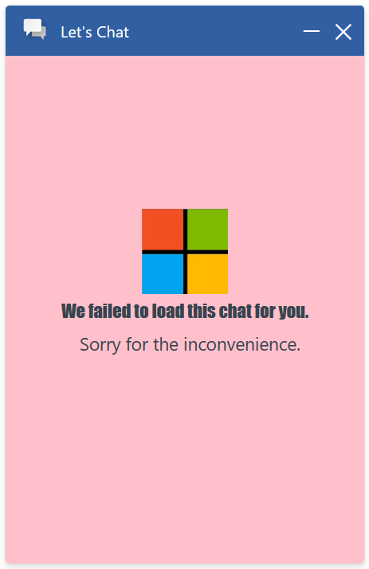

# Start Chat Error Pane

## Table of contents

- [Interfaces](#interfaces)
  - [IStartChatErrorPaneProps](#istartchaterrorpaneprops)
  - [IStartChatErrorPaneComponentOverrides](#istartchaterrorpanecomponentoverrides)
  - [IStartChatErrorPaneControlProps](#istartchaterrorpanecontrolprops)
  - [IStartChatErrorPaneStyleProps](#istartchaterrorpanestyleprops)
  - [IStartChatErrorPaneClassNames](#istartchaterrorpaneclassnames)
- [Sample Scenarios](#sample-scenarios)
  - [Changing start chat error pane icon, text, and container stylings](#changing-start-chat-error-pane-icon-text-and-container-stylings)

## Interfaces

### [IStartChatErrorPaneProps](https://github.com/microsoft/omnichannel-chat-widget/blob/main/chat-widget/src/components/startchaterrorpanestateful/interfaces/IStartChatErrorPaneProps.ts)

The top-level interface for customizing `StartChatErrorPane`.

| Property | Type | Required | Description | Default |
| - | - | - | - | - |
| componentOverrides     | [IStartChatErrorPaneComponentOverrides](#istartchaterrorpanecomponentoverrides)     | No | Used for overriding default `StartChatErrorPane` components, e.g., icon, title, and subtitle | -
controlProps | [IStartChatErrorPaneControlProps](#istartchaterrorpanecontrolprops) | No | Properties that control the element behaviors | -
styleProps | [IStartChatErrorPaneStyleProps](#istartchaterrorpanestyleprops) | No | Properties that control the element styles | -

### [IStartChatErrorPaneComponentOverrides](https://github.com/microsoft/omnichannel-chat-widget/blob/main/chat-widget/src/components/startchaterrorpanestateful/interfaces/IStartChatErrorPaneComponentOverrides.ts)

Custom React components can be passed as input to override the default sub-components. Alternatively, you can stringify the React component before passing it in. The `chat-components` library provides one util function that can be used: [encodeComponentString](https://github.com/microsoft/omnichannel-chat-widget/blob/main/chat-components/src/common/encodeComponentString.ts).

| Property | Type | Required | Description | Default |
| - | - | - | - | - |
| icon     | ReactNode\|string     | No | Used for overriding default start chat error pane icon | -
title | ReactNode\|string | No | Used for overriding default start chat error pane title | -
subtitle | ReactNode\|string | No | Used for overriding default start chat error pane subtitle | -

### [IStartChatErrorPaneControlProps](https://github.com/microsoft/omnichannel-chat-widget/blob/main/chat-widget/src/components/startchaterrorpanestateful/interfaces/IStartChatErrorPaneControlProps.ts)

| Property | Type | Required | Description | Default |
| - | - | - | - | - |
| id     | string     | No | The top-level element id for the start chat error pane | "oc-lcw-start-chat-error-pane"
role | string | No | Sets the `role` attribute at the top level element of the start chat error pane | "undefined"
dir | "rtl"\|"ltr"\|"auto" | No | The locale direction under the `StartChatErrorPane` component | "auto"
hideIcon | boolean | No | Whether to hide the icon on the start chat error pane | false
hideTitle | boolean | No | Whether to hide the title string on the start chat error pane | false
hideSubtitle | boolean | No | Whether to hide the subtitle on the start chat error pane | false
titleText | string | No | The title text of the start chat error pane | "We are unable to load chat at this time."
subtitleText | string | No | The subtitle text of the start chat error pane | "Please try again later."
unauthorizedTitleText | string | No | The title text of the start chat error pane during unauthorized error | "Chat authentication has failed."
unauthorizedSubtitleText | string | No | The subtitle text of the start chat error pane during unauthorized error | "UNAUTHORIZED"
authSetupErrorTitleText | string | No | The title text of the start chat error pane during auth setup error | "Chat authentication has failed."
authSetupErrorSubtitleText | string | No | The subtitle text of the start chat error pane during auth setup error | "AUTH SETUP ERROR"

> :pushpin: If both `hide-` option and `componentOverride` are used on the same sub-component, that sub-component will be hidden. `hide-` options take higher priority.

### [IStartChatErrorPaneStyleProps](https://github.com/microsoft/omnichannel-chat-widget/blob/main/chat-widget/src/components/startchaterrorpanestateful/interfaces/IStartChatErrorPaneStyleProps.ts)

[IStyle](https://github.com/microsoft/fluentui/blob/master/packages/merge-styles/src/IStyle.ts) is the interface provided by [FluentUI](https://developer.microsoft.com/en-us/fluentui#/).

| Property | Type | Required | Description | Default |
| - | - | - | - | - |
| generalStyleProps | [IStyle](https://github.com/microsoft/fluentui/blob/master/packages/merge-styles/src/IStyle.ts) | No | Overall styles of the `StartChatErrorPane` component, including the container | [defaultStartChatErrorPaneGeneralStyleProps](https://github.com/microsoft/omnichannel-chat-widget/blob/main/chat-widget/src/components/startchaterrorpanestateful/common/defaultStartChatErrorPaneGeneralStyleProps.ts) |
| titleStyleProps | [IStyle](https://github.com/microsoft/fluentui/blob/master/packages/merge-styles/src/IStyle.ts) | No | Styles of the start chat error pane title | [defaultStartChatErrorPaneTitleStyleProps](https://github.com/microsoft/omnichannel-chat-widget/blob/main/chat-widget/src/components/startchaterrorpanestateful/common/defaultStartChatErrorPaneTitleStyleProps.ts) |
| subtitleStyleProps | [IStyle](https://github.com/microsoft/fluentui/blob/master/packages/merge-styles/src/IStyle.ts) | No | Styles of the start chat error pane subtitle | [defaultStartChatErrorPaneSubtitleStyleProps](https://github.com/microsoft/omnichannel-chat-widget/blob/main/chat-widget/src/components/startchaterrorpanestateful/common/defaultStartChatErrorPaneSubtitleStyleProps.ts) |
| iconStyleProps | [IStyle](https://github.com/microsoft/fluentui/blob/master/packages/merge-styles/src/IStyle.ts) | No | Styles of the start chat error pane icon | [defaultStartChatErrorPaneIconStyleProps](https://github.com/microsoft/omnichannel-chat-widget/blob/main/chat-widget/src/components/startchaterrorpanestateful/common/defaultStartChatErrorPaneIconStyleProps.ts) |
| iconImageProps | [IStyle](https://github.com/microsoft/fluentui/blob/master/packages/merge-styles/src/IStyle.ts) | No | Styles of the start chat error pane icon image | [defaultStartChatErrorPaneIconImageStyleProps](https://github.com/microsoft/omnichannel-chat-widget/blob/main/chat-widget/src/components/startchaterrorpanestateful/common/defaultStartChatErrorPaneIconImageProps.ts) |
| classNames | [IStartChatErrorPaneClassNames](https://github.com/microsoft/omnichannel-chat-widget/blob/main/chat-widget/src/components/startchaterrorpanestateful/interfaces/IStartChatErrorPaneClassNames.ts) | No | Sets custom class names for sub-components | - |

### [IStartChatErrorPaneClassNames](https://github.com/microsoft/omnichannel-chat-widget/blob/main/chat-widget/src/components/startchaterrorpanestateful/interfaces/IStartChatErrorPaneClassNames.ts)

| Property | Type | Required | Description | Default |
| - | - | - | - | - |
| iconClassName | string | No | Custom class name for icon | -
| titleClassName | string | No | Custom class name for title | -
| subtitleClassName | string | No | Custom class name for subtitle | -

## Sample Scenarios

Below samples are build upon the base sample, which can be found [here](https://github.com/microsoft/omnichannel-chat-widget#example-usage). The code snippets below will only show the changes needed to be added before `ReactDOM.render`.

--------------------------------

### Changing start chat error pane icon, text, and container stylings

<details>
    <summary>Show code</summary>

```tsx
...
liveChatWidgetProps = {
    ...liveChatWidgetProps,
    startChatErrorPaneProps: {
        controlProps: {
            titleText: "We failed to load this chat for you.",
            subtitleText: "Sorry for the inconvenience.",
        },
        styleProps: {
            generalStyleProps: {
                backgroundColor: "pink",
            },
            titleStyleProps: {
                fontFamily: "Impact"
            },
            iconImageProps: {
                src: "https://msft-lcw-trial.azureedge.net/public/resources/microsoft.jpg",
            },
        }
    }
};
...
```

</details>



--------------------------------