# WebChatContainer

## Table of contents

- [Introduction](#introduction)
- [Interfaces](#interfaces)
  - [IWebChatContainerStatefulProps](#iwebchatcontainerstatefulprops)
  - [StyleOptions](#styleoptions)
  - [IWebChatProps](#iwebchatprops)
  - [IRenderingMiddlewareProps](#irenderingmiddlewareprops)
  - [ILiveChatWidgetLocalizedTexts](#ilivechatwidgetlocalizedtexts)
  - [IBotMagicCodeConfig](#ibotmagiccodeconfig)
  - [IBotAuthConfig](#ibotauthconfig)
  - [IAdaptiveCardStyles](#iadaptivecardstyles)
  - [IAttachmentProps](#iattachmentprops)
- [WebChat Middlewares](#webchat-middlewares)
  - [ActivityMiddleware](#activitymiddleware)
    - [Changing max bubble width](#changing-max-bubble-width)
    - [Changing message font sizes](#changing-message-font-sizes)
  - [ActivityStatusMiddleware](#activitystatusmiddleware)
    - [Changing default timestamp texts and styles](#changing-default-timestamp-texts-and-styles)
  - [AttachmentMiddleware](#attachmentmiddleware)
    - [Enable file attachment button and change file name styles](#enable-file-attachment-button-and-change-file-name-styles)
    - [Enable/Disable inline playing](#enabledisable-inline-playing)
    - [Changing default timestamp texts and styles](#changing-default-timestamp-texts-and-styles)
  - [AvatarMiddleware](#avatarmiddleware)
    - [Replacing avatar initials with image](#replacing-avatar-initials-with-image)
    - [Hiding agent avatar](#hiding-agent-avatars)
- [More Samples](#more-samples)
  - [Changing message bubble and adaptive card colors](#changing-message-bubble-and-adaptive-card-colors)
  - [Changing suggested action styles](#changing-suggested-action-styles)
  - [Disable send box](#disable-send-box)

## Introduction

[WebChat](https://github.com/microsoft/BotFramework-WebChat) is a customizable chat widget owned by Microsoft BotFramework, that the LiveChatWidget uses as the chat container. Instead of exposing css style customizations for components, WebChat has it's own set of customizabilities.

Instead of static styles, WebChat exposes middlewares that you can use to inject your custom logic and styles for components like message bubbles, attachments, timestamps, typing indicators, etc. Other middlewares let you change certain behaviors on state change like "Send Button Click", or "WebChat Connected". LiveChatWidget has some default middlewares implemented, and you can choose to completely disable them, overwrite them with your own middlewares, or tweak our default middlewares using props defined in LiveChatWidget. More details on that in below sections.

For more information on WebChat customization, please go to WebChat's official [GitHub page](https://github.com/microsoft/BotFramework-WebChat).

## Interfaces

### [IWebChatContainerStatefulProps](https://github.com/microsoft/omnichannel-chat-widget/blob/main/chat-widget/src/components/webchatcontainerstateful/interfaces/IWebChatContainerStatefulProps.ts)

> The top-level interface for customizing `WebChatContainer`.

> [IStyle](https://github.com/microsoft/fluentui/blob/master/packages/merge-styles/src/IStyle.ts) is the interface provided by [FluentUI](https://developer.microsoft.com/en-us/fluentui#/).

| Property | Type | Required | Description | Default |
| - | - | - | - | - |
| containerStyles    | [IStyle](https://github.com/microsoft/fluentui/blob/master/packages/merge-styles/src/IStyle.ts)     | No | Overall styles of the `WebChatContainer` component, specifically on the container | [defaultWebChatStatefulContainerStyles](https://github.com/microsoft/omnichannel-chat-widget/blob/main/chat-widget/src/components/webchatcontainerstateful/common/defaultStyles/defaultWebChatStatefulContainerStyles.ts)
| webChatStyles  | [StyleOptions](#styleoptions)     | No | The set of styles exposed by the `WebChat` component | [defaultWebChatStyles](https://github.com/microsoft/omnichannel-chat-widget/blob/main/chat-widget/src/components/webchatcontainerstateful/common/defaultStyles/defaultWebChatStyles.ts)
| webChatProps  | [IWebChatProps](#iwebchatprops)  | No | The props of the `WebChat` component, minus the "styleOptions", which is separated out above  | [defaultWebChatStatefulProps](https://github.com/microsoft/omnichannel-chat-widget/blob/main/chat-widget/src/components/webchatcontainerstateful/common/defaultProps/defaultWebChatStatefulProps.ts). **This file is not the complete list. Please see the "Middlewares" section below**
| directLine  | any  | No | WebChat by default uses DirectLine services as the communication service. In LiveChatWidget case, we are overwriting this prop with ACS Adapter to connect to ACS, which is the chat service used in Omnichannel. Most likely you do not want to touch this | see below
| storeMiddlewares  | any[]  | No | A list of middlewares that you want to run alongside the default WebChat behaviors. LiveChatWidget has implemented several by default. More samples below | see below
| renderingMiddlewareProps  | [IRenderingMiddlewareProps](#irenderingmiddlewareprops) | No | Sets the variables used in the various default rendering middlewares. For the default rendering middlewares See the "Middlewares" section below | [defaultStyles](https://github.com/microsoft/omnichannel-chat-widget/tree/main/chat-widget/src/components/webchatcontainerstateful/webchatcontroller/middlewares/renderingmiddlewares/defaultStyles). This is the folder that holds all the default rendering middleware style files
| localizedTexts  | [ILiveChatWidgetLocalizedTexts](#ilivechatwidgetlocalizedtexts) | No | Sets the strings used in the rendering middlewares (e.g. places where default WebChat strings are overwritten). For the default rendering middlewares See the "Middlewares" section below | [defaultMiddlewareLocalizedTexts](https://github.com/microsoft/omnichannel-chat-widget/blob/main/chat-widget/src/components/webchatcontainerstateful/common/defaultProps/defaultMiddlewareLocalizedTexts.ts)
| botMagicCode  | [IBotMagicCodeConfig](#ibotmagiccodeconfig) | No | Sets the necessary config needed to bypass extra login adaptive card for the built-in SSO experience. For more details of this feature, see [here](https://github.com/microsoft/omnichannel-chat-widget/blob/main/docs/Features.md#disable-bot-magic-code) | -
| hyperlinkTextOverride  | boolean | No | By default, this being enabled prevents possible XSS attacks using hyper links. The hyper link will always be set to the text that shows on DOM, no matter what its original value is. Setting this to true disables this behaviors | false
| adaptiveCardStyles  | [IAdaptiveCardStyles](#iadaptivecardstyles) | No | Sets certain style options of adaptive cards rendered inside WebChat. If your desired effect cannot be achieved by props offered in this interface, try modifying `adaptiveCardsHostConfig` in [IWebChatProps](#iwebchatprops) | [defaultAdaptiveCardStyles](https://github.com/microsoft/omnichannel-chat-widget/blob/main/chat-widget/src/components/webchatcontainerstateful/common/defaultStyles/defaultAdaptiveCardStyles.ts)

### [StyleOptions](https://github.com/microsoft/BotFramework-WebChat/blob/main/packages/api/src/StyleOptions.ts)

See the open source type definition in [WebChat](https://github.com/microsoft/BotFramework-WebChat/blob/main/packages/api/src/StyleOptions.ts) repo.

### [IWebChatProps](https://github.com/microsoft/omnichannel-chat-widget/blob/main/chat-widget/src/components/webchatcontainerstateful/interfaces/IWebChatProps.ts)

This interface was manually aggregated from WebChat's repo, since WebChat doesn't officially have an interface exposed for all the props to pass into its `<ReactWebChat/>` component. For this reason, this interface might be updated upon future WebChat updates. For more details, please redirect to WebChat official documentation  page.

| Property | Type | Required | Description | Default |
| - | - | - | - | - |
| activityMiddleware | OneOrMany\<ActivityMiddleware\>  | No | Changes what goes into each "activity". Activities can be viewed as the section where message goes, but also includes the timestamp, avatar, etc. that are related to that message. A sent/received attachment is also an activity | [activityMiddleware](https://github.com/microsoft/omnichannel-chat-widget/blob/main/chat-widget/src/components/webchatcontainerstateful/webchatcontroller/middlewares/renderingmiddlewares/activityMiddleware.tsx)
| activityStatusMiddleware | OneOrMany\<ActivityStatusMiddleware\>  | No | Control the behaviors of the section that typically holds timestamps and send status | [activityStatusMiddleware](https://github.com/microsoft/omnichannel-chat-widget/blob/main/chat-widget/src/components/webchatcontainerstateful/webchatcontroller/middlewares/renderingmiddlewares/activityStatusMiddleware.tsx)
| adaptiveCardsHostConfig | any  | No | Sets the Adaptive Crads' HostConfig for WebChat. For more information on Adaptive Card HostConfig, see [here](https://learn.microsoft.com/en-us/adaptive-cards/rendering-cards/host-config) | -
| attachmentForScreenReaderMiddleware | OneOrMany\<AttachmentForScreenReaderMiddleware\>  | No | Not used in this package by default. For more information, please go to WebChat's official documentation  page. | -
| attachmentMiddleware | OneOrMany\<AttachmentMiddleware\>  | No | Control the behaviors of the section that contains the actual message or attachment |[attachmentMiddleware](https://github.com/microsoft/omnichannel-chat-widget/blob/main/chat-widget/src/components/webchatcontainerstateful/webchatcontroller/middlewares/renderingmiddlewares/attachmentMiddleware.tsx)
| avatarMiddleware | OneOrMany\<AvatarMiddleware\>  | No | Control the behaviors of the section that contains avatar or participant initials | [avatarMiddleware](https://github.com/microsoft/omnichannel-chat-widget/blob/main/chat-widget/src/components/webchatcontainerstateful/webchatcontroller/middlewares/renderingmiddlewares/avatarMiddleware.tsx)
| cardActionMiddleware | OneOrMany\<CardActionMiddleware\>  | No | Control the behaviors of certain adaptive cards | [cardActionMiddleware](https://github.com/microsoft/omnichannel-chat-widget/blob/main/chat-widget/src/components/webchatcontainerstateful/webchatcontroller/middlewares/renderingmiddlewares/cardActionMiddleware.ts)
| children | ReactNode  | No | The children components of WebChat. Not used in this package by default. For more information, please go to WebChat's official documentation  page.| -
| dir | string  | No | The general locale direction | "ltr"
| disabled | boolean  | No | Disables the typing and sending area | false
| downscaleImageToDataURL | (blob: Blob, maxWidth: number, maxHeight: number, type: string, quality: number) => string  | No | Not used in this package by default. For more information, please go to WebChat's official documentation  page. | -
| grammars | any  | No | Not used in this package by default. For more information, please go to WebChat's official documentation  page. | -
| groupActivitiesMiddleware | OneOrMany<GroupActivitiesMiddleware> | No | Controls how the activities are grouped together regarding to avatar and timestamp grouping | [groupActivitiesMiddleware](https://github.com/microsoft/omnichannel-chat-widget/blob/main/chat-widget/src/components/webchatcontainerstateful/webchatcontroller/middlewares/renderingmiddlewares/groupActivitiesMiddleware.tsx)
| internalErrorBoxClass | React.Component \| Function | No | Not used in this package by default. For more information, please go to WebChat's official documentation  page. | -
| locale | string | No | Sets the locale code for WebChat | "en-US"
| onTelemetry | any | No | Sets pluggable telemetry logger for WebChat telemetry events | [WebChatLogger](https://github.com/microsoft/omnichannel-chat-widget/blob/main/chat-widget/src/components/webchatcontainerstateful/webchatcontroller/webchattelemetry/WebChatLogger.ts)
| overrideLocalizedStrings | any | No | Overrides default strings in webchat. This is not used by default since we modify the strings in the various middlewares themselves | -
| renderMarkdown | any | No | Sets the callback function for markdown renderer | [renderMarkdown](https://github.com/microsoft/omnichannel-chat-widget/blob/main/chat-widget/src/components/livechatwidget/common/initWebChatComposer.ts#L99)
| scrollToEndButtonMiddleware | OneOrMany<ScrollToEndButtonMiddleware> | No | Controls the behaviors of the "scroll to end" button. This is not used by default | -
| selectVoice | (voices: typeof window.SpeechSynthesisVoice[], activity: DirectLineActivity) => void | No | Not used in this package by default. For more information, please go to WebChat's official documentation  page. | -
| sendTypingIndicator | boolean | No | Whether to send typing indicator to the message recipient | true
| store | any | No | Sets any number of store middlewares to adjust webchat functional behaviors. See more details in below section | [storemiddlewares](https://github.com/microsoft/omnichannel-chat-widget/tree/main/chat-widget/src/components/webchatcontainerstateful/webchatcontroller/middlewares/storemiddlewares)
| toastMiddleware | OneOrMany<ToastMiddleware> | No | Controls the behaviors of the webchat toast banner | -
| typingIndicatorMiddleware | OneOrMany<TypingIndicatorMiddleware> | No | Controls the behaviors of the typing indicator above the send box | [typingIndicatorMiddleware](https://github.com/microsoft/omnichannel-chat-widget/blob/main/chat-widget/src/components/webchatcontainerstateful/webchatcontroller/middlewares/renderingmiddlewares/typingIndicatorMiddleware.tsx)
| userID | string | No | Sets the customer's user id. Not used with this repo | -
| username | string | No | Sets the customer's user name. Not used with this repo | -
| extraStyleSet | any | No | Not used with this repo | -
| nonce | string | No | Not used with this repo | -
| styleSet | any | No | Deprecated version of `StyleOptions`. Do not used unless necessary | -
| suggestedActionsAccessKey | boolean \| string | No | Not used with this repo | -
| webSpeechPonyfillFactory | WebSpeechPonyfillFactory | No | Inject libraries to enable text-to-speech and speech-to-text functionalities | -
| className | string | No | Class name for WebChat | -
| role | "complementary" \| "contentinfo" \| "form" \| "main" \| "region" | No | Sets the `role` attribute of the WebChat component | -

### [IRenderingMiddlewareProps](https://github.com/microsoft/omnichannel-chat-widget/blob/main/chat-widget/src/components/webchatcontainerstateful/interfaces/IRenderingMiddlewareProps.ts)

| Property | Type | Required | Description | Default |
| - | - | - | - | - |
| timestampDir | "ltr" \| "rtl" \| "auto" | No | Sets the direction of the timestamp string | "ltr" |
| disableActivityMiddleware | boolean | No | Whether to disable the use of `ActivityMiddleware` | false |
| disableAttachmentMiddleware | boolean | No | Whether to disable the use of `AttachmentMiddleware` | false |
| disableActivityStatusMiddleware | boolean | No | Whether to disable the use of `ActivityStatusMiddleware` | false |
| disableAvatarMiddleware | boolean | No | Whether to disable the use of `AvatarMiddleware` | false |
| disableGroupActivitiesMiddleware | boolean | No | Whether to disable the use of `GroupActivitiesMiddleware` | false |
| disableTypingIndicatorMiddleware | boolean | No | Whether to disable the use of `TypingIndicatorMiddleware` | false |
| disableThirdPartyCookiesAlert | boolean | No | Whether to disable the banner warning when third party cookies are blocked | false |
| hideSendboxOnConversationEnd | boolean | No | Whether to hide the send box when the conversation is ended by the Bot or teh agent | true |
| userMessageStyleProps | React.CSSProperties | No | Styles for the user messages | [defaultUserMessageStyles](https://github.com/microsoft/omnichannel-chat-widget/blob/main/chat-widget/src/components/webchatcontainerstateful/webchatcontroller/middlewares/renderingmiddlewares/defaultStyles/defaultUserMessageStyles.ts) |
| systemMessageStyleProps | React.CSSProperties | No | Styles for the system messages | [defaultSystemMessageStyles](https://github.com/microsoft/omnichannel-chat-widget/blob/main/chat-widget/src/components/webchatcontainerstateful/webchatcontroller/middlewares/renderingmiddlewares/defaultStyles/defaultSystemMessageStyles.ts) |
| userMessageBoxStyles | React.CSSProperties | No | Styles for the user message containers | [defaultUserMessageBoxStyles](https://github.com/microsoft/omnichannel-chat-widget/blob/main/chat-widget/src/components/webchatcontainerstateful/webchatcontroller/middlewares/renderingmiddlewares/defaultStyles/defaultUserMessageBoxStyles.tss) |
| systemMessageBoxStyles | React.CSSProperties | No | Styles for the system message containers | [defaultSystemMessageBoxStyles](https://github.com/microsoft/omnichannel-chat-widget/blob/main/chat-widget/src/components/webchatcontainerstateful/webchatcontroller/middlewares/renderingmiddlewares/defaultStyles/defaultSystemMessageBoxStyles.ts) |
| typingIndicatorStyleProps | React.CSSProperties | No | Styles for the typing indicator container | [defaultTypingIndicatorContainerStyles](https://github.com/microsoft/omnichannel-chat-widget/blob/main/chat-widget/src/components/webchatcontainerstateful/webchatcontroller/middlewares/renderingmiddlewares/defaultStyles/defaultTypingIndicatorContainerStyles.ts) |
| typingIndicatorBubbleStyleProps | React.CSSProperties | No | Styles for the typing indicator bubbles | [defaultTypingIndicatorBubbleStyles](https://github.com/microsoft/omnichannel-chat-widget/blob/main/chat-widget/src/components/webchatcontainerstateful/webchatcontroller/middlewares/renderingmiddlewares/defaultStyles/defaultTypingIndicatorBubbleStyles.ts) |
| typingIndicatorMessageStyleProps | React.CSSProperties | No | Styles for the typing indicator text | [defaultTypingIndicatorMessageStyles](https://github.com/microsoft/omnichannel-chat-widget/blob/main/chat-widget/src/components/webchatcontainerstateful/webchatcontroller/middlewares/renderingmiddlewares/defaultStyles/defaultTypingIndicatorMessageStyles.ts) |
| avatarStyleProps | React.CSSProperties | No | Styles for the agent side avatar | [defaultAvatarStyles](https://github.com/microsoft/omnichannel-chat-widget/blob/main/chat-widget/src/components/webchatcontainerstateful/webchatcontroller/middlewares/renderingmiddlewares/defaultStyles/defaultAvatarStyles.ts) |
| avatarTextStyleProps | React.CSSProperties | No | Styles for the agent side initials | [defaultAvatarTextStyles](https://github.com/microsoft/omnichannel-chat-widget/blob/main/chat-widget/src/components/webchatcontainerstateful/webchatcontroller/middlewares/renderingmiddlewares/defaultStyles/defaultAvatarTextStyles.ts) |
| timestampContentStyleProps | React.CSSProperties | No | Styles for the timestamp text | [defaultTimestampContentStyles](https://github.com/microsoft/omnichannel-chat-widget/blob/main/chat-widget/src/components/webchatcontainerstateful/webchatcontroller/middlewares/renderingmiddlewares/defaultStyles/defaultTimestampContentStyles.ts) |
| timestampFailedTextStyleProps | React.CSSProperties | No | Styles for the timestamp "Failed" text | [defaultTimestampFailedStyles](https://github.com/microsoft/omnichannel-chat-widget/blob/main/chat-widget/src/components/webchatcontainerstateful/webchatcontroller/middlewares/renderingmiddlewares/defaultStyles/defaultTimestampFailedStyles.ts) |
| timestampRetryTextStyleProps | React.CSSProperties | No | Styles for the timestamp "Retry" text | [defaultTimestampRetryStyles](https://github.com/microsoft/omnichannel-chat-widget/blob/main/chat-widget/src/components/webchatcontainerstateful/webchatcontroller/middlewares/renderingmiddlewares/defaultStyles/defaultTimestampRetryStyles.ts) |
| attachmentProps | [IAttachmentProps](#iattachmentprops) | No | Config props for file attachments | [defaultAttachmentProps](https://github.com/microsoft/omnichannel-chat-widget/blob/main/chat-widget/src/components/webchatcontainerstateful/common/defaultProps/defaultAttachmentProps.ts) |
| attachmentDividerStyles | React.CSSProperties | No | Styles for the divider between the attachment and its title | [defaultAttachmentDividerStyles](https://github.com/microsoft/omnichannel-chat-widget/blob/main/chat-widget/src/components/webchatcontainerstateful/webchatcontroller/middlewares/renderingmiddlewares/defaultStyles/defaultAttachmentDividerStyles.ts) |
| attachmentStyles | React.CSSProperties | No | Styles for the attachment containers | [defaultAtttachmentStyles](https://github.com/microsoft/omnichannel-chat-widget/blob/main/chat-widget/src/components/webchatcontainerstateful/webchatcontroller/middlewares/renderingmiddlewares/defaultStyles/defaultAtttachmentStyles.ts) |
| attachmentIconStyles | React.CSSProperties | No | Styles for the attachment icon as part of the title | [defaultAtttachmentIconStyles](https://github.com/microsoft/omnichannel-chat-widget/blob/main/chat-widget/src/components/webchatcontainerstateful/webchatcontroller/middlewares/renderingmiddlewares/defaultStyles/defaultAtttachmentIconStyles.ts) |
| attachmentAdaptiveCardStyles | React.CSSProperties | No | Styles for the adaptive card containers | [defaultAtttachmentAdaptiveCardStyles](https://github.com/microsoft/omnichannel-chat-widget/blob/main/chat-widget/src/components/webchatcontainerstateful/webchatcontroller/middlewares/renderingmiddlewares/defaultStyles/defaultAtttachmentAdaptiveCardStyles.ts) |
| attachmentFileNameStyles | React.CSSProperties | No | Styles for the attachment file name (title text) | [defaultAttachmentFileNameStyles](https://github.com/microsoft/omnichannel-chat-widget/blob/main/chat-widget/src/components/webchatcontainerstateful/webchatcontroller/middlewares/renderingmiddlewares/defaultStyles/defaultAttachmentFileNameStyles.ts) |
| attachmentDownloadIconStyles | React.CSSProperties | No | Styles for the download icon next to the attachment | [defaultAttachmentDownloadIconStyles](https://github.com/microsoft/omnichannel-chat-widget/blob/main/chat-widget/src/components/webchatcontainerstateful/webchatcontroller/middlewares/renderingmiddlewares/defaultStyles/defaultAttachmentDownloadIconStyles.ts) |
| attachmentContentStyles | React.CSSProperties | No | Styles for the attachment content WebChat div | [defaultAttachmentContentStyles](https://github.com/microsoft/omnichannel-chat-widget/blob/main/chat-widget/src/components/webchatcontainerstateful/webchatcontroller/middlewares/renderingmiddlewares/defaultStyles/defaultAttachmentContentStyles.ts) |
| attachmentSizeStyles | React.CSSProperties | No | Styles for the attachment size WebChat div. Hidden by default | [defaultAttachmentSizeStyles](https://github.com/microsoft/omnichannel-chat-widget/blob/main/chat-widget/src/components/webchatcontainerstateful/webchatcontroller/middlewares/renderingmiddlewares/defaultStyles/defaultAttachmentSizeStyles.ts) |
| receivedMessageAnchorStyles | React.CSSProperties | No | Styles for the hyperlinks for received messages | [defaultReceivedMessageAnchorStyles](https://github.com/microsoft/omnichannel-chat-widget/blob/main/chat-widget/src/components/webchatcontainerstateful/webchatcontroller/middlewares/renderingmiddlewares/defaultStyles/defaultReceivedMessageAnchorStyles.ts) |
| sentMessageAnchorStyles | React.CSSProperties | No | Styles for the hyperlinks for sent messages | [defaultSentMessageAnchorStyles](https://github.com/microsoft/omnichannel-chat-widget/blob/main/chat-widget/src/components/webchatcontainerstateful/webchatcontroller/middlewares/renderingmiddlewares/defaultStyles/defaultSentMessageAnchorStyles.ts) |

> If any `disable[]Middleware` is set to true, re-assigning that middleware in `webChatProps` with your custom middleware will not work either. If you want to use your custom `ActivityMiddleware` for example, directly inject your middleware in `webChatProps` while not setting `disableActivityMiddleware`, as the default one will already be overwritten.

### [ILiveChatWidgetLocalizedTexts](https://github.com/microsoft/omnichannel-chat-widget/blob/main/chat-widget/src/contexts/common/ILiveChatWidgetLocalizedTexts.ts)

| Property | Type | Required | Description | Default |
| - | - | - | - | - |
| MIDDLEWARE_BANNER_FILE_NULL_ERROR | string | No | Error message shown when the file uploaded is null | "There was an error uploading the file, please try again." |
| MIDDLEWARE_BANNER_FILE_SIZE_WITHOUT_EXTENSION_ERROR | string | No | Error message shown when the file uploaded exceeds size limit and has no extension. Variable replacement: {0} - File size max limit, {2} - File name | "File {2} exceeds the allowed limit of {0} MB and please upload the file with an appropriate file extension." |
| MIDDLEWARE_BANNER_FILE_SIZE_EXTENSION_ERROR | string | No | Error message shown when the file uploaded exceeds size limit and has an invalid extension. Variable replacement: {0} - File size max limit, {1} - The invalid extension, {2} - File name | "File {2} exceeds the allowed limit of {0} MB and {1} files are not supported." |
| MIDDLEWARE_BANNER_FILE_WITHOUT_EXTENSION | string | No | Error message shown when the file uploaded has no extension. Variable replacement: {2} - File name | "File upload error. Please upload the file {2} with an appropriate file extension." |
| MIDDLEWARE_BANNER_FILE_EXTENSION_ERROR | string | No | Error message shown when the file uploaded has an invalid extension. Variable replacement: {0} - The invalid extension | "{1} files are not supported." |
| MIDDLEWARE_BANNER_FILE_SIZE_ERROR | string | No | Error message shown when the file uploaded exceeds size limit. Variable replacement: {0} - File size max limit, {2} - File name | "File {2} exceeds the allowed limit of {0} MB." |
| MIDDLEWARE_BANNER_FILE_IS_EMPTY_ERROR | string | No | Error message shown when the file uploaded is empty. Variable replacement: {2} - File name | "This file {2} can't be attached because it's empty. Please try again with a different file." |
| MIDDLEWARE_BANNER_ERROR_MESSAGE | string | No | Error message shown on general file upload errors | "Upload failed, please try again." |
| MIDDLEWARE_BANNER_INTERNET_BACK_ONLINE | string | No | Internet connection back online message | "You’re back online." |
| MIDDLEWARE_BANNER_NO_INTERNET_CONNECTION | string | No | Error message shown when internet connection is offline | "Unable to connect—please check your internet connection." |
| MIDDLEWARE_MAX_CHARACTER_COUNT_EXCEEDED | string | No | Error message shown when the send box text length exceeds the limit | "This message is too long. Please shorten your message to avoid sending failure." |
| MIDDLEWARE_TYPING_INDICATOR_ONE | string | No | Typing indicator message when there's one person actively typing. Variable replacement (optional): {0} - Actively typing participant name | "{0} is typing ..." |
| MIDDLEWARE_TYPING_INDICATOR_TWO | string | No | Typing indicator message when there are two people actively typing. Variable replacement (optional): {0} - Actively typing participant 1 name, {1} - Actively typing participant 2 name | "{0} and {1} are typing ..." |
| MIDDLEWARE_TYPING_INDICATOR_MULTIPLE | string | No | Typing indicator message when there are more than two people actively typing. Variable replacement (optional): {0} - Number of actively typing participants | "{0} agents are typing ..." |
| MIDDLEWARE_MESSAGE_SENDING | string | No | Send status message for sending messages | "Sending ..." |
| MIDDLEWARE_MESSAGE_DELIVERED | string | No | Send status message for sent messages | "Sent" |
| MIDDLEWARE_MESSAGE_NOT_DELIVERED | string | No | Send status message for messages that fail to send | "Not Delivered" |
| MIDDLEWARE_MESSAGE_RETRY | string | No | Send status message action for retrying failed-to-send messages | "Retry" |
| PRECHAT_REQUIRED_FIELD_MISSING_MESSAGE | string | No | The alert text when a required field in the pre-chat survey is not filled. Variable replacement (optional): {0} - The required field name that's missing | "{0} field is required" |
| MARKDOWN_EXTERNAL_LINK_ALT | string | No | Markdown Text for URL opening in a new window | "Opens in a new window; external." |
| MIDDLEWARE_BANNER_CHAT_DISCONNECT | string | No | Warning message on chat disconnect | "Your conversation has been disconnected. For additional assistance, please start a new chat." |
| THIRD_PARTY_COOKIES_BLOCKED_ALERT_MESSAGE | string | No | Warning message when third party cookies are blocked | "Third party cookies are blocked. Reloading this page will start a new conversation." |
| MIDDLEWARE_BANNER_FILE_IS_MALICIOUS | string | No | Error message shown when the file uploaded may be malicious | "{0} has been blocked because the file may contain a malware."

### [IBotMagicCodeConfig](https://github.com/microsoft/omnichannel-chat-widget/blob/main/chat-widget/src/components/webchatcontainerstateful/interfaces/IBotMagicCodeConfig.ts)

| Property | Type | Required | Description | Default |
| - | - | - | - | - |
| disabled | boolean | No | Whether to use the default WebChat sign in url. Set this to true to enable Bot SSO feature | false |
| fwdUrl | string | No | The signin url to override | - |

### [IBotAuthConfig](https://github.com/microsoft/omnichannel-chat-widget/blob/main/chat-widget/src/components/webchatcontainerstateful/interfaces/IBotAuthConfig.ts)

| Property | Type | Required | Description | Default |
| - | - | - | - | - |
| fetchBotAuthConfigRetries | number | No | Number of retries to retrieve the botTokenUrl from the sign in card | 3 |
| fetchBotAuthConfigRetryInterval | number | No | Interval to wait between retries to retrieve the botTokenUrl from the sign in card | 1000 |

### [IAdaptiveCardStyles](https://github.com/microsoft/omnichannel-chat-widget/blob/main/chat-widget/src/components/webchatcontainerstateful/interfaces/IAdaptiveCardStyles.ts)

| Property | Type | Required | Description | Default |
| - | - | - | - | - |
| background | string | No | Adaptive Card background color | "white" |
| color | string | No | Adaptive Card text color | "black" |
| anchorColor | string | No | Adaptive Card hyperlink text color | "blue" |
| buttonWhiteSpace | string | No | Sets the `white-space` css property on buttons | "normal" |
| textWhiteSpace | string | No | Sets the `white-space` css property on text bloxks | "normal" |

### [IAttachmentProps](https://github.com/microsoft/omnichannel-chat-widget/blob/main/chat-widget/src/components/webchatcontainerstateful/interfaces/IAttachmentProps.ts)

| Property | Type | Required | Description | Default |
| - | - | - | - | - |
| webChatAttachmentId | string | No | Id of attachment elements | "oc-lcw-webchat-attachment" |
| adaptiveCardAttachmentId | string | No | Id of Adaptive Cards elements | "ms_lcw_webchat_adaptive_card" |
| enableInlinePlaying | boolean | No | Whether to enable inline playing for video and audio atttachments | true |

## WebChat Middlewares

The `<LiveChatWidget/>` component utilizes multiple WebChat's built-in middlewares. If these are overwritten completely, some of the default behaviors might break. If you decide to do this, please read the source code carefully on what the current middlewares do.

The sections below will list out some of the most used default rendering middlewares and sample usages that require `renderingMiddlewareProps` changes (overwriting certain middleware code). If a common usage is not included here, it most likely doesn't need any modifications in the `renderingMiddlewareProps` prop, but in `webChatProps` or `webChatStyles` props. They will be included in [More Samples](#more-samples) section.

### ActivityMiddleware

This middleware controls what goes into a message bubble and its surrounding elements. The default ActivityMiddleware renders system messages and user messages differently and decodes HTML strings, among other things.

#### Changing max bubble width

<details>
    <summary>Show code</summary>

```tsx
...
liveChatWidgetProps = {
    ...liveChatWidgetProps,
    webChatContainerProps: {
        renderingMiddlewareProps: {
            userMessageBoxStyles: {
                maxWidth: "40%"
            },
            systemMessageBoxStyles: {
                maxWidth: "40%"
            }
        }
    }
};
...
```

</details>

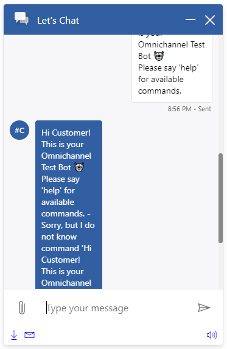

#### Changing message font sizes

<details>
    <summary>Show code</summary>

```tsx
...
liveChatWidgetProps = {
    ...liveChatWidgetProps,
    webChatContainerProps: {
        renderingMiddlewareProps: {
            userMessageStyleProps: {
                fontSize: "20px"
            },
            systemMessageStyleProps: {
                fontSize: "20px"
            }
        }
    }
};
...
```

</details>

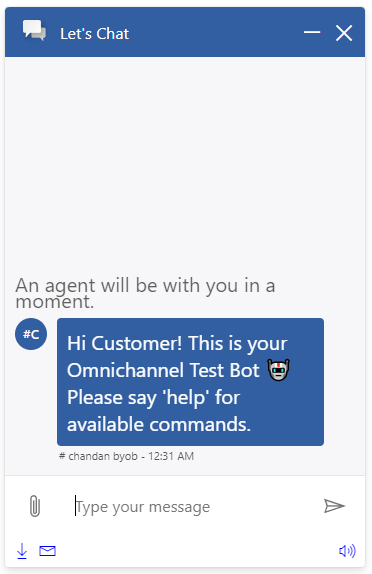

--------------------------------

### ActivityStatusMiddleware

This middlewares contains timestamp, sender name and send status that appear under the message bubbles.

#### Changing default timestamp texts and styles

<details>
    <summary>Show code</summary>

```tsx
...
liveChatWidgetProps = {
    ...liveChatWidgetProps,
    webChatContainerProps: {
        renderingMiddlewareProps: {
            timestampFailedTextStyleProps: {
                color: "orange"
            },
            timestampRetryTextStyleProps: {
                color: "purple"
            }
        },
        localizedTexts: {
            MIDDLEWARE_MESSAGE_NOT_DELIVERED: "Message failed to send!"
        }
    }
};
...
```

</details>

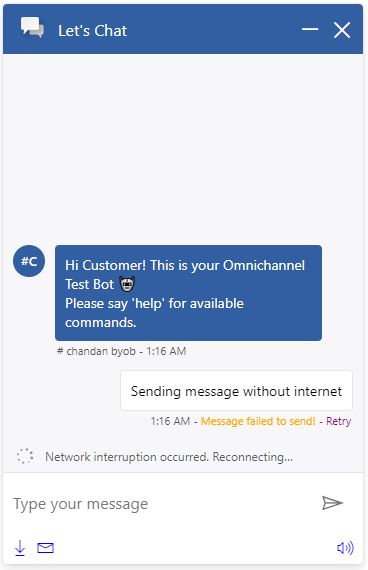

--------------------------------

### AttachmentMiddleware

This middleware controls what goes into the message bubble, excluding surrounding elements like timestamp and avatar. It also defines the behavior of attachments.

#### Enable file attachment button and change file name styles

<details>
    <summary>Show code</summary>

```tsx
...
liveChatWidgetProps = {
    ...liveChatWidgetProps,
    webChatContainerProps: {
        webChatStyles: {
            hideUploadButton: false
        },
        renderingMiddlewareProps: {
            attachmentFileNameStyles: {
                color: "red !important"
            }
        }
    }
};
...
```

</details>

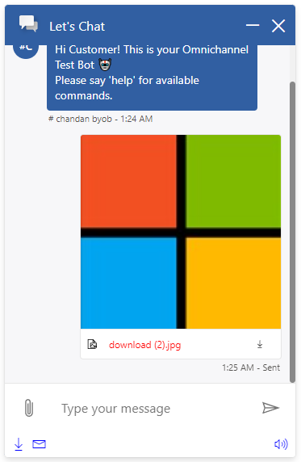

#### Enable/Disable inline playing

<details>
    <summary>Show code</summary>

```tsx
...
liveChatWidgetProps = {
    ...liveChatWidgetProps,
    webChatContainerProps: {
        webChatStyles: {
            hideUploadButton: false
        },
        renderingMiddlewareProps: {
            attachmentProps: {
                enableInlinePlaying: false
            }
        }
    }
};
...
```

</details>

<span>
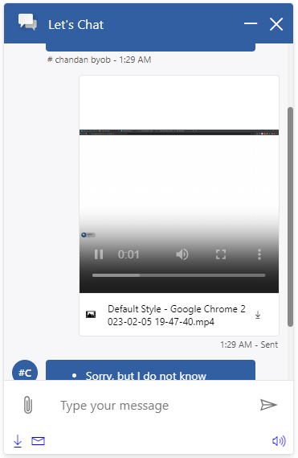
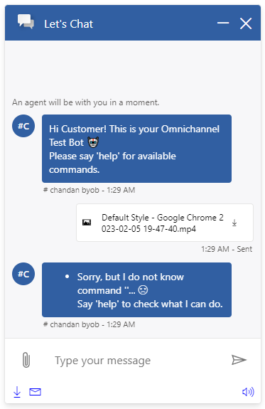
</span>

### AvatarMiddleware

This middleware controls the avatar element. The default AvatarMiddleware uses agent's initials (2 letters), but it can be easily changed to show an image. Note that it is currently not possible to distinguish whether the agent is a human agent or bot agent.

The default AvatarMiddleware currently doesn't show sender avatar. To enable it, try to disable AvatarMiddleware or inject your own custom middleware.

#### Replacing avatar initials with image

<details>
    <summary>Show code</summary>

```tsx
...
liveChatWidgetProps = {
    ...liveChatWidgetProps,
    webChatContainerProps: {
        renderingMiddlewareProps: {
            avatarStyleProps: {
                backgroundImage: "url('../.attachments/customizations-webchatcontainer-bot-avatar.png')",
                backgroundSize: "cover"
            },
            avatarTextStyleProps: {
                display: "none"
            }
        }
    }
};
...
```

</details>

<span>
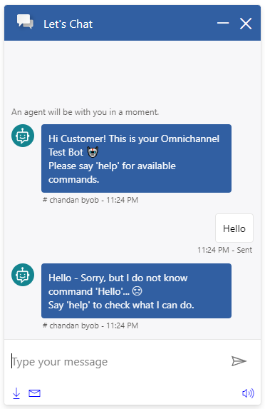
</span>

> Alternatively, if you want to use the default props offered by WebChat, you can do so after setting `disableAvatarMiddleware` to false.

#### Hiding agent avatars

<details>
    <summary>Show code</summary>

```tsx
...
liveChatWidgetProps = {
    ...liveChatWidgetProps,
    webChatContainerProps: {
        webChatStyles: {
            avatarSize: 0
        },
        renderingMiddlewareProps: {
            disableAvatarMiddleware: true
        }
    }
};
...
```

</details>

<span>
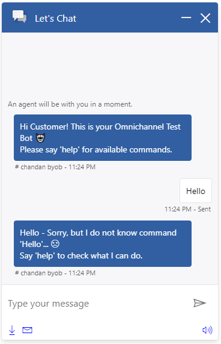
</span>

## More Samples

### Changing message bubble and adaptive card colors

<details>
    <summary>Show code</summary>

```tsx
...
liveChatWidgetProps = {
    ...liveChatWidgetProps,
    webChatContainerProps: {
        adaptiveCardStyles: {
            background: "black",
            color: "white"
        },
        webChatStyles: {
            bubbleBackground: "lightblue",
            bubbleTextColor: "black",
            bubbleFromUserBackground: "#ff0000",
            bubbleFromUserTextColor: "yellow"
        }
    }
};
...
```

</details>

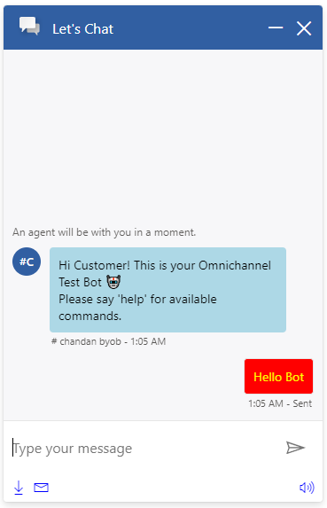

### Changing suggested action styles

<details>
    <summary>Show code</summary>

```tsx
...
liveChatWidgetProps = {
    ...liveChatWidgetProps,
    webChatContainerProps: {
        webChatStyles: {
            suggestedActionBackgroundColor: "blue",
            suggestedActionBorderColor: "green",
            suggestedActionTextColor: "red",
            suggestedActionLayout: "flow" // "stacked"
        }
    }
};
...
```

</details>

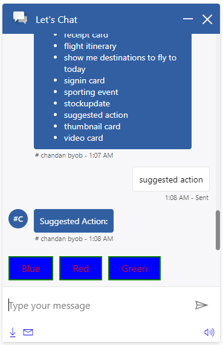

### Disable send box

<details>
    <summary>Show code</summary>

```tsx
...
liveChatWidgetProps = {
    ...liveChatWidgetProps,
    webChatContainerProps: {
        webChatStyles: {
            hideSendBox: true
        }
    }
};
...
```

</details>

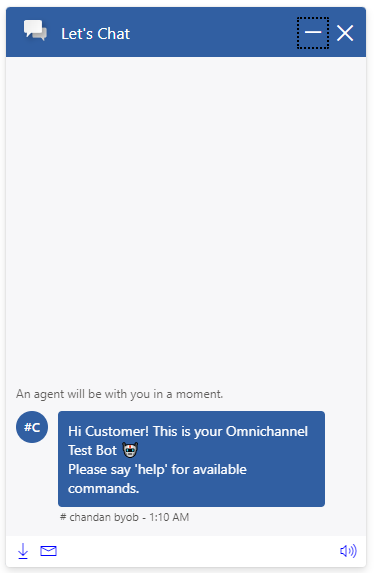
